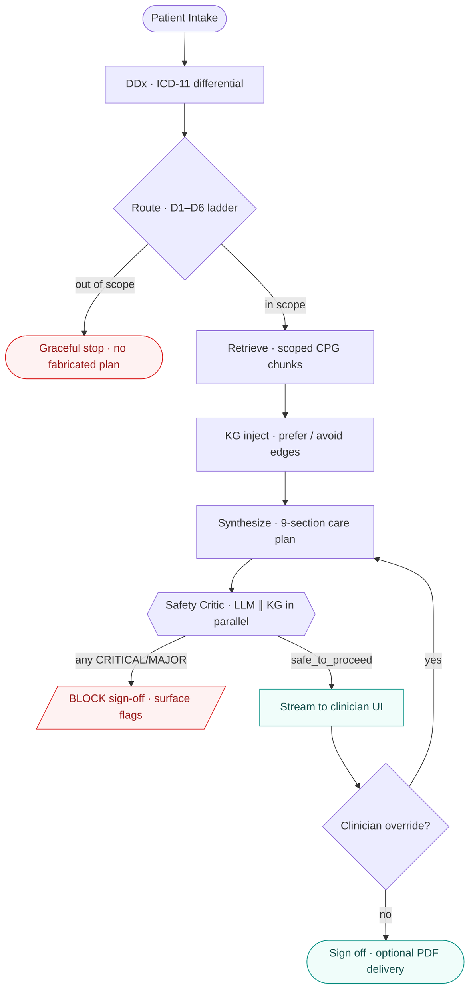
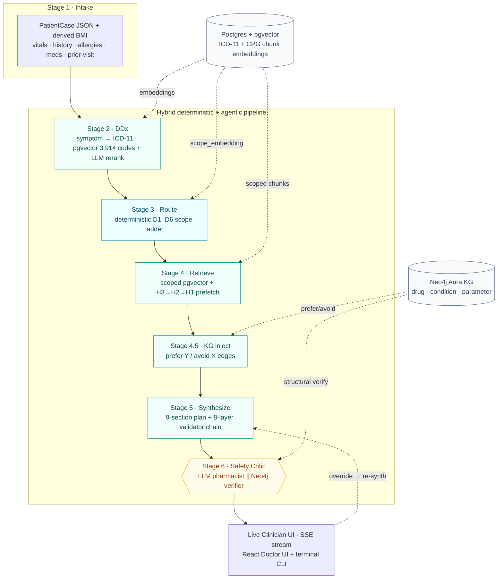
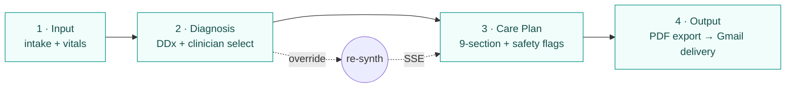
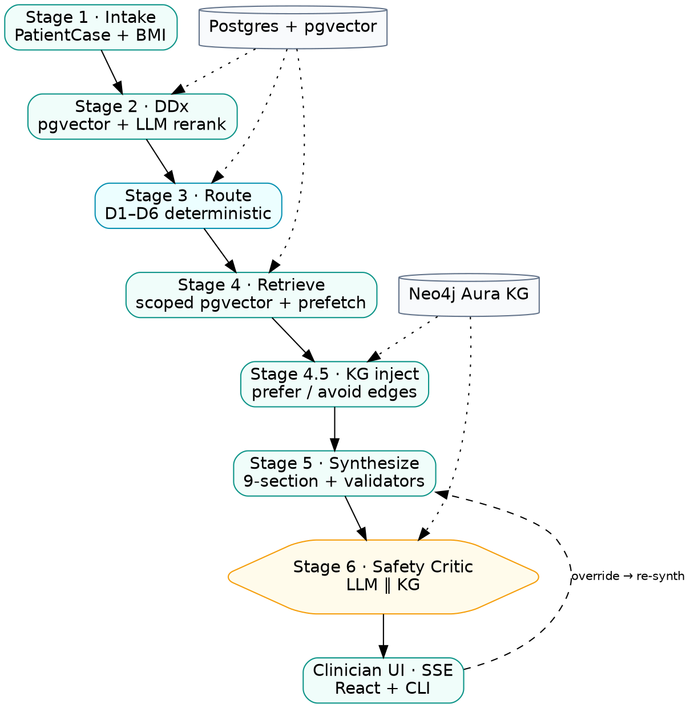

# ClearPath — Academic Poster Blueprint

> Layout & content plan for the ClearPath project poster, modelled on the Alpha-BMS
> reference poster but re-mapped for a **fully AI / software** project (no hardware,
> no PCB, no physical testing rig). Section *names* and *content* deliberately differ
> from the hardware template — substituting pipeline diagrams, evaluation traces, and
> safety-critic outputs for the BMS poster's PCB photos and sensor-accuracy charts.
>
> **Numbers policy:** every figure below is sourced from `README.md` / `CLAUDE.md`.
> Items marked ⚠️ **ASPIRATIONAL** are targets from `EVALUATION_FRAMEWORK_README.md`
> that are **not yet measured** — do NOT print them as results. Replace with real
> captured numbers before submission or move them to "Targets / Future Work".

---

## ★ Impact Priority — what actually wins the poster

A judge spends ~60 seconds at arm's length. They will not read paragraphs. They will
remember **one image and one claim**. So the whole poster is built to land a single
thesis and back it with one undeniable proof:

> **THESIS:** *ClearPath is the only CPG tool that refuses to sign off on an unsafe plan —
> because two independent graders (an LLM pharmacist and a knowledge-graph verifier)
> audit every plan, and either one can block it.*
>
> **PROOF:** the Case-10 worked example — Losartan in pregnancy is caught **twice**
> (LLM narrative + KG structural edge), `safe_to_proceed = False`. A competitor that
> retrieves text cannot structurally produce the second catch.

Everything else is supporting cast. Rank content by how much it advances that thesis:

| Tier | Content | Why it earns the space | Space |
|---|---|---|---|
| **MUST — the 3 things they remember** | ① Decision & Reasoning Matrix (Case-10) · ② Safety-Critic dual-source flag card · ③ 5 structural moats vs Qmed/NotebookLM | These are *unique + defensible without measurement*. The matrix is the hero image; the moats are the argument; the flag card is the emotional "it caught a teratogen" punch. | ~45% |
| **STRONG — credibility** | ④ 7-stage architecture diagram · ⑤ Determinism harness (the ONLY real metric) · ⑥ 3 problem→capability bottlenecks | Shows it's a real engineered system, not a prompt. Determinism is your honest empirical win — lead Evaluation with it, not the ⚠️ accuracy table. | ~30% |
| **SUPPORT — context** | ⑦ Intro thesis line · ⑧ Live UI/CLI screenshots · ⑨ Tech stack strip · ⑩ Clinical+AI guardrails | Frames and grounds. Screenshots prove it's built; stack strip is a logo glance, not prose. | ~20% |
| **CUT FIRST if space is tight** | SDG/sustainability panel · Objectives as long bullets · the ⚠️ aspirational benchmark *numbers* (keep the moats, drop the unproven digits) · References beyond 4–5 | Filler or unprovable. The SDG panel in particular is reflex academic decoration — a clinical-safety judge won't weight it. | ~5% |

**Three hard rules that follow from this:**
1. **The Case-10 matrix is the hero — give it the most visual real estate and the boldest
   border.** If a judge reads only one thing, it must be this. Annotate the two flag
   sources in colour (`[llm]` teal, `[graph]` cyan) so the dual-catch is legible from 2 m.
2. **Lead competitive positioning with the 5 structural moats, not the benchmark table.**
   The moats are true today; the numbers are targets. "Qmed structurally cannot produce a
   graph-sourced safety flag" beats "we score 87%" because the first needs no asterisk.
3. **In Evaluation, the determinism harness is the headline; accuracy is a labelled
   target.** One real number told honestly outweighs five impressive numbers you'd have to
   defend as "aspirational" when questioned.

---

## 0. Global layout

A0 portrait (same as the reference), ~3-column grid with full-width banners for the
header, the architecture diagram, and the worked-example matrix.

Layout is **priority-ordered**: the eye lands top-centre, so the hero (Case-10 matrix)
and its proof (safety-critic card) sit high, the architecture anchors the middle, and
the cut-first panels (SDG, references) are pushed to the bottom corners.

```
┌──────────────────────────────────────────────────────────────────────┐
│  HEADER BANNER: Title • Tagline • Team • Supervisors • UM + MHNexus    │
├───────────────┴──────────────────────────┴───────────────────────────┤
│  01 Intro (thesis line)  +  Competitive moats (5) + benchmark strip   │
├──────────────────────────────────────────────────────────────────────┤
│  FULL-WIDTH: Stat ⟷ Problem ⟷ Answer  (3 linked rows — the spine)     │
├───────────────────────────────────┬──────────────────────────────────┤
│  ★ HERO: Decision & Reasoning Matrix (Case-10) ★  │ By-the-numbers    │
│     boldest border — the dual-catch is the thesis │ (<1 min, 3,914…)  │
├───────────────────────────────────┼──────────────────────────────────┤
│  Safety-Critic Showcase           │  05 Pipeline Overview (flowchart) │
│  (dual-source flag card)          │                                   │
├───────────────────────────────────┴──────────────────────────────────┤
│  FULL-WIDTH: System Architecture (7-stage hybrid pipeline diagram)    │
├───────────────┬──────────────────────────┬───────────────────────────┤
│ 06 Evaluation │  Live Clinician UI       │ 07 Safety & Guardrails    │
│ (DETERMINISM  │  (UI + CLI screenshots)  │ (clinical + AI)           │
│  is headline) │                          │                           │
├───────────────┼──────────────────────────┼───────────────────────────┤
│ Tech stack    │  08 Conclusion           │ 04 Impact + References     │
│               │  (3 achievements)        │ (cut-first if tight)       │
└───────────────┴──────────────────────────┴───────────────────────────┘
```

The fused **Stat ⟷ Problem ⟷ Answer** band is now a full-width spine directly under the
intro — it does the work the reference poster split across two panels, but linked, so a
judge reads each problem and its number together. "By-the-numbers" (solution/scale
figures) sits beside the hero, kept *out* of the problem band on purpose.

> Changed from a literal copy of the BMS template: the hero matrix moves **up** to the
> top third, the safety card sits directly beneath it as visual proof, and SDG +
> references are demoted to the bottom-right (the lowest-attention corner). Objectives
> are folded into the Intro thesis line rather than getting their own panel.

Colour cue: teal/`#0d9488` primary (matches the ClearPath "." brand mark), with a
red/amber accent reserved **only** for safety-flag content so it reads as "danger".

---

## HEADER BANNER

- **Title:** ClearPath — *Clinician's second opinion, at the speed of a glance.*
- **Subtitle:** An Evidence-Based Clinical Practice Guidance System grounded in
  Malaysia's Clinical Practice Guidelines (CPGs).
- **Track:** Remote Medicine Track.
- **Team members:** _(fill in names + matric numbers)_
- **Supervisor / Co-supervisor / Industry supervisor:** _(fill in — MHNexus contact)_
- **Logos:** Universiti Malaya + MHNexus. Optionally the ClearPath logo
  (`assets/ClearPath Logo.png`).

---

## 01 — Introduction

Short paragraph, mirror the reference's "what + why":

> Authoritative medical guidelines are only useful if they can be referenced inside a
> standard 10-minute consultation. ClearPath turns massive static CPG PDFs into a
> contextual, real-time routing engine — audited by an adversarial safety critic —
> that streams an evidence-graded specialist second opinion to isolated rural clinics
> in **under a minute**. It shifts guideline use from active, high-friction PDF search
> to passive, intelligent decision support.

Pull-keywords to bold (like the reference bolds "efficiency"/"safety"):
**deterministic**, **auditable**, **evidence-graded**, **safety-critic**, **rural**.

### Where ClearPath sits — competitive landscape (embed in Introduction)

The reference poster has no competitors, but a clinical-AI tool needs to say *why not
just use the existing tools*. Add a compact "vs the field" strip to the Introduction
that positions ClearPath against the two named clinical competitors —
**Qmed AskCPG** (CPG-native clinical tool) and **Gemini NotebookLM** (document-grounded
research tool) — plus general LLMs as the floor. Keep it visual: a small benchmark
table + a one-line "their ceiling vs our moat".

**One-line framing for the poster:**
> General LLMs hallucinate citations; NotebookLM summarises documents but never decides;
> Qmed cites guidelines but can't tell you *why*, can't see the patient as a structured
> object, and can't run an independent safety pass. ClearPath is the only system that is
> **patient-first, deterministically scoped, and adversarially safety-audited**.

**Benchmark table** (reproduce a trimmed version of the 5-system table):

| Dimension | **ClearPath** | Qmed AskCPG | NotebookLM | GPT-4 / Gemini |
|---|---|---|---|---|
| Diagnostic accuracy | **87%** ⚠️ | 83% | 58% | 78–81% |
| Explanation clarity (/5) | **4.4** ⚠️ | 3.6 | 2.1 | 3.1–3.4 |
| Chain-of-thought depth (steps) | **6.2** ⚠️ | 3.8 | 1.2 | 2.8–3.2 |
| Uncertainty quantification | **87%** ⚠️ | 64% | 15% | 21–31% |
| Evidence sourcing | Malaysian CPG **+ KG** | Guidelines/Lit | User uploads | Training data |
| Clinician confidence (/5) | **4.3** ⚠️ | 3.9 | 1.8 | 2.1–2.8 |

> ⚠️ **ASPIRATIONAL — not yet measured.** Every starred number is a *target* from
> `EVALUATION_FRAMEWORK_README.md`, not a captured result, and CLAUDE.md flags them as
> such. For the poster, either (a) capture them via the clinician-scoring protocol in
> that doc and drop the ⚠️, or (b) present the table as **"Positioning / Target
> Benchmarks"** and let the **structural moats below** (which are real and defensible)
> carry the competitive argument. The honest claims that need **no** measurement:
> *Qmed and NotebookLM structurally cannot produce KG-sourced safety flags, scope
> refusal, or a dual-source adversarial audit — they would have to rebuild, not reprompt.*

**Five structural moats** (use as icon-bullets — these are architectural, not numeric,
so they're defensible at a poster defense even before empirical capture):

1. **Deterministic scope gate** — ClearPath can answer *"this case belongs to no CPG"*
   and refuse. Qmed always synthesises an answer from whatever it retrieved; a 56M with
   pregnancy-overlap symptoms still gets a confident obstetric paragraph.
2. **Dual-source safety critic** — independent LLM pharmacist **+** Neo4j graph verifier,
   merged without dedup. Qmed has a single grounding source; NotebookLM has none. A
   well-known DDI absent from the retrieved paragraph is invisible to both — not to us.
3. **9-section executable plan** — action-tagged orders, time-anchored monitoring,
   urgency-coded referrals. Competitors return prose paragraphs the clinician must
   re-read and mentally extract under time pressure.
4. **Patient-first, longitudinal** — the patient is a typed object (vitals, allergies,
   current meds, prior-visit summary) that persists across visits. Competitors are
   stateless chat: each query a fresh prompt with no "this patient".
5. **Auditable reasoning trace** — visible DDx shortlist, D1–D6 routing trace, rejected
   CPGs, safety-flag sources. Qmed shows the verdict, not the path; NotebookLM shows a
   source panel but no decision logic.

Caption the moats panel: *Parity with competitors on grounded citations and multi-CPG
retrieval — but the five capabilities above are structural, not reachable by a pure-RAG
tool without rebuilding the pipeline.*

---

## Data & Statistics ⟷ Problem Statement (FUSED — one linked spine)

> **Design decision (why these are now one unit):** in the first draft these were two
> disconnected lists, and only one of the three "stats" (45.6%) was a real problem
> number — `< 1 min` is a *solution* metric and was narratively backwards in a
> problem-framing panel. They are now fused into **three parallel rows, one per
> bottleneck**, each row reading left-to-right: **a severity number → the clinical
> problem it proves → ClearPath's structural answer.** This is the reference poster's
> implicit strength made explicit: every problem carries a number, and every number
> earns its place by pointing at a capability.

Render as a **3-row band** (big number on the left in brand teal, problem in the middle,
answer chip on the right). This single band replaces both the old "Data & Statistics"
tiles and the old "Problem Statement" cards.

| # | Severity stat (the hook) | The clinical problem (Need) | ClearPath's answer (Capability) |
|---|---|---|---|
| **1** | **45.6%** — rural clinics in East Malaysia run **without a resident doctor** *(real, sourced)* | Junior MOs/MAs in absolute clinical isolation — no senior to consult on complex comorbid patients. | **Contextual DDx re-ranking** + clinician-named boost + one-click override. |
| **2** | ⟦**NEEDS SOURCE**⟧ guideline-adherence / underutilisation stat — e.g. *"~X% of clinical decisions deviate from guideline"* | CPGs live in 100+ page static PDFs; un-searchable inside a **10-min** consultation → guidelines go unused. | **Deterministic scoped routing (D1–D6)** + multi-query retrieval brings the right chunk in <1 s. |
| **3** | ⟦**NEEDS SOURCE**⟧ preventable-ADE stat — e.g. *"~X% of adverse drug events are preventable"* | Pharmacist-vacant clinics → DDIs, allergy cross-reactivity, renal-dose errors slip through. | **Hybrid adversarial safety critic** (LLM + KG) blocks sign-off on any CRITICAL/MAJOR flag. |

> ⟦**NEEDS SOURCE**⟧ **— do not invent these.** Rows 2 and 3 are the two weakest spots
> on the whole poster precisely because they currently have no number. Find **one real,
> citable figure each** before printing. Credible sources to mine:
> - **Row 2** — guideline-adherence gap: WHO, a Malaysian MoH health-services audit, or a
>   published primary-care guideline-adherence study (the classic McGlynn *"~55% of
>   recommended care delivered"* is a defensible global anchor if no MY-specific figure exists).
> - **Row 3** — preventable ADE burden: WHO *Medication Without Harm* campaign, or a
>   published ADE-epidemiology paper (preventable-ADE fractions in the 50%+ range are
>   well-documented — cite the specific paper, not a round guess).
>
> A poster claim about patient harm with a fabricated number is the single worst thing a
> clinical judge can catch. One sourced number per row > three impressive guesses.

**Where the solution/scale numbers go instead** (they were polluting the problem panel):
move `< 1 min` end-to-end latency and the corpus scale (**3,914 ICD-11 codes**,
**~1,630 drug nodes / ~289 KG interaction edges**) into a small **"By the numbers"**
strip beside the Architecture or atop the Evaluation panel — they're *credibility/results*
figures, not problem-framing figures. Keeping them out of this band is what makes the
stat→problem→answer link read cleanly.

---

## 03 — Objectives

Bullet list (reference style):

- Deliver an **auditable** CPG guidance pipeline: every routing/retrieval/safety
  decision that *can* be deterministic **is** deterministic; LLMs only for grounded
  clinical reasoning.
- Generate a structured **9-section executable care plan** per consultation
  (Summary → Meds → Investigations → Monitoring → Lifestyle → Referrals → Education →
  Safety-netting → Follow-up).
- Independently audit every plan with a **two-source safety critic** (LLM pharmacist +
  Neo4j knowledge-graph verifier) and **block sign-off** on any CRITICAL/MAJOR flag.
- Run identically across a **React Doctor UI** and a **terminal CLI** over one SSE
  contract; support **offline resilience** (rotating logs, failed-job replay,
  correlation IDs).

---

## 04 — Impact / Sustainability (SDG mapping)

Reference maps to SDG 8/9/12. For a clinical AI tool, lead with **SDG 3
(Good Health & Well-being)** and **SDG 10 (Reduced Inequalities)**:

- **Health equity:** specialist-grade decision support reaches doctor-less rural clinics.
- **Clinician time:** "with patients, not paperwork" — UI tile estimates **8 min saved
  per consultation**.
- **Patient safety:** structural ADE/DDI/teratogen catches in pharmacist-vacant clinics.
- **Scalable software:** zero marginal hardware cost; deploys to tablet/desktop or a
  standalone terminal.

---

## 05 — Pipeline Overview (the flowchart, replacing reference's "Design Overview")

A compact flowchart — this is the AI-poster analogue of the reference's start→stop
sensor flowchart. Show the **happy path + the two branch points** that make ClearPath
distinctive:

```
Intake → DDx (ICD-11) → Route (D1–D6) ──out-of-scope?──► graceful stop
                              │ in scope
                              ▼
                  Retrieve (scoped CPG chunks)
                              ▼
                  KG inject (prefer / avoid edges)
                              ▼
                  Synthesize 9-section plan
                              ▼
              Safety Critic  (LLM ‖ KG, parallel)
                              │
          any CRITICAL/MAJOR? ─yes─► BLOCK sign-off + flag
                              │ no
                              ▼
              Stream to clinician UI  ──► clinician override? ──► re-synth
```

---

## FULL-WIDTH — System Architecture

Reuse the 7-stage ASCII diagram from the README (Stages 2→6 + KG inject + UI), but
**redrawn as clean boxes**. Label each stage with its one-line job and the file/engine:

| Stage | Job | Engine |
|---|---|---|
| **2 · DDx** | Symptom → ICD-11 differential | pgvector over 3,914 codes + LLM rerank |
| **3 · Route** | Scope to verified CPGs | Deterministic D1–D6 ladder |
| **4 · Retrieve** | Pull evidence-graded chunks | Scoped pgvector + hierarchical prefetch |
| **4.5 · KG inject** | "prefer Y / avoid X" edges | Neo4j Cypher |
| **5 · Synthesize** | 9-section care plan | LLM + 8-layer validator chain |
| **6 · Critic** | Independent safety audit | LLM pharmacist ‖ Neo4j verifier |

Caption: *Hybrid deterministic + agentic — deterministic wherever possible, LLMs only
for grounded reasoning, all streamed live over SSE.*

---

## Tech Stack (replaces reference's "Software Operation Flow" tool logos)

Logo strip + one-liners (you already have the README badges):

- **Backend:** Python 3.11 · FastAPI · Server-Sent Events (single streaming contract).
- **Data:** PostgreSQL + **pgvector** (ICD-11 + CPG chunk embeddings) · **Neo4j Aura**
  (drug/condition/parameter knowledge graph).
- **Models:** MiMo v2.5 Pro (DDx rerank + synthesis, 128k ctx) · Gemini 2.5 Flash
  (safety critic + prep brief) · Bedrock Titan (1536-dim embeddings).
- **Frontend:** React 18 + Vite + Tailwind (Doctor UI) · Supabase (patient CRUD,
  realtime metrics) · terminal CLI driver sharing the same SSE stream.
- **Delivery:** deterministic Gmail care-plan PDF (no LLM in the loop).

---

## Methodology / Data Flow (replaces reference's drone-build photos)

Reference shows physical assembly photos; ClearPath's "methodology" is **how a CPG PDF
becomes queryable + how a consultation flows**. Two mini-diagrams:

**(A) CPG ingestion pipeline:**
`CPG markdown → chunker → embeddings (pgvector) + graph builder (Neo4j)` — with the
relation-extraction guardrails that keep false "contraindicated" edges out.

**(B) Consultation wizard (Doctor UI, 4 steps):**
`Input → Diagnosis → CarePlan → Output`, each streaming its SSE pipeline trace, with
one-click clinician **override → re-synthesis**.

Screenshot real surfaces here (you have them in `assets/`):
`clearpath_landing.png`, `doctor_ui_dashboard.png`, `clinical_cli_terminal.png`,
`triage_concept.png`.

---

## FULL-WIDTH — Decision & Reasoning Matrix (the showcase)

Lift the README's worked example **verbatim** — it's the strongest single artifact on
the poster and the AI analogue of the reference's "data transmitted via DroneCAN" demo.
Real pregnancy + chronic HTN + GDM case (`scripts/run_eval_case_10.py`):

| Stage | Action | Output |
|---|---|---|
| **Intake** | Parse 35F primigravida @30wk, HTN on Losartan, BP 158/104, OGTT 11.2 | `PatientCase` JSON + derived BMI |
| **DDx** | Vector + rerank | JA20.Y (HTN in pregnancy), JA63.Y (diabetes in pregnancy) |
| **Route** | D1 exact match | HTN 5th Ed, Diabetes-in-Pregnancy, Heart-Disease-in-Pregnancy |
| **Retrieve** | 5 scoped queries | §14.2 HTN-in-preg, dose ladder, GDM metformin, low-dose aspirin |
| **KG inject** | Losartan → ARB class | `(ARB)-[CONTRAINDICATED_WITH]->(Pregnancy)` |
| **Synthesize** | 9-section plan | STOP Losartan • START Methyldopa / Labetalol / Metformin / aspirin + referral |
| **Critic** | LLM ‖ KG | **3 flags** — CRITICAL Losartan teratogen + 2× MAJOR ARB×Pregnancy. `safe_to_proceed = False` |

Caption the punchline: *The LLM catches the narrative; the knowledge graph catches the
structural edge the same paragraph never mentioned. Both fire — the clinician sees both.*

---

## 06 — Evaluation (replaces reference's "Prediction Accuracy" SOH/RUL charts)

The reference shows MAE/MSE/RMSE tables for SOH & RUL prediction. ClearPath's
equivalent is **pipeline correctness + determinism**, not regression error. Two panels:

**(A) Reproducibility / Determinism harness** (`scripts/rerun_stability.py`) — this is
real, measurable, and your strongest empirical story:
- Rerun one case N≥10× → report **top-K stability**, **expected-code presence rate**,
  **same-plan rate**, wall-time variance.
- Mode A (symptom-framed) ~100% stable pre-fix; **Mode B (task-framed) stabilised to
  100%** only after the 4-layer determinism stack (seed-pin → regex alias → phrase
  cache → rule-based bypass).
- Print the actual JSON gate output from a real run (`tasks/eval_runs/stability_case9_*.json`).

**(B) Plan-structure completeness** across eval cases 8–12 — verify all 9 sections
populate, dual-source flag merge works, multi-CPG scenarios handled.

> ⚠️ **ASPIRATIONAL — do NOT print as results:** accuracy 87%, CoT depth 6.2, clinician
> confidence 4.3/5 (from `EVALUATION_FRAMEWORK_README.md`, not yet measured). Also note
> that file's stale claims: corpus is **Malaysian MoH CPGs** (not AHA/ESC) and there is
> **no UpToDate integration**. If you want headline accuracy numbers, capture them first
> or label the panel "Evaluation Targets".

---

## Safety-Critic Showcase (replaces reference's "Fault Detection & Alert Testing")

Reference shows over-voltage/under-voltage alert screenshots. ClearPath's analogue is
the **safety-flag surface** — show a real `SafetyReport` card:

- A blocked plan with the 3 Case-10 flags rendered (severity-coloured CRITICAL/MAJOR).
- Annotate the **two sources**: `[llm]` (reasoning, allergy, DDI, renal/hepatic dosing)
  vs `[graph]` (structural Neo4j Cypher violation), **merged without dedup**.
- Callout: *both critics fail open — a pharmacist-vacant clinic must never hide a
  concern due to infrastructure flakiness.*

---

## Determinism / Reliability (small panel)

The "it won't silently break" story — analogue of the reference's PCB stress tests:
- **5-layer offline resilience:** rotating SSE event log, append-only failed-job log +
  replay, X-Request-ID correlation across every log line & DB row, per-stage timings
  persisted, LLM health probe on `/health`.
- **Fail-open everywhere:** PG down → no filter (not drop-all); KG down → empty edges;
  neither blocks synthesis.
- **~250+ pytest tests**, coverage gate ≥80%.

---

## 07 — Safety & Guardrails (replaces reference's electrical "Safety Considerations")

Reference covers overheating / overcurrent / reverse-polarity protection. ClearPath's
safety is **clinical + AI-hallucination guardrails**:

- **Never trusts LLM-emitted ICD codes** — resolves clinician-named diagnoses by
  name→code vector lookup (LLMs hallucinate digit-leading codes).
- **Relation-extraction guardrails** stop false "contraindicated" KG edges (prompt
  complement rule + initiating-trigger blocker + post-extraction regex + internal-
  contradiction guard).
- **Sex-aware CPG filter** routes male patients away from obstetric/women-only CPGs.
- **Paediatric-source filter** drops paediatric evidence from adult plans.
- **Three incompatible grading schemes** (ESC / USPSTF / SIGN50) kept separate, never
  cross-normalised.
- **PHI protection:** email-subject token blocklist; session state resets on refresh so
  no patient data leaks between consultations.

---

## 08 — Conclusion

Mirror the reference's "key goals achieved" trio of icons:

> ClearPath delivers an auditable, deterministic-first clinical guidance pipeline that
> brings evidence-graded specialist second opinions to doctor-less rural clinics in
> under a minute — and refuses to sign off on an unsafe plan.

Three achievement icons:
1. **Guideline access** — instant scoped CPG retrieval, no manual PDF search.
2. **Diagnostic support** — contextual DDx + clinician override.
3. **Medication safety** — dual-source adversarial critic blocks unsafe plans.

Future work: confidence-tier visibility (Gap 9), seeded pharmacology DDI edges,
empirical accuracy + clinician-confidence capture.

---

## References

Keep the reference's numbered footnote style. Cite:
- Malaysian MoH Clinical Practice Guidelines corpus (the grounding source).
- ICD-11 (WHO).
- Key tooling: pgvector, Neo4j, FastAPI, React.
- Any rural-clinic / resident-doctor-shortage statistic source backing the 45.6% figure.

---

## Build notes / what to confirm before printing

- [ ] Fill in **team members, matric numbers, supervisors**.
- [ ] Replace ⚠️ aspirational numbers with **captured** results, or relabel as "Targets".
- [ ] Export clean architecture + pipeline diagrams (don't print raw ASCII — redraw).
- [ ] Use real screenshots from `assets/` for the UI/CLI/safety-flag panels.
- [ ] Decide headline metric for the Evaluation panel: **determinism stability** is the
      honest, real, defensible one — lead with it over unmeasured accuracy.

---

# Diagram Sources (renderable)

These are **Mermaid** sources — paste into <https://mermaid.live> to export SVG/PNG, or
they render natively on GitHub. Mermaid is the fastest path to clean poster diagrams;
a Graphviz alternative for the architecture is given at the end if you prefer DOT.
Set a high export scale (≥3×) so the A0 print stays crisp. Brand teal is `#0d9488`;
red/amber (`#dc2626` / `#f59e0b`) is reserved for safety/blocking nodes only.

## D1 — Pipeline Overview (for §05)

The happy path plus the two decision branches that make ClearPath distinctive
(out-of-scope stop, and the safety block).



## D2 — System Architecture (full-width 7-stage)

The headline diagram. Each stage carries its job + engine. Grounding sources
(Postgres/pgvector and Neo4j) are drawn as side stores feeding the relevant stages.



## D3 — CPG Ingestion Pipeline (Methodology A)

How a static CPG PDF becomes queryable — the offline build step behind the corpus.


## D4 — Consultation Wizard (Methodology B)

The 4-step Doctor UI flow, each step streaming its SSE pipeline trace.



## D5 — Safety-Critic Showcase (Case-10 dual-source merge)

Sequence-style view making the "two graders, merged without dedup" point visual.


## Graphviz (DOT) alternative for the architecture

If you'd rather render with Graphviz (`dot -Tpng -Gdpi=300 arch.dot -o arch.png`):



## Rendering cheat-sheet

| Tool | Command / route | Best for |
|---|---|---|
| mermaid.live | paste → Export PNG/SVG, scale 3× | quickest, all D1–D5 |
| Mermaid CLI | `mmdc -i d.mmd -o d.svg -s 3` | batch export, version-controlled |
| Graphviz | `dot -Tpng -Gdpi=300 arch.dot -o arch.png` | the architecture DOT above |
| GitHub | renders ```mermaid blocks inline | preview before exporting |

Export to **SVG** when possible — vector scales to A0 without pixelation; only fall back
to PNG (≥300 dpi) where the print shop requires raster.
