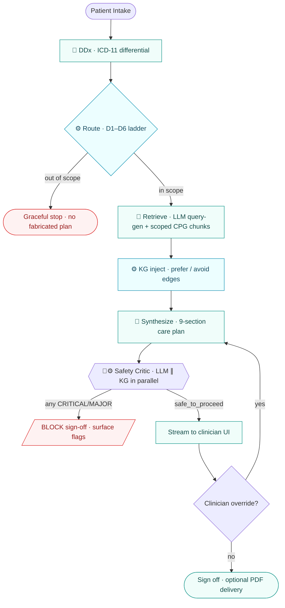
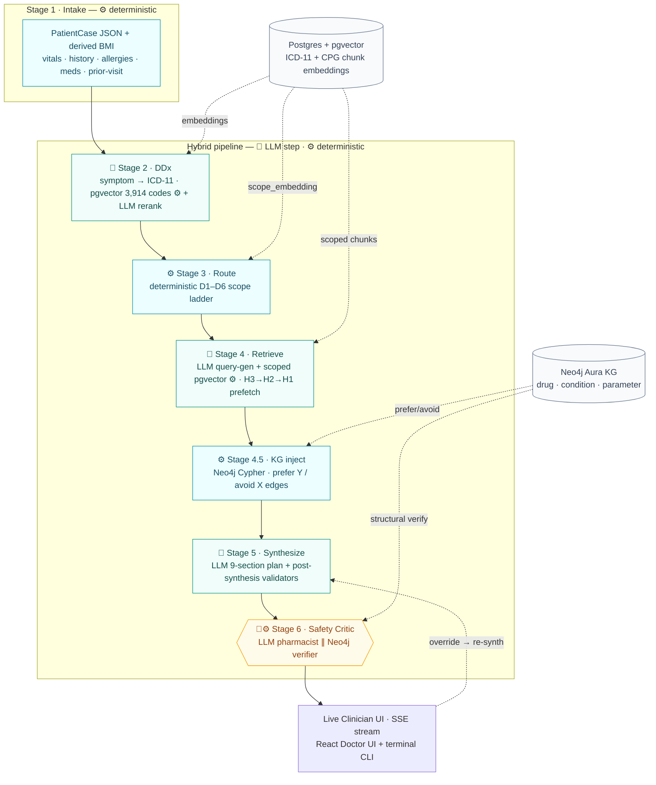
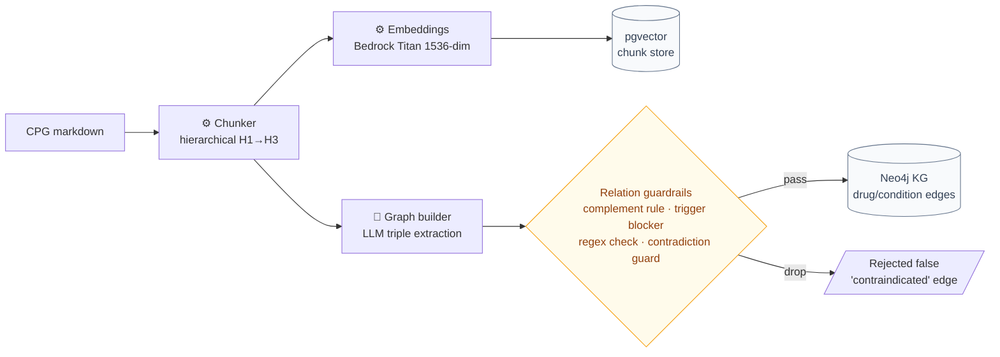
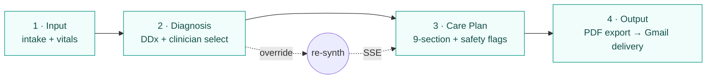
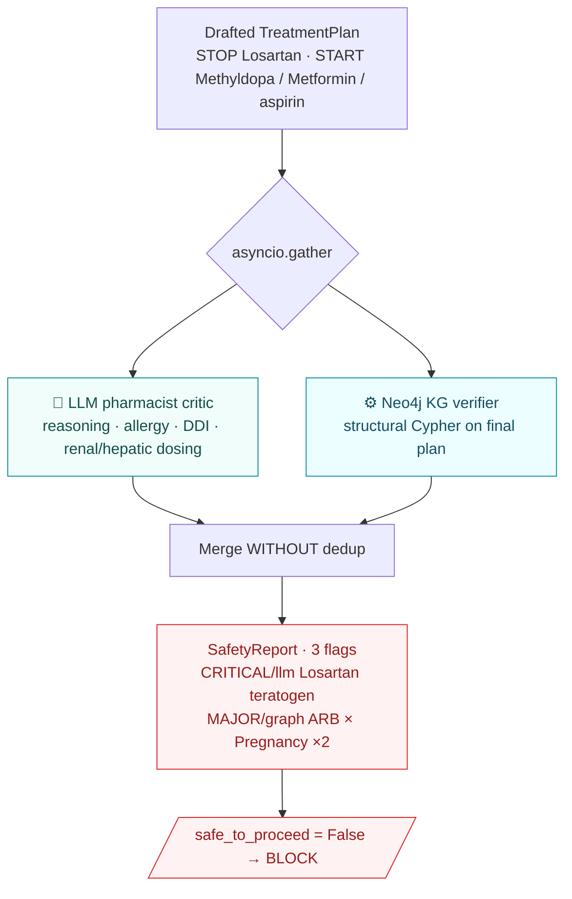
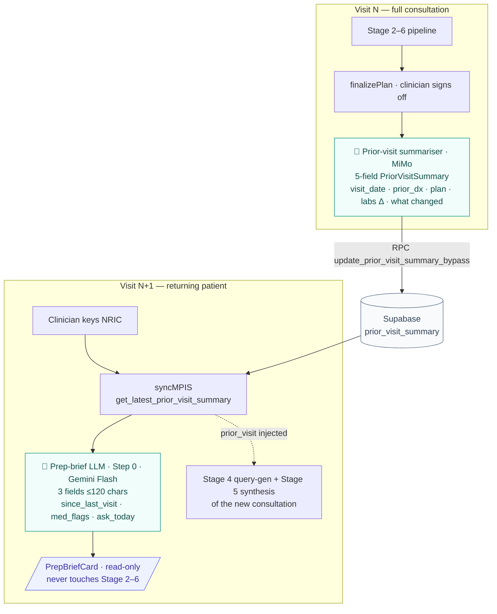
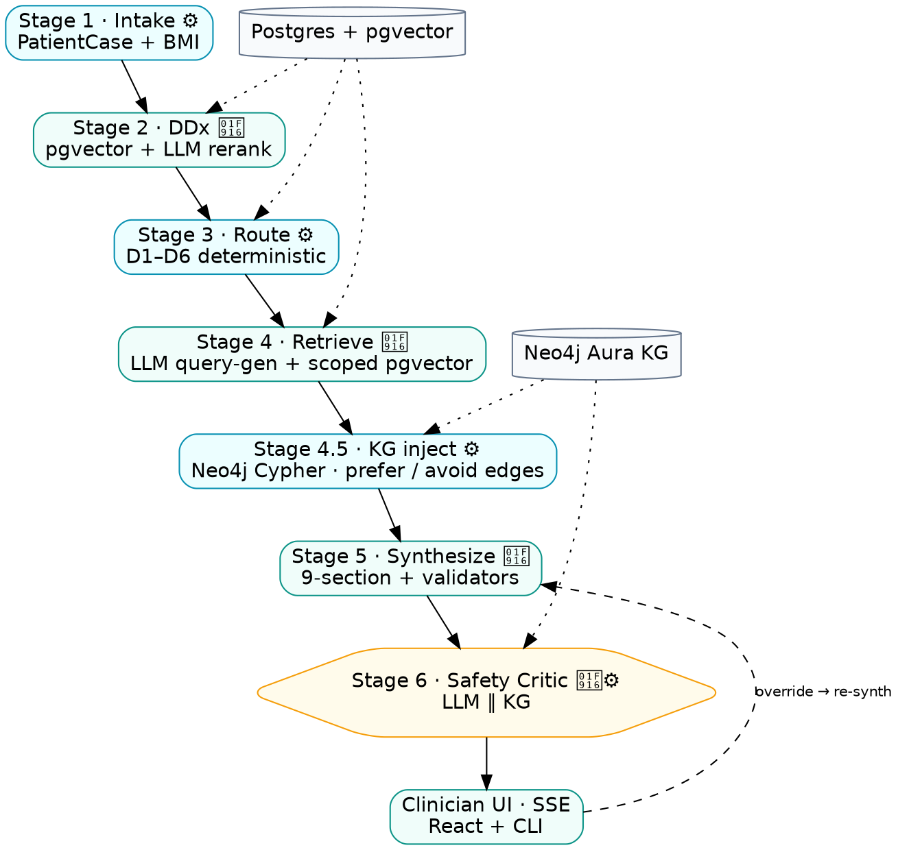

# ClearPath — Academic Poster Blueprint

> Layout & content plan for the ClearPath project poster, modelled on the Alpha-BMS
> reference poster but re-mapped for a **fully AI / software** project (no hardware,
> no PCB, no physical testing rig). Section *names* and *content* deliberately differ
> from the hardware template — substituting pipeline diagrams, evaluation traces, and
> safety-critic outputs for the BMS poster's PCB photos and sensor-accuracy charts.
>
> **Numbers policy:** every figure below is sourced from `README.md` / `CLAUDE.md`.
> Items marked ⚠️ **ASPIRATIONAL** are targets from `EVALUATION_FRAMEWORK_README.md`
> that are **not yet measured** — do NOT print them as results. Replace with real
> captured numbers before submission or move them to "Targets / Future Work".

---

## ★ Impact Priority — what actually wins the poster

A judge spends ~60 seconds at arm's length. They will not read paragraphs. They will
remember **one image and one claim**. So the whole poster is built to land a single
thesis and back it with one undeniable proof:

> **THESIS:** *ClearPath is the only CPG tool that refuses to sign off on an unsafe plan —
> because two independent graders (an LLM pharmacist and a knowledge-graph verifier)
> audit every plan, and either one can block it.*
>
> **PROOF:** the Case-10 worked example — Losartan in pregnancy is caught **twice**
> (LLM narrative + KG structural edge), `safe_to_proceed = False`. A competitor that
> retrieves text cannot structurally produce the second catch.

Everything else is supporting cast. Rank content by how much it advances that thesis:

| Tier | Content | Why it earns the space | Space |
|---|---|---|---|
| **MUST — the 3 things they remember** | ① Decision & Reasoning Matrix (Case-10) · ② Safety-Critic dual-source flag card · ③ 5 structural moats vs Qmed/NotebookLM | These are *unique + defensible without measurement*. The matrix is the hero image; the moats are the argument; the flag card is the emotional "it caught a teratogen" punch. | ~45% |
| **STRONG — credibility** | ④ 7-stage architecture diagram · ⑤ Determinism harness (the ONLY real metric) · ⑥ 3 problem→capability bottlenecks | Shows it's a real engineered system, not a prompt. Determinism is your honest empirical win — lead Evaluation with it, not the ⚠️ accuracy table. | ~30% |
| **SUPPORT — context** | ⑦ Intro thesis line · ⑧ Live UI/CLI screenshots · ⑨ Tech stack strip · ⑩ Clinical+AI guardrails | Frames and grounds. Screenshots prove it's built; stack strip is a logo glance, not prose. | ~20% |
| **CUT FIRST if space is tight** | SDG/sustainability panel · Objectives as long bullets · the ⚠️ aspirational benchmark *numbers* (keep the moats, drop the unproven digits) · References beyond 4–5 | Filler or unprovable. The SDG panel in particular is reflex academic decoration — a clinical-safety judge won't weight it. | ~5% |

**Three hard rules that follow from this:**
1. **The Case-10 matrix is the hero — give it the most visual real estate and the boldest
   border.** If a judge reads only one thing, it must be this. Annotate the two flag
   sources in colour (`[llm]` teal, `[graph]` cyan) so the dual-catch is legible from 2 m.
2. **Lead competitive positioning with the 5 structural moats, not the benchmark table.**
   The moats are true today; the numbers are targets. "Qmed structurally cannot produce a
   graph-sourced safety flag" beats "we score 87%" because the first needs no asterisk.
3. **In Evaluation, the determinism harness is the headline; accuracy is a labelled
   target.** One real number told honestly outweighs five impressive numbers you'd have to
   defend as "aspirational" when questioned.

---

## 0. Global layout

A0 portrait (same as the reference), ~3-column grid with full-width banners for the
header, the architecture diagram, and the worked-example matrix.

Layout is **priority-ordered**: the eye lands top-centre, so the hero (Case-10 matrix)
and its proof (safety-critic card) sit high, the architecture anchors the middle, and
the cut-first panels (SDG, references) are pushed to the bottom corners.

```
┌──────────────────────────────────────────────────────────────────────┐
│  HEADER BANNER: Title • Tagline • Team • Supervisors • UM + MHNexus    │
├───────────────┬──────────────────────────┬───────────────────────────┤
│ 01 Intro      │  02 Problem → Capability │ Competitive moats (5)     │
│ (thesis line) │  (3 bottlenecks)         │ + benchmark strip         │
├───────────────┴──────────────────────────┴───────────────────────────┤
│  ★ FULL-WIDTH HERO: Decision & Reasoning Matrix (Case-10) ★           │
│     boldest border on the poster — the dual-catch is the thesis       │
├───────────────────────────────────┬──────────────────────────────────┤
│  Safety-Critic Showcase           │  05 Pipeline Overview (flowchart) │
│  (dual-source flag card)          │                                   │
├───────────────────────────────────┴──────────────────────────────────┤
│  FULL-WIDTH: System Architecture (7-stage hybrid pipeline diagram)    │
├───────────────┬──────────────────────────┬───────────────────────────┤
│ 06 Evaluation │  Live Clinician UI       │ 07 Safety & Guardrails    │
│ (DETERMINISM  │  (UI + CLI screenshots)  │ (clinical + AI)           │
│  is headline) │                          │                           │
├───────────────┼──────────────────────────┼───────────────────────────┤
│ Tech stack +  │  08 Conclusion           │ 04 Impact + References     │
│ Data stats    │  (3 achievements)        │ (cut-first if tight)       │
└───────────────┴──────────────────────────┴───────────────────────────┘
```

> Changed from a literal copy of the BMS template: the hero matrix moves **up** to the
> top third, the safety card sits directly beneath it as visual proof, and SDG +
> references are demoted to the bottom-right (the lowest-attention corner). Objectives
> are folded into the Intro thesis line rather than getting their own panel.

Colour cue: teal/`#0d9488` primary (matches the ClearPath "." brand mark), with a
red/amber accent reserved **only** for safety-flag content so it reads as "danger".

---

## HEADER BANNER

- **Title:** ClearPath — *Clinician's second opinion, at the speed of a glance.*
- **Subtitle:** An Evidence-Based Clinical Practice Guidance System grounded in
  Malaysia's Clinical Practice Guidelines (CPGs).
- **Track:** Remote Medicine Track.
- **Team members:** _(fill in names + matric numbers)_
- **Supervisor / Co-supervisor / Industry supervisor:** _(fill in — MHNexus contact)_
- **Logos:** Universiti Malaya + MHNexus. Optionally the ClearPath logo
  (`assets/ClearPath Logo.png`).

---

## 01 — Introduction

Short paragraph, mirror the reference's "what + why". Lead with the bold hook line, then
the body — moats carried in **bold** so they read at 2 m:

> **An authoritative guideline only helps if it opens inside a 10-minute consultation.**
> ClearPath collapses Malaysia's static MoH Clinical Practice Guidelines (CPGs) into a
> **real-time, patient-aware routing engine** — every recommendation **evidence-graded**,
> **traceable to its source chunk**, and **independently vetted by an adversarial
> safety-critic agent** before the clinician ever sees it. To isolated primary care it
> streams a **specialist-grade second opinion in under a minute**, turning high-friction
> PDF search into passive decision support that **will not sign off on an unsafe plan**.

Pull-keywords to bold (like the reference bolds "efficiency"/"safety"):
**patient-first**, **deterministically scoped**, **evidence-graded**, **traceable**,
**adversarial safety-critic**, **refuses unsafe plans**.

### Where ClearPath sits — competitive landscape (embed in Introduction)

The reference poster has no competitors, but a clinical-AI tool needs to say *why not
just use the existing tools*. Add a compact "vs the field" strip to the Introduction
that positions ClearPath against the two named clinical competitors —
**Qmed AskCPG** (CPG-native clinical tool) and **Gemini NotebookLM** (document-grounded
research tool) — plus general LLMs as the floor. Keep it visual: a small benchmark
table + a one-line "their ceiling vs our moat".

**One-line framing for the poster** (set the three rebuttals in a row, then land the moat):
> Generative AI **fabricates citations**. NotebookLM summarises documents but **never
> decides**. Qmed cites guidelines but can't tell you **why**, can't see the patient as a
> **structured object**, and can't run an **independent safety pass**. ClearPath is the
> only system that is **patient-first, deterministically scoped, and adversarially
> safety-audited** — three capabilities a pure-retrieval tool cannot reach without
> rebuilding its pipeline.

**Benchmark table** (reproduce a trimmed version of the 5-system table):

| Dimension | **ClearPath** | Qmed AskCPG | NotebookLM | GPT-4 / Gemini |
|---|---|---|---|---|
| Diagnostic accuracy | **87%** ⚠️ | 83% | 58% | 78–81% |
| Explanation clarity (/5) | **4.4** ⚠️ | 3.6 | 2.1 | 3.1–3.4 |
| Chain-of-thought depth (steps) | **6.2** ⚠️ | 3.8 | 1.2 | 2.8–3.2 |
| Uncertainty quantification | **87%** ⚠️ | 64% | 15% | 21–31% |
| Evidence sourcing | Malaysian CPG **+ KG** | Guidelines/Lit | User uploads | Training data |
| Clinician confidence (/5) | **4.3** ⚠️ | 3.9 | 1.8 | 2.1–2.8 |

> ⚠️ **ASPIRATIONAL — not yet measured.** Every starred number is a *target* from
> `EVALUATION_FRAMEWORK_README.md`, not a captured result, and CLAUDE.md flags them as
> such. For the poster, either (a) capture them via the clinician-scoring protocol in
> that doc and drop the ⚠️, or (b) present the table as **"Positioning / Target
> Benchmarks"** and let the **structural moats below** (which are real and defensible)
> carry the competitive argument. The honest claims that need **no** measurement:
> *Qmed and NotebookLM structurally cannot produce KG-sourced safety flags, scope
> refusal, or a dual-source adversarial audit — they would have to rebuild, not reprompt.*

**Five structural moats** (use as icon-bullets — these are architectural, not numeric,
so they're defensible at a poster defense even before empirical capture):

1. **Deterministic scope gate** — ClearPath can answer *"this case belongs to no CPG"*
   and refuse. Qmed always synthesises an answer from whatever it retrieved; a 56M with
   pregnancy-overlap symptoms still gets a confident obstetric paragraph.
2. **Dual-source safety critic** — independent LLM pharmacist **+** Neo4j graph verifier,
   merged without dedup. Qmed has a single grounding source; NotebookLM has none. A
   well-known DDI absent from the retrieved paragraph is invisible to both — not to us.
3. **9-section executable plan** — action-tagged orders, time-anchored monitoring,
   urgency-coded referrals. Competitors return prose paragraphs the clinician must
   re-read and mentally extract under time pressure.
4. **Patient-first, longitudinal** — the patient is a typed object (vitals, allergies,
   current meds, prior-visit summary) that persists across visits. Competitors are
   stateless chat: each query a fresh prompt with no "this patient".
5. **Auditable reasoning trace** — visible DDx shortlist, D1–D6 routing trace, rejected
   CPGs, safety-flag sources. Qmed shows the verdict, not the path; NotebookLM shows a
   source panel but no decision logic.

Caption the moats panel: *Parity with competitors on grounded citations and multi-CPG
retrieval — but the five capabilities above are structural, not reachable by a pure-RAG
tool without rebuilding the pipeline.*

---

## Data & Statistics ⟷ Problem Statement (FUSED — one linked spine)

> **Design decision (why these are now one unit):** in the first draft these were two
> disconnected lists, and only one of the three "stats" (45.6%) was a real problem
> number — `< 1 min` is a *solution* metric and was narratively backwards in a
> problem-framing panel. They are now fused into **three parallel rows, one per
> bottleneck**, each row reading left-to-right: **a severity number → the clinical
> problem it proves → ClearPath's structural answer.** This is the reference poster's
> implicit strength made explicit: every problem carries a number, and every number
> earns its place by pointing at a capability.

Render as a **3-row band** (big number on the left in brand teal, problem in the middle,
answer chip on the right). This single band replaces both the old "Data & Statistics"
tiles and the old "Problem Statement" cards.

| # | Severity stat (the hook) | The clinical problem (Need) | ClearPath's answer (Capability) |
|---|---|---|---|
| **1** | **45.6%** — rural clinics in East Malaysia run **without a resident doctor** *(real, sourced)* | Junior MOs/MAs in absolute clinical isolation — no senior to consult on complex comorbid patients. | **Contextual DDx re-ranking** + clinician-named boost + one-click override. |
| **2** | ⟦**NEEDS SOURCE**⟧ guideline-adherence / underutilisation stat — e.g. *"~X% of clinical decisions deviate from guideline"* | CPGs live in 100+ page static PDFs; un-searchable inside a **10-min** consultation → guidelines go unused. | **Deterministic scoped routing (D1–D6)** + multi-query retrieval brings the right chunk in <1 s. |
| **3** | ⟦**NEEDS SOURCE**⟧ preventable-ADE stat — e.g. *"~X% of adverse drug events are preventable"* | Pharmacist-vacant clinics → DDIs, allergy cross-reactivity, renal-dose errors slip through. | **Hybrid adversarial safety critic** (LLM + KG) blocks sign-off on any CRITICAL/MAJOR flag. |

> ⟦**NEEDS SOURCE**⟧ **— do not invent these.** Rows 2 and 3 are the two weakest spots
> on the whole poster precisely because they currently have no number. Find **one real,
> citable figure each** before printing. Credible sources to mine:
> - **Row 2** — guideline-adherence gap: WHO, a Malaysian MoH health-services audit, or a
>   published primary-care guideline-adherence study (the classic McGlynn *"~55% of
>   recommended care delivered"* is a defensible global anchor if no MY-specific figure exists).
> - **Row 3** — preventable ADE burden: WHO *Medication Without Harm* campaign, or a
>   published ADE-epidemiology paper (preventable-ADE fractions in the 50%+ range are
>   well-documented — cite the specific paper, not a round guess).
>
> A poster claim about patient harm with a fabricated number is the single worst thing a
> clinical judge can catch. One sourced number per row > three impressive guesses.

**Where the solution/scale numbers go instead** (they were polluting the problem panel):
move `< 1 min` end-to-end latency and the corpus scale (**3,914 ICD-11 codes**,
**~1,630 drug nodes / ~289 KG interaction edges**) into a small **"By the numbers"**
strip beside the Architecture or atop the Evaluation panel — they're *credibility/results*
figures, not problem-framing figures. Keeping them out of this band is what makes the
stat→problem→answer link read cleanly.

### Moat Bank — reverse-engineerable `stat → need → moat` candidates

The 3-row spine above uses the three strongest moats. But you only ship 3 rows, and two
of them still need a sourced stat — so build a **bank of candidate rows** and pick the
three where (a) the moat is real *and* (b) a credible stat actually exists to anchor it.
**Selection rule:** a moat is only poster-worthy if you can find a real number for its
need. A brilliant capability with no sourceable stat is a *feature*, not a *row* — demote
it to the architecture/guardrails panel instead.

Every moat below is a **genuine, shipped capability** (traced to `README.md` / `CLAUDE.md`).
The stat column says *what kind of number to hunt and where* — **never invent it.**

| # | ClearPath moat (real capability) | The need / problem it proves | Stat to source (type → where to look) | Sourceability |
|---|---|---|---|---|
| **A** | **Full-traceability CoT** — visible DDx shortlist, D1–D6 routing trace, rejected CPGs, dual-source flag provenance | Clinicians won't trust (or can't be medico-legally accountable for) black-box AI they can't audit | Clinician distrust of black-box clinical AI; % who require explainability to adopt → surveys (JAMA/BMJ digital-health, MMA position papers) | **High** — lots of published trust/explainability surveys |
| **B** | **Scope-refusal gate** — answers *"this case belongs to no CPG"* and declines instead of fabricating | Overconfident LLMs hallucinate plausible wrong answers → patient harm | Medical-LLM hallucination / fabrication rate on out-of-scope queries → published LLM-in-medicine eval papers | **High** — hallucination-rate studies are common |
| **C** | **Determinism / reproducibility** — seed-pin + deterministic routing → same input, same plan | Non-reproducible advice is un-auditable and erodes trust; same patient must get the same answer | Run-to-run variance of vanilla LLMs on identical clinical prompts → cite your *own* determinism harness as the contrast (this is your real metric) | **High** — you can MEASURE the contrast yourself |
| **D** | **Evidence-graded, citation-pinned recs** — every rec stamped MoH grade + `CPG §x [chunk N]` | Unverifiable AI assertions can't be acted on safely; defensive-medicine/medico-legal need for sources | % of general-LLM medical answers with fabricated/unverifiable citations → LLM citation-accuracy studies | **High** |
| **E** | **KG structural safety (DDI / teratogen / renal-dose)** — catches harm no retrieved paragraph mentions | Pharmacist-vacant clinics miss drug–drug / drug–condition interactions → preventable ADEs | Preventable-ADE burden; DDI prevalence in polypharmacy → WHO *Medication Without Harm*, ADE-epidemiology papers *(this is spine row 3)* | **High** |
| **F** | **Offline resilience** — rotating logs, failed-job replay, fail-open everywhere | Rural clinics have unreliable power/connectivity; a flaky link must not drop a safety concern | Rural East-Malaysia internet/electricity reliability or clinic downtime → MCMC / MoH rural-infrastructure reports | **Medium** — MY-specific figures harder to find |
| **G** | **Sub-minute latency in the consult window** — full pipeline < 1 min | Public-clinic consults are short and patient load is crushing; advice must fit the window | Mean primary-care consult duration / daily patient load in MY *Klinik Kesihatan* → MoH health-facts, primary-care workload studies | **Medium-High** |
| **H** | **9-section executable plan** — action-tagged orders, not prose | Cognitive load of extracting an order list from prose under time pressure raises error risk | Documentation burden / time on paperwork / EHR cognitive-load → clinician-burnout & time-motion studies | **High** — burnout/documentation stats abound |
| **I** | **Patient-first longitudinal memory** — typed patient object + prior-visit summary persists across visits | Fragmented rural records → repeated history-taking, continuity-of-care gaps | Continuity-of-care impact on outcomes, or time lost re-taking history → primary-care continuity literature | **Medium** |
| **J** | **Multilingual care-plan delivery (en / ms / zh)** — localized patient cover, kept in sync | Language barriers in multi-ethnic MY population → poor comprehension & adherence | % MY population with limited English health-literacy; language-barrier → adherence impact → DOSM census, health-literacy surveys | **Medium-High** — DOSM language data is solid |
| **K** | **Clinician override + instant re-synthesis** — human stays the decision-maker | Automation bias: clinicians over-trust AI and miss errors when they can't easily override | Automation-bias error rates in clinical decision support → CDS automation-bias studies | **Medium** |

**How to use this bank:**
- **Anchor rows (pick 3 for the spine):** the strongest *stat-supported* trio is most
  likely **A (traceability)** or **B (scope-refusal)** + **E (medication safety)** +
  **G (consult-window) or H (documentation burden)**. These all have abundant, credible,
  citable literature — you won't be stuck hunting a number that doesn't exist.
- **Keep 1–2 as backups** in case a stat search dead-ends — swap a Medium-sourceability
  row (F, I, K) out for a High one rather than printing a number you can't cite.
- **The rest still appear on the poster** — just in the Architecture, Safety/Guardrails,
  or Conclusion panels as capabilities, not as a stat-anchored need row. A moat doesn't
  have to carry a statistic to earn wall space; it only needs a stat to anchor the
  *problem-framing* band.

> **Strategic note:** your example (full-traceability CoT, row A) is one of the *best*
> reversals precisely because "clinicians distrust black-box AI" is one of the most
> heavily-surveyed claims in digital-health — you will find a citable number in minutes.
> Contrast that with row F (offline resilience): a true and differentiating moat, but the
> MY-specific reliability stat is harder to pin down — so it's a backup, not an anchor.

### ★★ Game-Winning Moats — the only 5 that beat BOTH Qmed *and* NotebookLM

**Filter applied:** a moat is "game-winning" only if `EVALUATION_FRAMEWORK_README.md`
documents it as **structural** against *both* named clinical competitors — something they
would have to **rebuild, not reprompt**, to match. By that test exactly **five** of the
bank qualify (they are the doc's Moats 1–5). Rows C, D, F, G, J, K do **not** make the
cut — see the **parity traps** warning below before you put any of them on a stat row.

Ranked by poster impact (a clinical-safety judge weights *prevented patient harm*
highest), each with its one-line kill-shot vs each competitor:

| Rank | Game-winning moat | Kills Qmed because… | Kills NotebookLM because… |
|---|---|---|---|
| **#1** | **Dual-source safety critic** (KG + LLM, merged) — *Moat 2 / bank E* | single grounding source: surfaces a DDI **only if** the retrieved paragraph names the pair — misses teratogens on existing meds | pure RAG, **no drug ontology, no typed contraindication edges, no second grader** — a textbook DDI absent from the notebook is invisible |
| **#2** | **ICD-anchored routing + first-class refusal** — *Moat 1 / bank B* | **no diagnostic-scope layer** — always synthesises from whatever it pulled; a 56 M with pregnancy-overlap symptoms still gets a confident obstetric paragraph | generic doc-chatbot — **no ICD, no sex-exclusion, no notion of clinical applicability**; paraphrases any chunk on demand |
| **#3** | **Auditable per-stage decision trace** (typed CoT events) — *Moat 5 / bank A* | shows the verdict + page cite but the **reasoning is opaque** — no DDx shortlist, no routing rejections, no why | shows a source panel but **no decision logic** — reasoning hidden inside the final paragraph |
| **#4** | **Schema-constrained executable 9-section plan** — *Moat 3 / bank H* | returns **long-form prose** — clinician must re-read and mentally extract the order list under time pressure | conversational paragraphs with footnotes — **no clinical structure**, can't render as a checklist or diff vs prior visit |
| **#5** | **Patient-first, longitudinal intake** (typed `PatientCase` + rPPG + prior-visit loop) — *Moat 4 / bank I* | **stateless chat** — no allergy field, no current-med list, no prior visit; allergies are at best a sentence the LLM may miss | **notebook chat** — no vitals, no patient schema, no longitudinal memory; every consult starts from zero context |

> ⛔ **Parity traps — do NOT frame these as competitor wins** (the doc lists them as
> table-stakes, and one is an outright loss):
> - **Grounded citations** — all three cite; NotebookLM's side-panel UX is arguably *best*. **Parity.**
> - **Multi-CPG retrieval in one answer** — Qmed does it too. **Parity.**
> - **Streaming output** — all three stream tokens; your edge is *what* streams (Moat 5), not *that* it streams. **Parity.**
> - **Speed** — ClearPath **18–22 s vs Qmed 16–20 s**: you are *slightly slower*. Claiming a speed win invites an easy rebuttal. Sell "fits the 10-min window," never "faster than Qmed."

**Spine recommendation:** the three rows of the `stat → need → moat` band should be the
**top 3 game-winners** — #1 (safety), #2 (refusal), #3 (auditability) — because they're
the most defensible *and* the most safety-weighted. #4 and #5 still appear on the poster
(in the plan-renderer screenshot and the intake/architecture panels) but don't need to
carry a stat row. This keeps the spine, the hero matrix, and the moats panel all telling
**one coherent story: a system that refuses to be confidently wrong.**

### Stat-hunting kit — concrete queries + named sources for the top 3

Real, findable literature for the three anchor rows. **Pull the exact figure from the
source and cite the source — do not print my paraphrase as the number.**

**Row #1 — Dual-source safety critic → need: preventable medication harm in pharmacist-vacant clinics**
- Search: `WHO Medication Without Harm preventable medication-related harm 50%`
- Search: `Hodkinson prevalence medication errors systematic review BMC Medicine 2020`
- Search: `medication error prevalence primary care Malaysia Klinik Kesihatan`
- Strong named anchors: **WHO *Medication Without Harm*** (3rd Global Patient Safety
  Challenge — global medication-harm burden, large share avoidable); **Hodkinson et al.,
  *BMC Medicine* 2020** (medication-error prevalence / proportion severe). A MY-specific
  primary-care medication-error study is the ideal local anchor if you can find one.

**Row #2 — Scope-refusal → need: LLMs answer confidently when they should decline**
- Search: `large language model hallucination rate clinical question fabricated`
- Search: `ChatGPT fabricated references medical accuracy study`
- Search: `medical LLM safety inappropriate confident answer out-of-scope`
- Strong named anchors: published **medical-LLM evaluation papers** reporting
  fabricated-citation / inaccurate-answer rates (commonly cited in the tens-of-percent
  range). This row pairs perfectly with your **scope-refusal demo** — show the stat, then
  show ClearPath emitting `out_of_scope` instead.

**Row #3 — Auditable trace → need: clinicians won't adopt / can't be accountable for black-box AI**
- Search: `physician trust AI explainability barrier adoption survey`
- Search: `AMA augmented intelligence physician survey clinician concerns`
- Search: `clinician requirement explainable AI clinical decision support npj Digital Medicine`
- Strong named anchors: **AMA Augmented-Intelligence physician surveys** (clinician
  adoption concerns, incl. transparency/oversight); **npj Digital Medicine / BMJ Health &
  Care Informatics** explainability-in-clinical-AI surveys. The number you want is
  "% of clinicians citing lack of transparency/explainability as a barrier to trusting AI."

> If a search for any anchor row dead-ends, **swap in #4 (documentation-burden /
> consult-length: Sinsky 2016 *Annals of Internal Medicine*; Irving 2017 *BMJ Open* on
> international consultation length) or #5 (continuity-of-care: Pereira Gray 2018 *BMJ
> Open* "Continuity of care … a matter of life and death?")** — both are game-winners
> with famously well-cited stats. Never downgrade to a parity-trap row to fill the gap.

---

## 03 — Objectives

Bullet list (reference style):

- Deliver an **auditable** CPG guidance pipeline: every routing/retrieval/safety
  decision that *can* be deterministic **is** deterministic; LLMs only for grounded
  clinical reasoning.
- Generate a structured **9-section executable care plan** per consultation
  (Summary → Meds → Investigations → Monitoring → Lifestyle → Referrals → Education →
  Safety-netting → Follow-up).
- Independently audit every plan with a **two-source safety critic** (LLM pharmacist +
  Neo4j knowledge-graph verifier) and **block sign-off** on any CRITICAL/MAJOR flag.
- Run identically across a **React Doctor UI** and a **terminal CLI** over one SSE
  contract; support **offline resilience** (rotating logs, failed-job replay,
  correlation IDs).

---

## 04 — Impact / Sustainability

Triple-bottom-line impact in **glanceable phrases** (poster format — no sentences).
Use three tight columns; reserve the row beneath for the SDG badges.

**💰 Economic**
- Zero marginal hardware — runs on clinics' existing tablets/desktops
- ~8 min saved/consult → more patients seen, same staff
- Software scales at near-zero cost — one pipeline, every clinic
- Averts costly preventable-ADE admissions

**🤝 Social**
- Specialist second opinion reaches **doctor-less rural clinics** (45.6% w/o resident doctor)
- Structural teratogen / DDI / ADE catches where **no pharmacist is on site**
- Closes the urban–rural care gap — same CPG-grounded guidance everywhere
- "With patients, not paperwork" — attention back on the patient

**🌱 Environmental**
- **Paperless** care plans — digital PDF delivery, no printed guideline binders
- **No new device footprint** — reuses existing clinic hardware (avoids e-waste)
- Lightweight deploy vs shipping/maintaining physical kit to remote sites

### The 3 SDGs that genuinely fit ClearPath

Pick the three it actually moves the needle on — don't pad with reflex green goals.

| SDG | Why it's a real fit for ClearPath |
|---|---|
| **3 · Good Health & Well-being** | CPG-grounded support + dual-source safety critic → safer care, fewer preventable harms. **The core mission.** |
| **10 · Reduced Inequalities** | Specialist-grade guidance to isolated rural clinics → closes the urban–rural care divide. |
| **9 · Industry, Innovation & Infrastructure** | Offline-resilient, fail-open digital-health infrastructure built for low-resource settings. |

> **Honest scoping note:** environmental SDGs (12/13) are a *weak* fit for a clinical AI
> tool — the green wins above are real but modest, so they stay as the Environmental
> column, **not** a fourth SDG badge. A clinical-safety judge rewards focus (SDG 3/10/9)
> over a padded SDG wall.

---

## 05 — Pipeline Overview (the flowchart, replacing reference's "Design Overview")

A compact flowchart — this is the AI-poster analogue of the reference's start→stop
sensor flowchart. Show the **happy path + the two branch points** that make ClearPath
distinctive:

```
Intake → DDx (ICD-11) → Route (D1–D6) ──out-of-scope?──► graceful stop
                              │ in scope
                              ▼
                  Retrieve (scoped CPG chunks)
                              ▼
                  KG inject (prefer / avoid edges)
                              ▼
                  Synthesize 9-section plan
                              ▼
              Safety Critic  (LLM ‖ KG, parallel)
                              │
          any CRITICAL/MAJOR? ─yes─► BLOCK sign-off + flag
                              │ no
                              ▼
              Stream to clinician UI  ──► clinician override? ──► re-synth
```

---

## FULL-WIDTH — System Architecture

Reuse the 7-stage ASCII diagram from the README (Stages 2→6 + KG inject + UI), but
**redrawn as clean boxes**. Label each stage with its one-line job and the file/engine:

| Stage | Job | Engine | Type |
|---|---|---|---|
| **2 · DDx** | Symptom → ICD-11 differential | pgvector over 3,914 codes + LLM rerank | 🤖 **LLM step** (rerank over deterministic vector pass) |
| **3 · Route** | Scope to verified CPGs | Deterministic D1–D6 ladder | ⚙ **Deterministic** |
| **4 · Retrieve** | Pull evidence-graded chunks | LLM query-gen + scoped pgvector (H3→H2→H1 prefetch) | 🤖 **LLM step** (LLM writes the queries) |
| **4.5 · KG inject** | "prefer Y / avoid X" edges | Neo4j Cypher | ⚙ **Deterministic** (graph lookup) |
| **5 · Synthesize** | 9-section care plan | LLM + post-synthesis validator chain | 🤖 **LLM step** |
| **6 · Critic** | Independent safety audit | LLM pharmacist ‖ Neo4j verifier | 🤖⚙ **Hybrid — the one true *agent*** (LLM critic with veto ∥ deterministic KG) |

Caption: *Hybrid deterministic + agentic — deterministic wherever possible (routing,
KG lookup), LLMs only for grounded reasoning (DDx rerank, query-gen, synthesis, the
critic's pharmacist arm). 🤖 marks the four LLM reasoning steps; everything else is
rule- or graph-based. Only the safety critic is an **agent** in the strict sense (an
independent reviewer that can block sign-off). All streamed live over SSE.*

---

## Tech Stack (replaces reference's "Software Operation Flow" tool logos)

Logo strip + one-liners (you already have the README badges):

- **Backend:** Python 3.11 · FastAPI · Server-Sent Events (single streaming contract).
- **Data:** PostgreSQL + **pgvector** (ICD-11 + CPG chunk embeddings) · **Neo4j Aura**
  (drug/condition/parameter knowledge graph).
- **Models:** MiMo v2.5 Pro (DDx rerank + synthesis + prior-visit summariser, 128k ctx) ·
  Gemini 2.5 Flash (safety critic + returning-patient prep brief) · Bedrock Titan
  (1536-dim embeddings).
- **Frontend:** React 18 + Vite + Tailwind (Doctor UI) · Supabase (patient CRUD,
  realtime metrics) · terminal CLI driver sharing the same SSE stream.
- **Delivery:** deterministic Gmail care-plan PDF (no LLM in the loop).

---

## Methodology / Data Flow (replaces reference's drone-build photos)

Reference shows physical assembly photos; ClearPath's "methodology" is **how a CPG PDF
becomes queryable + how a consultation flows**. Two mini-diagrams:

**(A) CPG ingestion pipeline:**
`CPG markdown → chunker → embeddings (pgvector) + graph builder (Neo4j)` — with the
relation-extraction guardrails that keep false "contraindicated" edges out.

**(B) Consultation wizard (Doctor UI, 4 steps):**
`Input → Diagnosis → CarePlan → Output`, each streaming its SSE pipeline trace, with
one-click clinician **override → re-synthesis**.

**(C) Returning-patient longitudinal loop (see diagram D6):** for a known NRIC, a
read-only **"Step 0" prep brief** (Gemini Flash LLM step) renders *before* the wizard, and
at sign-off a **prior-visit summariser** (MiMo LLM step) compresses the visit into a
5-field record that feeds the *next* consultation. This is the concrete realisation of the
"patient-first, longitudinal" moat — two LLM steps that sit outside the Stage 2–6 pipeline.

Screenshot real surfaces here (you have them in `assets/`):
`clearpath_landing.png`, `doctor_ui_dashboard.png`, `clinical_cli_terminal.png`,
`triage_concept.png`.

---

## FULL-WIDTH — Decision & Reasoning Matrix (the showcase)

Lift the README's worked example **verbatim** — it's the strongest single artifact on
the poster and the AI analogue of the reference's "data transmitted via DroneCAN" demo.
Real pregnancy + chronic HTN + GDM case (`scripts/run_eval_case_10.py`):

| Stage | Action | Output |
|---|---|---|
| **Intake** | Parse 35F primigravida @30wk, HTN on Losartan, BP 158/104, OGTT 11.2 | `PatientCase` JSON + derived BMI |
| **DDx** | Vector + rerank | JA20.Y (HTN in pregnancy), JA63.Y (diabetes in pregnancy) |
| **Route** | D1 exact match | HTN 5th Ed, Diabetes-in-Pregnancy, Heart-Disease-in-Pregnancy |
| **Retrieve** | 5 scoped queries | §14.2 HTN-in-preg, dose ladder, GDM metformin, low-dose aspirin |
| **KG inject** | Losartan → ARB class | `(ARB)-[CONTRAINDICATED_WITH]->(Pregnancy)` |
| **Synthesize** | 9-section plan | STOP Losartan • START Methyldopa / Labetalol / Metformin / aspirin + referral |
| **Critic** | LLM ‖ KG | **3 flags** — CRITICAL Losartan teratogen + 2× MAJOR ARB×Pregnancy. `safe_to_proceed = False` |

Caption the punchline: *The LLM catches the narrative; the knowledge graph catches the
structural edge the same paragraph never mentioned. Both fire — the clinician sees both.*

---

## 06 — Testing Results & Evaluation (replaces reference's "Testing Results" panel)

The reference's Testing Results panel shows ML charts (RF decision boundary, Battery-RUL
trend) and two headline accuracies (84% / 87.5%). ClearPath's honest analogue is **not a
regression metric** — it's **reproducibility, structural correctness, and a caught
teratogen**. Mirror the reference's four-column results grid, then the big-number callout
strip. **Every number below is real and capturable from a live run; the aspirational
benchmark numbers are fenced into their own clearly-labelled box at the end.**

**Quadrant 1 — Reproducibility / Determinism** *(the strongest empirical story; analogue of "Crash Analysis")*
- `scripts/rerun_stability.py --case 9 --n 10` → **top-1 stability**, top-3/top-5 Jaccard,
  **same-plan rate**, med/ref count μ±σ, wall-time μ±σ.
- Mode A (symptom-framed) ~100% stable pre-fix; **Mode B (task-framed) → 100%** only after
  the 4-layer determinism stack (seed-pin → regex alias → phrase cache → rule-based bypass).
- **Show the real JSON gate** from `tasks/eval_runs/stability_case9_*.json` (this is your
  RF-decision-boundary equivalent — a real artifact, not a mock).

**Quadrant 2 — Plan correctness & structure** *(analogue of "Predictive Maintenance")*
- **9/9 sections populate** across eval cases 8–12 (`scripts/run_eval_case_08..12.py`).
- Dual-source flag merge verified; multi-CPG scenarios handled; coverage-gap + specialist
  cross-check fire correctly (and never fabricate a prescription).
- Output: per-case `_summary.md` + `_trace.json` under `tasks/eval_runs/`.

**Quadrant 3 — Safety catch & scope refusal** *(the hero result; analogue of "Fault Detection")*
- **Case-10 dual-catch:** CRITICAL `[llm]` Losartan teratogen **+** 2× MAJOR `[graph]`
  ARB×Pregnancy → `safe_to_proceed = False`. Two independent graders, both fired.
- **Scope refusal:** `probe_d2_semantic_scope.py` (5 in-scope + 6 orphan cases) → orphans
  correctly emit `out_of_scope`, gap around `SEMANTIC_SCOPE_THRESHOLD` preserved.
- (Renders as the Safety-Critic Showcase card / diagram **D5**.)

**Quadrant 4 — System robustness & live surfaces** *(analogue of "Website System")*
- **~250+ pytest tests, coverage gate ≥80%** (CI-enforced via `pytest.ini`).
- **Sub-minute end-to-end** — real `pipeline_timings` persisted per consultation.
- 5-layer offline resilience + fail-open everywhere (see Determinism/Reliability panel).
- Live screenshots from `assets/`: dashboard, CLI terminal, safety-flag card.

**Big-number callout strip (real — mirror the reference's two stat tiles):**

| Metric | Value | Source |
|---|---|---|
| **Same-plan reproducibility** (Mode B, post-fix) | **100%** | `rerun_stability.py` |
| **Plan-section completeness** | **9 / 9** | eval cases 8–12 |
| **End-to-end latency** | **< 60 s** | `pipeline_timings` |
| **Test coverage gate** | **≥ 80%** | `pytest.ini` |

> ⚠️ **Targets — NOT yet measured (keep in a separate, clearly-labelled box):** accuracy
> 87%, CoT depth 6.2, clinician confidence 4.3/5 are *aspirational* targets from
> `EVALUATION_FRAMEWORK_README.md`, pending the clinician-scoring protocol — **do not print
> them as results.** Two factual corrections vs that doc: the corpus is **Malaysian MoH
> CPGs** (not AHA/ESC) and there is **no UpToDate integration**. Lead the panel with the
> four real callouts above; if you show the targets at all, title that sub-box
> *"Evaluation Targets (capture pending)"* so a judge can never mistake them for findings.

---

## Safety-Critic Showcase (replaces reference's "Fault Detection & Alert Testing")

Reference shows over-voltage/under-voltage alert screenshots. ClearPath's analogue is
the **safety-flag surface** — show a real `SafetyReport` card:

- A blocked plan with the 3 Case-10 flags rendered (severity-coloured CRITICAL/MAJOR).
- Annotate the **two sources**: `[llm]` (reasoning, allergy, DDI, renal/hepatic dosing)
  vs `[graph]` (structural Neo4j Cypher violation), **merged without dedup**.
- Callout: *both critics fail open — a pharmacist-vacant clinic must never hide a
  concern due to infrastructure flakiness.*

---

## Determinism / Reliability (detail behind Testing-Results Quadrant 4)

The "it won't silently break" story — analogue of the reference's PCB stress tests.
Expands the robustness callouts from §06 with the engineering depth:
- **5-layer offline resilience:** rotating SSE event log, append-only failed-job log +
  replay, X-Request-ID correlation across every log line & DB row, per-stage timings
  persisted, LLM health probe on `/health`.
- **Fail-open everywhere:** PG down → no filter (not drop-all); KG down → empty edges;
  neither blocks synthesis — a flaky rural link never silently drops a safety concern.

---

## 07 — Safety & Guardrails (replaces reference's electrical "Safety Considerations")

Reference covers overheating / overcurrent / reverse-polarity protection. ClearPath's
safety is **clinical + AI-hallucination guardrails**:

- **Never trusts LLM-emitted ICD codes** — resolves clinician-named diagnoses by
  name→code vector lookup (LLMs hallucinate digit-leading codes).
- **Relation-extraction guardrails** stop false "contraindicated" KG edges (prompt
  complement rule + initiating-trigger blocker + post-extraction regex + internal-
  contradiction guard).
- **Sex-aware CPG filter** routes male patients away from obstetric/women-only CPGs.
- **Paediatric-source filter** drops paediatric evidence from adult plans.
- **Three incompatible grading schemes** (ESC / USPSTF / SIGN50) kept separate, never
  cross-normalised.
- **PHI protection:** email-subject token blocklist; session state resets on refresh so
  no patient data leaks between consultations.

---

## 08 — Conclusion

Mirror the reference's "key goals achieved" trio of icons:

> ClearPath delivers an auditable, deterministic-first clinical guidance pipeline that
> brings evidence-graded specialist second opinions to doctor-less rural clinics in
> under a minute — and refuses to sign off on an unsafe plan.

Three achievement icons:
1. **Guideline access** — instant scoped CPG retrieval, no manual PDF search.
2. **Diagnostic support** — contextual DDx + clinician override.
3. **Medication safety** — dual-source adversarial critic blocks unsafe plans.

Future work: confidence-tier visibility (Gap 9), seeded pharmacology DDI edges,
empirical accuracy + clinician-confidence capture.

---

## References

Keep the reference's numbered footnote style. Cite:
- Malaysian MoH Clinical Practice Guidelines corpus (the grounding source).
- ICD-11 (WHO).
- Key tooling: pgvector, Neo4j, FastAPI, React.
- Any rural-clinic / resident-doctor-shortage statistic source backing the 45.6% figure.

---

## Build notes / what to confirm before printing

- [ ] Fill in **team members, matric numbers, supervisors**.
- [ ] Replace ⚠️ aspirational numbers with **captured** results, or relabel as "Targets".
- [ ] Export clean architecture + pipeline diagrams (don't print raw ASCII — redraw).
- [ ] Use real screenshots from `assets/` for the UI/CLI/safety-flag panels.
- [ ] Decide headline metric for the Evaluation panel: **determinism stability** is the
      honest, real, defensible one — lead with it over unmeasured accuracy.

---

# Diagram Sources (renderable)

These are **Mermaid** sources — paste into <https://mermaid.live> to export SVG/PNG, or
they render natively on GitHub. Mermaid is the fastest path to clean poster diagrams;
a Graphviz alternative for the architecture is given at the end if you prefer DOT.
Set a high export scale (≥3×) so the A0 print stays crisp. Brand teal is `#0d9488`;
red/amber (`#dc2626` / `#f59e0b`) is reserved for safety/blocking nodes only.

> **LLM-step vs deterministic legend (used across D0–D6, verified against the code):**
> **🤖 = LLM reasoning step** — a single LLM call inside the deterministic orchestration,
> *not* an autonomous agent. In the core pipeline: Stage 2 DDx rerank, Stage 4 query-gen,
> Stage 5 synthesis, and the Stage 6 pharmacist-critic call. Three more LLM steps sit
> *outside* Stage 2–6: the prior-visit summariser (MiMo), the prep-brief LLM (Gemini
> Flash), and the offline ingestion triple-extractor (D3). **⚙ = deterministic**
> (rule/vector/graph, no LLM) — Stage 3 D1–D6 routing, Stage 4.5 KG inject (Neo4j Cypher),
> and the Stage 6 KG-verify arm. **The one component that genuinely earns the noun
> "agent" is the Stage 6 safety critic** — an independent adversarial reviewer with veto
> power over sign-off (the classic critic pattern). Teal = LLM step, cyan = deterministic,
> amber = the safety-critic agent. This split *is* the thesis ("LLM only where reasoning
> is needed, deterministic everywhere it can be"), so keep the colours distinct in print.

## D0 — Detailed Design (master, process-flow)

The compiled "everything in one frame" chart — the analogue of the reference's **Detailed
Design** panel, but **process-first**: every box shows *what transforms into what*, not the
tech stack (no "Implementation Details" nodes — a judge doesn't care that it's React or a
terminal). **Colour legend:** teal containers = the 8 stages · **purple pills = a process
step** · **green pills = data the system produces (with its exact form)** · ＋ = separate
fields merging into one object · amber diamonds = decision branches · red = a stop ·
**slate cylinders = the databases this flow reads from / writes to**.
**🤖 = an AI step · ⚙ = deterministic** (only Stage 6 is a true *agent*). *(ICD-11 = the
World Health Organization's standard catalogue of diagnosis codes.)* The two grounding
stores — the **vector store** (Stages 2 & 4) and the **knowledge graph** (Stages 4.5 & 6) —
are pre-built **offline** by the CPG ingestion pipeline (**D3**); the live flow only reads
them.

```mermaid
flowchart TB
    SB[("Patient database<br/>patients · consultations · prior-visit summaries")]:::store

    subgraph PREP["Pre-Consultation Prep · returning patient ONLY · read-only sidecar"]
        direction TB
        PR1["last-visit summary + current meds<br/>+ age / sex / conditions"]:::step
        PR2["🤖 Prep AI"]:::step
        PR3["3-line brief: what changed ·<br/>medication watch-outs · what to ask today"]:::step
        PR4(["Briefing card shown to clinician BEFORE the consult<br/>— informs only · NEVER enters the diagnostic pipeline"]):::art
        PR1 --> PR2 --> PR3 --> PR4
    end
    SB -. last visit .-> PR1

    subgraph M1["Stage 1 · Clinical Intake — assemble one patient picture"]
        direction TB
        L1["Look up patient"]:::step
        V1["Contactless vitals (face-camera) + manual<br/>→ heart rate · blood pressure · blood-oxygen"]:::step
        H1["History + Medications + Allergies"]:::step
        N1["Voice consult → speech-to-text (2-speaker)<br/>→ 🤖 AI writes structured clinical notes (SOAP)"]:::step
        B1["height + weight → BMI"]:::step
        MRG((＋)):::merge
        L1 --> MRG
        V1 --> MRG
        H1 --> MRG
        N1 --> MRG
        B1 --> MRG
    end
    SB -. last visit .-> M1

    PC(["Patient Case — one structured object<br/>vitals · history · meds · allergies · notes · BMI · last visit"]):::art
    MRG --> PC

    subgraph M2["Stage 2 · Diagnostic Reasoning"]
        direction TB
        E2["🤖 Pull symptom phrases from notes"]:::step
        EM2["Turn each phrase into a meaning-vector"]:::step
        VS2["Match against 3,914 ICD-11 codes<br/>→ closest candidates"]:::step
        CC2["Clinician-named diagnosis →<br/>resolve to its ICD-11 code → boost it"]:::step
        RR2["🤖 AI re-ranks → merges near-duplicates"]:::step
        E2 --> EM2 --> VS2 --> RR2
        CC2 --> RR2
    end
    PC --> M2
    DDX(["Clinician-approved ICD-11 diagnoses (ranked)"]):::art
    RR2 --> DDX

    subgraph M3["Stage 3 · Scope Routing — ⚙ deterministic"]
        direction TB
        R3["6-step ladder: exact match → nearby code →<br/>broader category → related topic"]:::step
        F3["sex / child-vs-adult guideline filter<br/>(from patient profile)"]:::step
        R3 --> F3
    end
    DDX --> M3
    DEC1{"Covered by<br/>our guidelines?"}:::dec
    F3 --> DEC1
    STOP1(["Graceful stop — declare out-of-scope<br/>NO fabricated plan"]):::stop
    DEC1 -- no --> STOP1
    CPG(["Matched guideline set"]):::art
    DEC1 -- yes --> CPG

    subgraph M4["Stage 4 · Evidence Retrieval"]
        direction TB
        Q4["🤖 AI writes targeted search queries"]:::step
        RET4["Retrieve passages — only from the matched<br/>guidelines + surrounding section context"]:::step
        Q4 --> RET4
    end
    CPG --> M4
    CHUNKS(["Evidence-graded guideline passages"]):::art
    RET4 --> CHUNKS

    subgraph M45["Stage 4.5 · Knowledge-Graph Injection — ⚙ deterministic"]
        direction TB
        X45["expand drug classes + match conditions<br/>(incl. patient's current meds)"]:::step
        E45["graph lookup → prefer / avoid drugs"]:::step
        X45 --> E45
    end
    CHUNKS --> M45
    KGC(["Prefer / avoid drug constraints"]):::art
    E45 --> KGC

    subgraph M5["Stage 5 · Plan Synthesis"]
        direction TB
        S5["🤖 AI drafts the 9-section care plan"]:::step
        V5["automated checks: de-duplicate · coverage gaps ·<br/>specialist cross-check · flag assumptions"]:::step
        S5 --> V5
    end
    KGC --> M5
    CHUNKS -. guideline evidence .-> M5
    PC -. patient + last visit .-> M5
    PLAN(["Draft care plan · 9 sections"]):::art
    V5 --> PLAN

    subgraph M6["Stage 6 · Adversarial Safety Critic — the one true AGENT"]
        direction TB
        G6{"run both<br/>in parallel"}:::dec
        L6["🤖 AI pharmacist critic<br/>drug interactions · allergies · kidney/liver dosing"]:::step
        K6["⚙ Knowledge-graph cross-check"]:::step
        MG6["combine both flag lists →<br/>any CRITICAL / MAJOR blocks sign-off"]:::step
        G6 --> L6 --> MG6
        G6 --> K6 --> MG6
    end
    PLAN --> M6
    PC -. allergies · current meds · renal/hepatic .-> M6
    DEC2{"Safe to<br/>proceed?"}:::dec
    MG6 --> DEC2
    BLOCK1(["Approve DISABLED · red banner lists CRITICAL /<br/>MAJOR flags + safer alternatives (source-tagged)"]):::stop
    DEC2 -- no --> BLOCK1

    subgraph M7["Stage 7 · Delivery & Continuity"]
        direction TB
        UI7["Live-stream plan to clinician"]:::step
        OV7["clinician override → re-synthesise (AI re-runs)"]:::step
        EDIT7["clinician edits the plan inline — esp. Medications<br/>(add · edit dose · start / stop / change · delete) →<br/>records the FINALIZED prescription for this visit"]:::step
        PDF7["sign-off → PDF → email to patient"]:::step
        PVS7["🤖 AI summarises this visit →<br/>compact record for next time"]:::step
        UI7 --> OV7
        UI7 --> EDIT7 --> PDF7 --> PVS7
    end
    DEC2 -- "yes · safety report shown" --> M7
    BLOCK1 -. revise plan / re-synthesise .-> M5
    BLOCK1 -- "clinician accepts responsibility → Approve unlocks" --> M7
    OV7 -. re-synth .-> M5
    PVS7 == write summary ==> SB
    SB == feeds NEXT visit's intake + Prep ==> M1

    %% --- Grounding knowledge stores · built OFFLINE by the D3 ingestion pipeline ---
    VDB[("Guideline + ICD-11 vector store<br/>Postgres + pgvector · 3,914 codes + CPG passages")]:::store
    KG[("Clinical knowledge graph<br/>Neo4j · drug ⇄ condition relationships")]:::store
    VDB -. ICD-11 codes .-> M2
    VDB -. guideline passages .-> M4
    KG -. prefer / avoid links .-> M45
    KG -. safety cross-check .-> M6

    classDef step fill:#8b5cf6,stroke:#6d28d9,color:#ffffff;
    classDef art fill:#10b981,stroke:#047857,color:#ffffff;
    classDef store fill:#f1f5f9,stroke:#64748b,color:#334155;
    classDef dec fill:#fef3c7,stroke:#f59e0b,color:#92400e;
    classDef stop fill:#fee2e2,stroke:#dc2626,color:#991b1b;
    classDef merge fill:#fde68a,stroke:#d97706,color:#78350f;

    style PREP fill:#f0fdfa,stroke:#0d9488,color:#0f766e;
    style M1 fill:#f0fdfa,stroke:#0d9488,color:#0f766e;
    style M2 fill:#f0fdfa,stroke:#0d9488,color:#0f766e;
    style M3 fill:#f0fdfa,stroke:#0d9488,color:#0f766e;
    style M4 fill:#f0fdfa,stroke:#0d9488,color:#0f766e;
    style M45 fill:#f0fdfa,stroke:#0d9488,color:#0f766e;
    style M5 fill:#f0fdfa,stroke:#0d9488,color:#0f766e;
    style M6 fill:#fffbeb,stroke:#d97706,color:#92400e;
    style M7 fill:#f0fdfa,stroke:#0d9488,color:#0f766e;
```



> **The flows judges actually ask about, now explicit:**
> 1. **Intake → one patient picture:** lookup + rPPG/manual vitals + history/meds/allergies +
>    voice→speech-to-text→🤖 SOAP notes + BMI all **＋-merge into a single structured
>    PatientCase** — that one object is what every downstream stage consumes.
> 2. **Symptom → diagnosis (the data forms):** free-text notes → **🤖 extracted symptom
>    phrase** → **meaning-vector** → **matched against 3,914 ICD-11 codes** → re-rank
>    → **a ranked list of named ICD-11 diagnoses** (codes, not prose).
> 3. **Continuity loop:** at sign-off the system **summarises the visit into a compact record**
>    (bold ⇒ arrows), which feeds *both* the next visit's intake (folded into the PatientCase)
>    **and** the read-only **Prep sidecar** — which briefs the clinician *before* the consult
>    and never enters the diagnostic pipeline.
>
> Render **landscape, full-width**; D1–D6 are zoomed insets of individual regions.

## D1 — Pipeline Overview (for §05)

The happy path plus the two decision branches that make ClearPath distinctive
(out-of-scope stop, and the safety block).

🤖 = LLM reasoning step · ⚙ = deterministic (the safety critic is the one true agent).



## D2 — System Architecture (full-width 7-stage)

The headline diagram. Each stage carries its job + engine. Grounding sources
(Postgres/pgvector and Neo4j) are drawn as side stores feeding the relevant stages.



> **Why the colours moved (accuracy fix):** Stage 4.5 KG inject is **deterministic
> Neo4j Cypher**, not an LLM step — it's now cyan with Stage 3, not teal. Stages 2/4/5
> are teal because each makes a real LLM call (rerank · query-gen · synthesis). Stage 6
> stays amber because it is genuinely hybrid: an LLM pharmacist arm **and** a
> deterministic KG-verify arm, run together via `asyncio.gather`.

## D3 — CPG Ingestion Pipeline (Methodology A)

How a static CPG PDF becomes queryable — the offline build step behind the corpus.



## D4 — Consultation Wizard (Methodology B)

The 4-step Doctor UI flow, each step streaming its SSE pipeline trace.



## D5 — Safety-Critic Showcase (Case-10 dual-source merge)

Sequence-style view making the "two graders, merged without dedup" point visual.



## D6 — Returning-patient longitudinal loop (the two "memory" LLM steps)

The Stage 2–6 pipeline is **stateless per consultation** — but two *additional* LLM steps,
outside that pipeline, give ClearPath its longitudinal memory (Moat 4/5). They never run
during a first visit. Show this as a separate panel so judges see the patient is a
persistent object, not a fresh prompt each time.

🤖 = LLM reasoning step. Both fail-open — a summariser/brief failure never blocks care.



> **Two distinct jobs, two models (verified):** the **summariser** (MiMo) *compresses* a
> finished visit into a lean carry-forward record; the **prep-brief LLM** (Gemini Flash)
> *expands* that record into a 3-line "what to ask today" the moment a returning NRIC is
> keyed. The prep brief is strictly read-only — it produces no DDx input and is gated on
> `mpisFound && prior_visit`, so it never fires for a first-time patient. The summary it
> reads is ALSO injected into Stage 4/5 of the live consultation, which is how "the system
> remembers this patient" becomes concrete on the poster.

## Graphviz (DOT) alternative for the architecture

If you'd rather render with Graphviz (`dot -Tpng -Gdpi=300 arch.dot -o arch.png`):



## Rendering cheat-sheet

| Tool | Command / route | Best for |
|---|---|---|
| mermaid.live | paste → Export PNG/SVG, scale 3× | quickest, all D0–D6 |
| Mermaid CLI | `mmdc -i d.mmd -o d.svg -s 3` | batch export, version-controlled |
| Graphviz | `dot -Tpng -Gdpi=300 arch.dot -o arch.png` | the architecture DOT above |
| GitHub | renders ```mermaid blocks inline | preview before exporting |

Export to **SVG** when possible — vector scales to A0 without pixelation; only fall back
to PNG (≥300 dpi) where the print shop requires raster.
