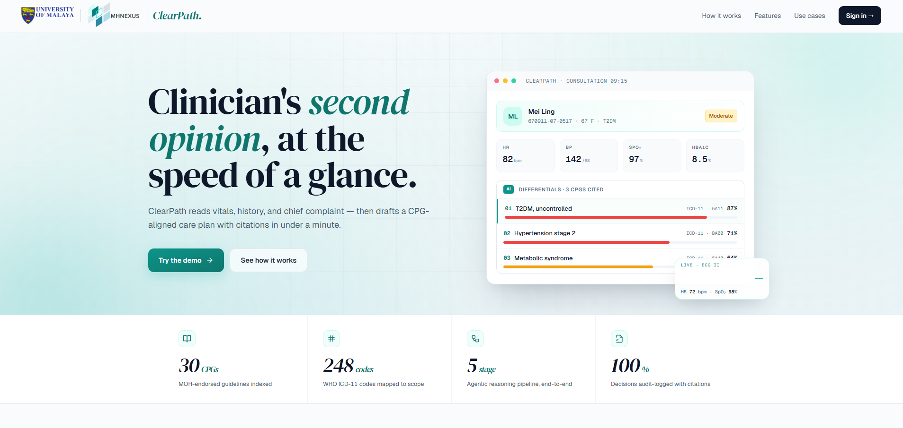
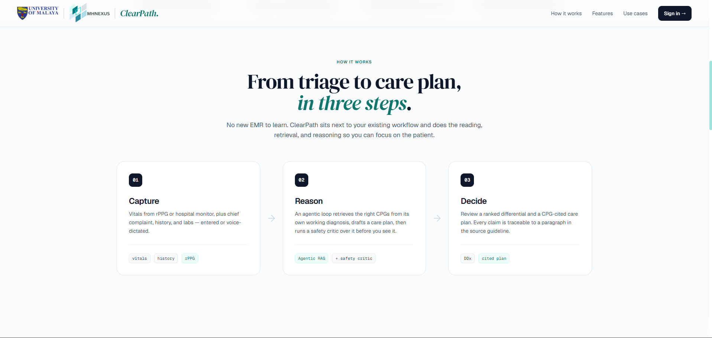
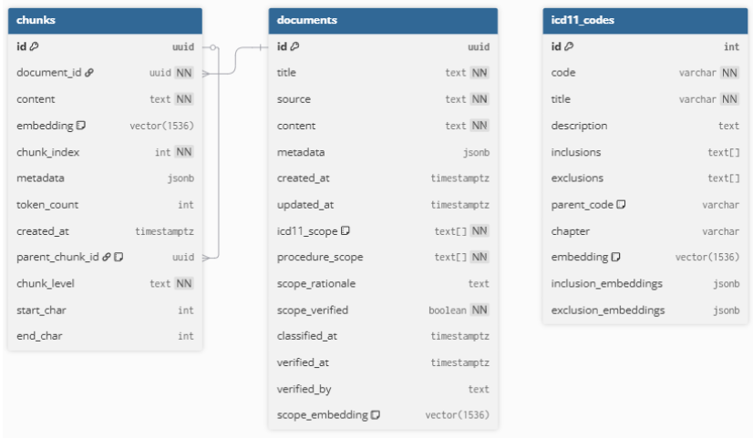
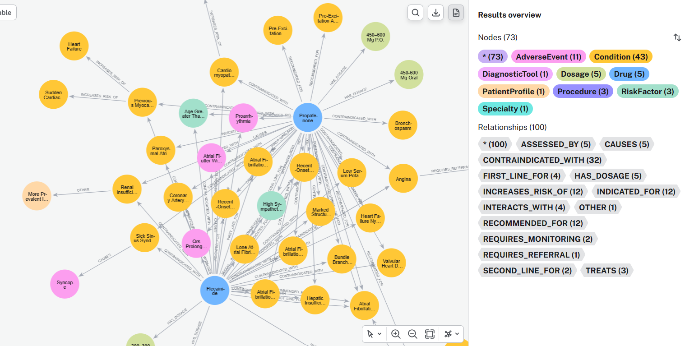
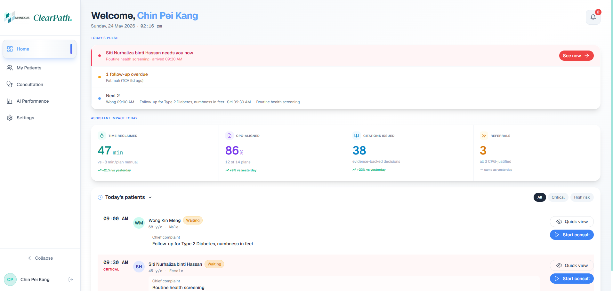
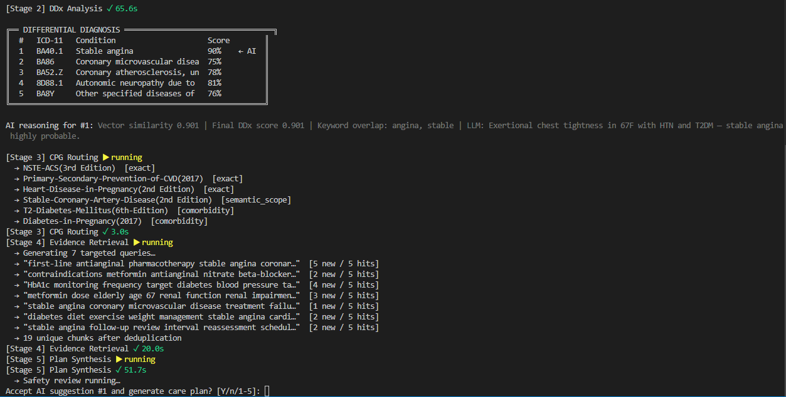

<p align="center">
  <strong>CODEX COMMUNITY MEETUP · KUALA LUMPUR 2026</strong>
</p>
<p align="center">
  
</p>
<p align="center"><strong>Clinician's second opinion, at the speed of a glance.</strong></p>
<p align="center">
  <i>An evidence-based clinical decision-support system grounded in Malaysia's Clinical Practice Guidelines (CPGs)</i>
</p>
<p align="center">
  
  
  
  
  
  
  
  
</p>

<p align="center">
  
</p>

---

## Overview

**ClearPath** turns complex patient information into a **citation-traceable, safety-checked care-plan draft** — automatically, inside the consultation, with no visible search step.

> **Why doctors skip guidelines:** not carelessness. Checking a 100+ page CPG mid-consult is too slow for a 10-minute window and socially awkward in front of a patient — so doctors default to memory, which silently drifts from the guideline over time. Passive "search-when-asked" AI tools repeat that failure. ClearPath instead **surfaces** a grounded, safety-critiqued plan at the moment of decision.

**At a glance**

- **Deterministic CPG routing** — a six-level ladder (D1–D6) maps ICD-11 diagnoses to verified guidelines with no LLM guesswork in the routing decision.
- **Scoped, evidence-graded retrieval** over **30 Malaysian MoH CPGs** in a pgvector store — no cross-guideline contamination.
- **Neo4j knowledge graph** of drug / condition / parameter relationships powers an independent structural safety check.
- **Live literature layer (EBM)** — graded, recent evidence pulled from Europe PMC at consult time and folded into the plan through a two-pass refine.
- **Hybrid adversarial safety critic** — an LLM clinical-pharmacist and the knowledge graph review the plan in parallel; any CRITICAL/MAJOR flag blocks sign-off.
- **Fully observable** — OpenTelemetry, Jaeger, and Logfire trace every stage and LLM call; one request ID links the trace, event log, timings, and clinician feedback.
- **Telegram follow-up agent** — post-consult check-ins, tripwire triage, and appointment reminders, entirely outside the clinical pipeline.
- **Multimodal intake** — contactless vitals from the camera (rPPG) and voice-to-SOAP transcription (STT) capture the patient record without extra typing.
- **Two front-ends, one contract** — a React clinician workspace and a terminal driver stream the identical Server-Sent Events pipeline.

---

## The Problem

ClearPath addresses three point-of-care bottlenecks, turning each clinical friction into a structured capability.

### 1. Adherence Gap
- Manual CPG search is too slow for a 10-minute consult.
- Pausing to search looks unsure in front of the patient.

*Consequence:* the doctor defaults to memory instead → guideline drift goes uncaught, silently.

**ClearPath's answer:** deterministic scoped routing + multi-query retrieval (Stages 3–4) — guideline-grounded evidence surfaces automatically, with no visible search step.

### 2. Multimorbidity Reconciliation
- Each CPG is written for a single condition, standalone.
- A comorbid patient needs 2–3 CPGs merged manually.

*Consequence:* dosing and threshold conflicts clash between conditions → left for the doctor to resolve alone, under time pressure.

**ClearPath's answer:** contextual DDx re-ranking + clinician-named boost + interactive override (Stages 2 & 5), tailored to age, sex, comorbidities, and current medications.

### 3. AI Trust Gap
- Generic AI summarises CPG text with no source shown, and no actionable plan.
- No check for hallucinated or wrong claims.

*Consequence:* the doctor can't verify the output against the real guideline → the output stops at text, and the doctor still builds the plan alone.

**ClearPath's answer:** a hybrid adversarial safety critic (Stage 6) — LLM and knowledge-graph review in parallel, every recommendation citation-traced, sign-off blocked on any critical flag.

---

## The Solution

**ClearPath** is a Malaysian CPG-grounded clinical decision-support system that converts static, multi-hundred-page guidelines into an automated, moment-driven pipeline — minimising documentation time, safeguarding patient care, and letting doctors spend their hours **with patients, not paperwork**.

<p align="center">
  
</p>

---

## System Architecture

ClearPath is a **hybrid deterministic + agentic pipeline**: every routing, retrieval, and safety decision that *can* be deterministic **is** deterministic; LLMs are reserved for clinical reasoning and are **always grounded** against retrieved CPG chunks, knowledge-graph edges, and — where relevant — live literature. All stages stream to clients through a single Server-Sent Events (SSE) channel with a shared `emit` contract, so the React Doctor UI and the terminal `clinical_cli.py` driver render identically.

<p align="center">
  
</p>

```
  Stage 1   Patient Intake            Vitals (manual / rPPG), history, CC, allergies,
                                      current meds, staged comorbidities, prior-visit summary
     │  PatientCase JSON (+ derived BMI)
     v
  Stage 2   DDx Extraction            Symptom -> ICD-11. Mode A/B detector, seed-pinned
            (LLM rerank)              extraction, CC-boost (name->ICD resolver), pgvector over
                                      3,914 codes, contextual rerank, sibling-cluster collapse
     v
  Stage 3   CPG Scope Routing         Deterministic D1->D6 ladder (exact -> sibling -> ancestor ->
            (deterministic)           semantic pgvector -> out-of-scope). Sex filter + staged-
                                      comorbidity short-circuit. No LLM.
     v
  Stage 4   Scoped Retrieval          3-7 targeted queries -> scoped pgvector (document_id pinned)
            (LLM query-gen)           -> H3->H2->H1 hierarchical prefetch -> cross-reference resolver
     v
  Stage 4.5 KG Inject                 Neo4j Cypher: drug-class expansion + comorbidity aliasing.
            (deterministic)           Contraindication flags + PREFER (first / second-line) edges
     v
  Stage 4.6 EBM Literature Fetch      Live Europe PMC query (disease + plan terms), pub-type +
            (live API, NEW)           recency filtered, graded onto a three-tier evidence pyramid
     v
  Stage 5   Care-Plan Synthesis       Pydantic-validated 8-section TreatmentPlan + 8-layer
            (LLM)                     post-synthesis validator chain (dedup, harmonisation, gaps)
     v
  Stage 5.5 EBM Refine (NEW)          Re-synthesise the plan with CPG + KG + literature block —
            (LLM)                     literature backs recs, or fills gaps where CPGs are silent
     v
  Stage 6   Hybrid Safety Critic      asyncio.gather( LLM clinical-pharmacist critic,
            (LLM + KG)                Neo4j structural verifier ). Merged WITHOUT dedup;
                                      safe_to_proceed = no CRITICAL/MAJOR across the union
     v
  Live transparent clinician UI (SSE) -> override -> re-synthesis -> optional Gmail PDF delivery
```

<details>
<summary><strong>Per-stage detail (click to expand)</strong></summary>

- **Stage 1 — Intake.** Vitals are captured either manually or **contactlessly from the camera via rPPG** (remote photoplethysmography — pulse, SpO₂, respiratory rate, no cuff or probe), and the consultation can be **voice-recorded and transcribed to a SOAP note (STT)** with speaker diarisation, written straight into clinical notes (audio is deleted the moment it is transcribed). History, labs, chief complaint, allergies, current meds, and staged comorbidities complete the `PatientCase`.
- **Stage 2 — DDx.** Symptom-framed visits (Mode A) hit an LLM extractor; task-framed visits (Mode B — post-PCI, antenatal booking, medication review) use a deterministic template to kill cross-rerun jitter. A four-layer determinism stack (seed-pinning, ~60-alias regex disease→ICD fallback, phrase cache, Mode-B bypass) plus a CC-boost that resolves clinician-named diagnoses via `search_ddx` (**never** trusting LLM-emitted ICD codes) stabilise the candidate pool.
- **Stage 3 — Routing.** D1 exact ICD → D2 sibling → ancestor → semantic pgvector (threshold 0.32, calibrated) → out-of-scope. A sex-incompatibility filter routes male patients away from obstetric / women-only CPGs; a staged-comorbidity short-circuit skips the ~4 s vector path for already-confirmed ICDs.
- **Stage 4 — Retrieval.** LLM drafts 3–7 CPG-scoped queries; pgvector search is pinned by `document_id_filter`; a hierarchical prefetcher carries grandparent headers so evidence levels and Malaysian-context callouts ride along; a cross-reference resolver follows inline §-anchors.
- **Stage 4.5 — KG inject.** Candidate drugs **and** the patient's current meds expand to knowledge-graph class names so class-level edges (e.g. `ARB → CONTRAINDICATED_WITH → Pregnancy`) fire; comorbidity strings are aliased to canonical KG forms; a PREFER arm surfaces first / second-line recommendations.
- **Stage 4.6 — EBM literature (live).** Not ingested — a live Europe PMC search at consult time, filtered to systematic reviews / meta-analyses / RCTs / guidelines within a recency window, graded high / moderate / low. Fail-open, and cached only to cut latency.
- **Stage 5 / 5.5 — Synthesis + refine.** An 8-section executable plan (Clinical Summary, Medications, Procedures, Monitoring, Lifestyle, Referrals, Safety Netting, Follow-up), each rec stamped with its *original* MoH grading scheme (ESC / USPSTF / SIGN50 — never cross-normalised), passed through an 8-layer validator chain, then refined against the literature block.
- **Stage 6 — Hybrid safety critic.** An LLM clinical-pharmacist critic (allergies, drug–drug interactions, organ-impairment dosing, absolute contraindications) and a Neo4j structural verifier run in parallel; flags **merged without dedup** so a graph-only violation surfaces even when no CPG paragraph mentions it.

</details>

---

## Dual-Database Foundation

ClearPath's robustness comes from **two purpose-built stores**, each doing what it does best — a vector database for *semantic recall* and a graph database for *structural reasoning*. Building and curating both was the bulk of the engineering effort.

<table width="100%">
  <tr>
    <td align="center" width="50%"></td>
    <td align="center" width="50%"></td>
  </tr>
</table>

<table width="100%">
<tr><th align="left" width="50%">Vector database — Retrieval</th><th align="left" width="50%">Knowledge graph — Reasoning</th></tr>
<tr valign="top"><td>

**What it contains**

The full text of all 30 Malaysian MoH clinical practice guidelines, broken into passages and stored as meaning-based vectors, alongside the complete ICD-11 diagnosis catalogue (3,914 codes) and its hierarchy.

**What it serves**

Given a patient's diagnoses, it finds the exact guideline passages that apply — quickly, and scoped only to the relevant guidelines so no unrelated advice leaks in. This is the "recall" half of the system: what does the guideline actually say for this patient.

**Why it's robust**

Tuned so it never silently misses the correct guideline, and locked to the routed guidelines so retrieval cannot drift across unrelated conditions. Extending coverage to a new guideline needs no costly re-processing of the rest.

</td><td>

**What it contains**

A curated map of how drugs, conditions, and monitoring requirements relate to one another — which drugs are unsafe in which conditions, which interact, and what each condition must be monitored for.

**What it serves**

An independent safety check that reasons over *relationships* rather than text — catching, for example, that a whole drug class is unsafe in pregnancy even when no single guideline paragraph says so outright. This is the "verify" half: does the plan hold up structurally.

**Why it's robust**

Relationships are extracted from guideline text under strict guard rails to avoid false links, kept scoped to the relevant guidelines, and the whole layer fails safe — if the graph is briefly unavailable, the plan still generates.

</td></tr>
</table>

Both stores are populated by a single **CPG ingestion pipeline** — guideline PDFs become searchable passages on one side and structured drug/condition relationships on the other:

<p align="center">
  
</p>

> A **third evidence source — live Europe PMC literature (EBM)** — is deliberately *not* stored: it is fetched fresh each consult so it never goes stale, and discarded after the plan is built.

---

## Beyond the Core Pipeline

The clinical pipeline is wrapped in production-grade infrastructure — each of these was a distinct engineering track:

- **EBM literature layer.** Stages 4.6 / 5.5 inject graded, recent Europe PMC evidence into synthesis so recommendations are *backed by* the literature and, where **no routed CPG covers a question**, can be *extended by* it (clearly tagged, never silently overriding a CPG). Europe PMC hits are split into **international guideline** vs **supporting EBM** records, surfaced in a standalone **Evidence & Literature** panel in the UI.
- **International guidance comparison.** An optional, clinician-gated layer: turning on **Activate international guidance** at diagnosis, then **Compare international**, renders a side-by-side panel weighing the routed **Malaysian MoH plan baseline** (formulary, access, referral pathways) against the live international guideline and EBM records retrieved for the case. The local CPG stays authoritative — nothing changes until a clinician explicitly approves a mapped recommendation.
- **Telegram follow-up ecosystem** (`backend/agent/followup/`). A post-consultation check-in loop entirely outside the Stage 2–6 pipeline: QR-token enrollment, an LLM-generated check-in schedule, regex **tripwires** + LLM triage on patient replies (fail-safe = *escalate*), and deterministic appointment reminders keyed off the real calendar. Two-way, but the send path is LLM-free.
- **Full observability** (`backend/agent/tracing.py`). OpenTelemetry spans for FastAPI requests, every pipeline stage, every LLM call (via Logfire — capturing prompts, completions, token counts), pgvector queries, and Bedrock embeddings — viewable locally in **Jaeger**, no account needed. Env-gated and zero-overhead when off.
- **Resilience & traceability.** A single `X-Request-ID` correlates the Jaeger trace, the rotating SSE event log, per-stage `pipeline_timings`, machine-harvested pipeline signals, and clinician feedback. Plus a replayable failed-job log, per-stage transient-only retries, and fingerprint-keyed checkpoint / resume.
- **Deterministic Gmail delivery.** Approved care-plan PDFs are consent-checked, PHI-subject-validated, and SMTP-sent to patients — **no LLM in the loop**.
- **Continuity.** A pre-consultation **prep brief** (a 30-second orientation for returning patients) and a **prior-visit summary loop** thread context across visits.

---

## Interface

The React Doctor UI and the terminal `clinical_cli.py` driver share an identical SSE contract — every event (`stage_start`, `ddx`, `routing`, `retrieval`, `plan`, `safety_review`, `final_result`, `out_of_scope`) renders in both surfaces.

<table width="100%">
  <tr>
    <td align="center" width="50%"><strong>Doctor UI — Clinician Workspace</strong></td>
    <td align="center" width="50%"><strong>clinical_cli.py — Terminal Orchestrator</strong></td>
  </tr>
  <tr>
    <td align="center" valign="top"></td>
    <td align="center" valign="top"></td>
  </tr>
  <tr>
    <td align="left" valign="top">
      A 4-step consultation wizard (Input → Diagnosis → CarePlan → Output) with an SSE-streamed pipeline trace, one-click clinician override that re-fires synthesis, DB-backed workflow analytics, and an 8-section plan renderer with a Stage-6 safety banner.
    </td>
    <td align="left" valign="top">
      The same pipeline without a UI: structured intake, deterministic D1–D6 scope verification, and an override harness that executes real-time re-synthesis over the identical SSE contract — ideal for judging and reproducible runs.
    </td>
  </tr>
</table>

---

## Validation & Measured Results

These are **measured pilot results**, not aspirational targets. Evaluation runs through a **RAGAS-style layered evaluation framework we built in-house**, scored against **clinician-validated gold sets** curated for each layer over the **30 Malaysian MoH CPGs** and their ICD-11 routing relationships. Evidence sources are the CPG corpus and the knowledge graph, plus live Europe PMC literature — there is **no UpToDate or AHA/ESC integration**. Every number below is reproducible from the eval harness.

| Layer | Metric | Target | Achieved | Verdict |
|---|---|---|---|---|
| **A1 — DDx** | Hit@5 / MRR | ≥0.90 / ≥0.70 | **0.971 / 0.810** | Pass |
| **A2 — Routing** | Top-1 | ≥0.85 | **1.000** (44/44) | Pass |
| **B — Retrieval** | Recall@10 / Hit@10 | ≥0.85 / ≥0.95 | **0.874 / 0.953** | Pass |
| **B — Retrieval** | nDCG@10 / MRR | ≥0.75 / ≥0.70 | 0.669 / 0.682 | Short (diagnosed) |
| **B — Retrieval** | Precision@5 | ≥0.50 | 0.251 | Short (graded gold dilutes) |
| **C — Re-ranker** | nDCG@10 lift | >0 | **+6.0%** | Directional pass |
| **D — Faithfulness** | Mean per-claim grounded | ≥0.90 | 0.864 (849/979 claims) | Short (diagnosed) |
| **Scope refusal** | Orphan refusal | 100% | **11/11** | Pass |
| **SAF — Safety critic** | Sensitivity / Specificity | >90% / 100% | **92% / 100%** | Pass |
| **ADV/INJ/LNG** | Adversarial + injection + multilingual | ≥85% | **14/14** | Pass |
| **SIL/INF** | Fail-loud on silent degradation + infra outage | 6/6 | **6/6** | Pass |
| **Determinism** | Top-1 stability (dominant dx) | Stable | **10/10** (cases 8, 9) | Pass |
| **Latency** | End-to-end | <5 min budget | **~2.1 min** (pilot) | Pass |
| **Coverage** | In-scope backend lines | ≥60% | **64.93%** (355 tests, 174 s) | Pass |

Read honestly: routing, retrieval recall, scope refusal, safety-critic recall, robustness, determinism, and latency all meet target; DDx meets target on the clinically meaningful lineage metric; **faithfulness and retrieval-ranking fall a measured, stated distance below target** — reported rather than hidden.

### Blinded clinician evaluation

Five practising doctors scored ClearPath against **Qmed AskCPG** and **NotebookLM** in blinded, randomised order across three cases, on a 1–5 scale over 8 clinical-quality + 6 workflow aspects:

- **ClearPath led every clinical-quality dimension.** Safety **4.93/5**, Guideline Fidelity **4.85**, Reasoning Transparency **4.82**. Widest margin was **Uncertainty Handling** (+0.80 over Qmed AskCPG) — its structured referral injection + explicit unresolved-question surfacing.
- **Workflow.** Reasoning visibility **5/5** and override / feedback **5/5** (ceiling) validated the transparency-and-control thesis. Time-to-answer scored **3+/5** — evaluators judged synthesis too slow for live in-consult use, recommending **post-consult review / teaching** as the near-term deployment context.

> **Caveat on scope.** Pilot-scale results (3 end-to-end cases, 5 evaluators). They supersede the *aspirational* placeholder figures (87% accuracy, 6.2 CoT depth, 4.3/5 confidence) still in `EVALUATION_FRAMEWORK_README.md` — do not cite those as results.

---

## Future Enhancements

Planned work to deepen the retrieval-and-reasoning core and further enforce grounding:

- **Knowledge-graph expansion.** Enrich the graph with drug–drug interaction relationships drawn from citation-attributed pharmacology references, complementing the relationships already extracted from guideline text and closing known gaps where guidelines assume baseline pharmacology knowledge.
- **Longitudinal memory loop.** A per-patient memory that carries structured history, prior plans, and outcomes across visits into the retrieval context — so recommendations compound on what is already known about the patient rather than starting cold each consult.
- **Feedback-reinforced retrieval.** Turn captured clinician feedback (approvals, overrides, edits) into a signal that reranks which guideline passages and recommendations surface first — a closing loop that makes the system sharper with use.
- **Semantic caching.** A meaning-aware cache over recurring question and plan shapes to cut latency and cost without weakening grounding.
- **Corpus growth and confidence tiers.** Extend beyond the current 30 CPGs and add per-recommendation confidence tiers in the UI so clinicians can triage which recommendations to action first.

---

## Built with Codex + GPT-5.6

ClearPath is a big system for a hackathon — a multi-stage clinical pipeline, a dual database, a live literature layer, a React UI, a Telegram companion, full observability, and a layered eval harness. **Codex (GPT-5.6) built it.** The free GPT-5.6 quota was our single biggest accelerant, letting a tiny team ship what is otherwise a semester of work — genuine thanks for the compute.

**We routed each job to the right GPT-5.6 model:**

| Model | What it built |
|---|---|
| **Sol** | The safety-critical core: the hybrid LLM + knowledge-graph safety critic, the deterministic D1–D6 routing ladder, the two-pass EBM refine, and the 8-layer validator chain. |
| **Terra** | The supporting systems: the CPG ingestion pipeline behind the dual database, the Telegram follow-up ecosystem, the eval analysis against gold sets, and the docs. |
| **Luna** | The high-volume glue: unit tests, SSE event wiring, ICD-11 alias tagging, and routine summaries. |

**And we drove it through Skills and Sub-agents, not one long chat:**

- **Skills gave every task a method.** `brainstorming` settled the design before any code; `test-driven-development` started each rule as a failing test (hence 500+ tests behind a coverage gate); `systematic-debugging` turned "KG returns 0 flags" into reproduce → isolate → fix; `verification-before-completion` meant nothing was "done" until the command ran and its output was shown — the eval numbers above are a direct result.
- **Sub-agents ran in parallel.** `code-explorer` mapped a subsystem before edits landed, `code-architect` turned specs into blueprints, `root-cause-debugger` owned regressions, and `code-reviewer` vetted every chunk — while `dispatching-parallel-agents` ran independent workstreams at once, so wall-clock time tracked the *longest* task, not the *sum*.

The payoff: the right model on the right problem, little rework, and free compute spent breadth-first across the whole system.

---

## Quickstart (judging / testing)

```bash
# 1. Backend (FastAPI + SSE)
cd backend
python -m venv ../venv && ../venv/Scripts/activate      # venv lives at the repo root
pip install -r ../requirements.txt
cp .env.example .env                                     # fill Supabase / Neo4j / Bedrock / LLM keys
python -m agent.api                                      # serves on APP_PORT (default 8000)

# 2. Frontend (Vite + React)
cd frontend/doctor-ui
npm install && npm run dev

# 3. Terminal driver — exercises the same SSE pipeline, no UI needed
python backend/clinical_cli.py

# 4. Sample cases (backend running) — ready-made patient vignettes
python backend/scripts/run_eval_case_10.py               # the pregnancy + HTN + GDM worked example above
```

**Tests:** `cd backend; pytest` (coverage-gated). **Local traces:** open Jaeger at `http://localhost:16686` with `OTEL_TRACING_ENABLED=true`.

---

<p align="center"><i>ClearPath — built for Malaysian primary care. Guideline-grounded, safety-checked, and auditable end to end.</i></p>
