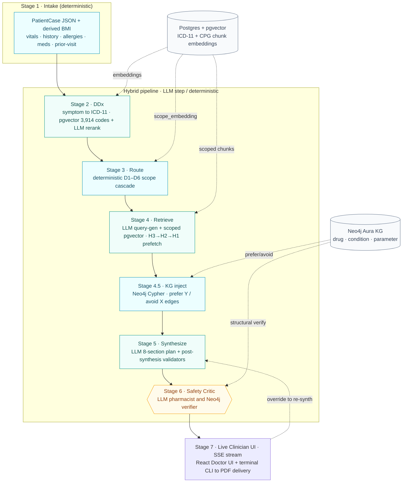
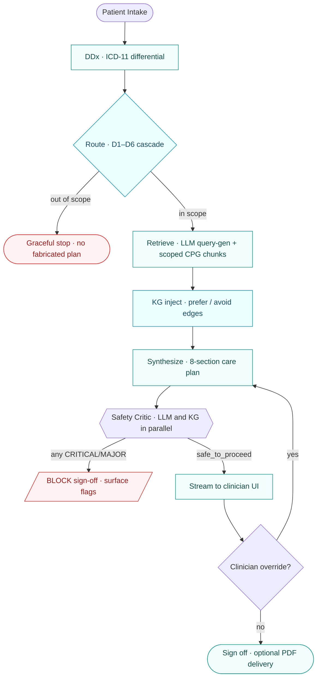
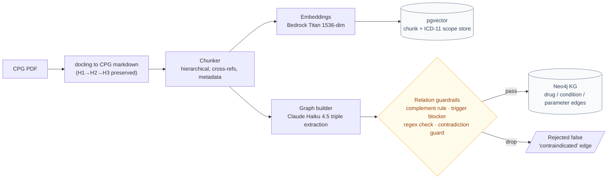
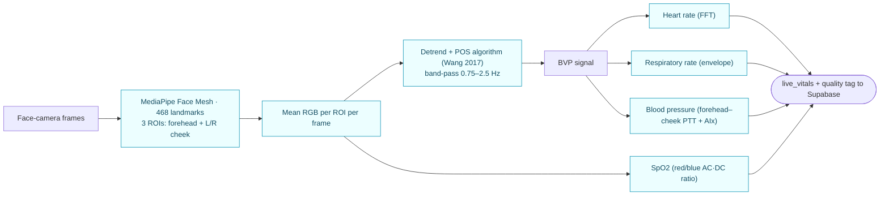
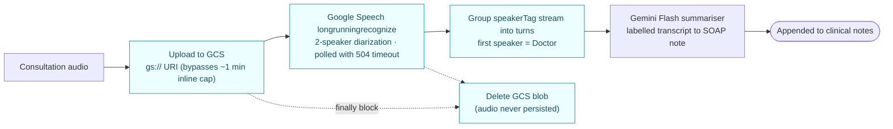
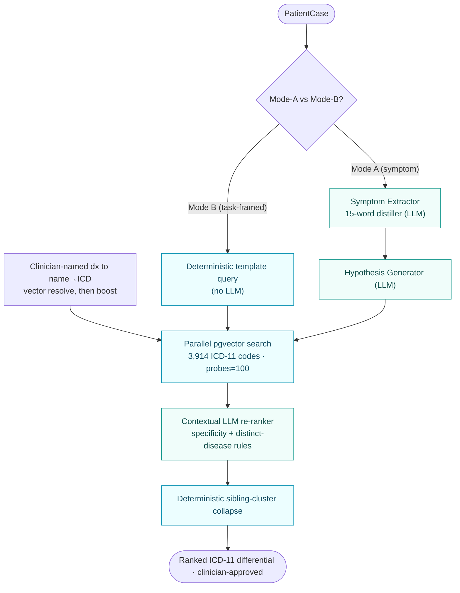
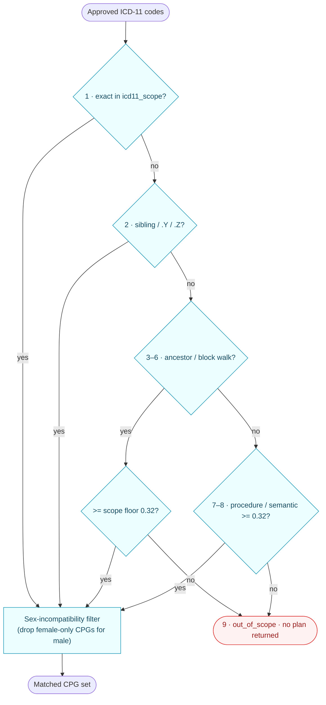
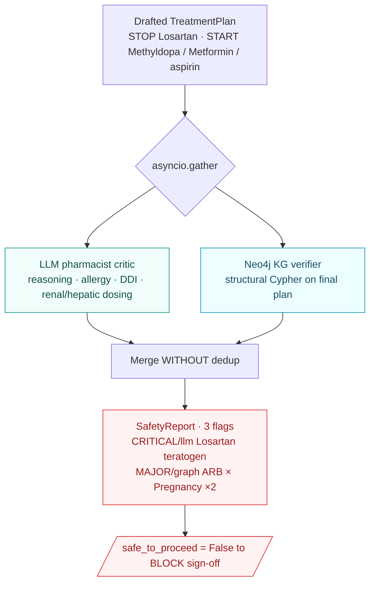
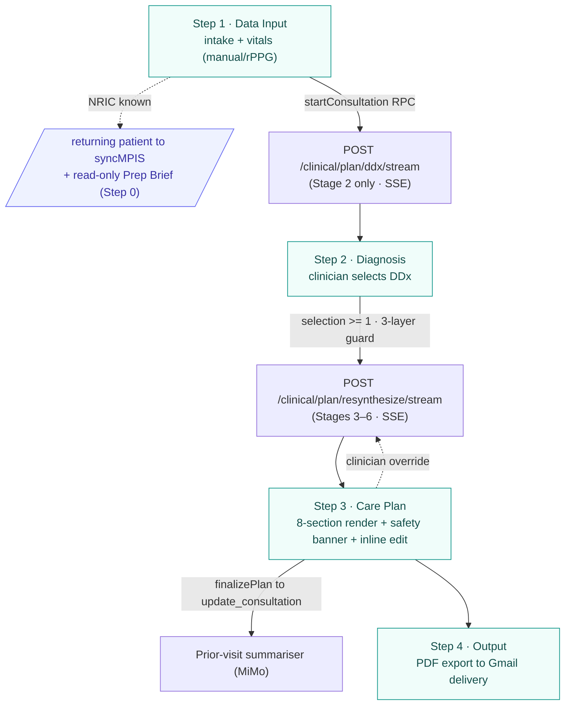
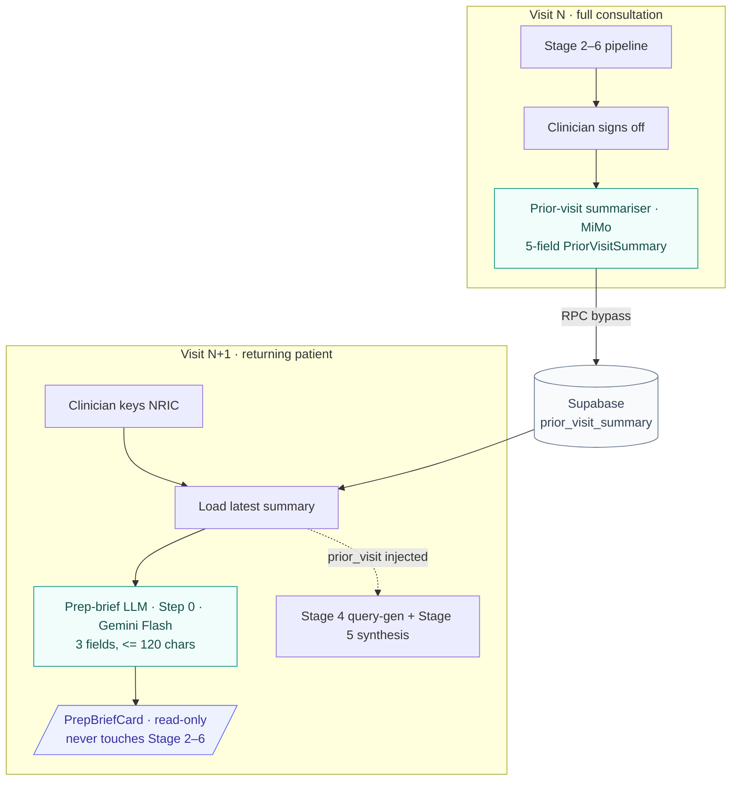

# CHAPTER 3: DETAILED DESIGN

## 3.1 Overall System Architecture

ClearPath was implemented as an integrated, cloud-native clinical decision-support system that
produces an audited, executable care plan from a single patient consultation, with the explicit
constraint that the entire process must complete inside a ten-minute consultation window. Rather
than routing a clinical question through a single large language model, the system was architected
as a hybrid deterministic-agentic pipeline. Every routing, retrieval, and verification decision
that could be expressed as a deterministic rule, a vector computation, or a graph query was
implemented as such, and a language model was reserved only for the steps that require genuine
clinical reasoning. This principle, which we summarise as "deterministic wherever possible,
generative only where necessary", governed the design of every stage, because it is the property
that makes the system's output auditable, reproducible, and safe to operate in a setting where no
senior clinician or pharmacist is present to catch an error.

The pipeline consists of seven primary stages that operate as a continuous data-processing chain.
Each stage transforms one typed, validated object into the next, and each stage streams its
progress to the clinician in real time. The conceptual architecture and the high-level data flow
between the stages are shown in Fig. 3.1, which serves as the master reference for the detailed
specifications that follow in this chapter.

> **[FIGURE 3.1: Conceptual architecture of the ClearPath system.]**
> *Insert the full-width 7-stage pipeline flowchart by rendering the Mermaid source in §3.1.1
> (diagram D-ARCH) at high export scale. The figure shows Stage 1 Intake, Stage 2 DDx, Stage 3
> Route, Stage 4 Retrieve, Stage 4.5 KG inject, Stage 5 Synthesize, Stage 6 Safety Critic, and
> Stage 7 Delivery, with the two grounding stores (pgvector and Neo4j) drawn as side cylinders and
> the two decision branches (out-of-scope stop and safety block) marked.*

As shown, the system operates as a directed pipeline in which each stage carries a single,
well-defined responsibility:

- **Stage 1, Clinical Intake (deterministic).** The process begins at the clinician's workspace,
  where patient demographics, history, current medications, allergies, and vital signs (captured
  either manually or contactlessly through remote photoplethysmography) are assembled into one
  typed `PatientCase` object. This object is the canonical input consumed by every downstream
  stage.
- **Stage 2, Differential Diagnosis (LLM-assisted).** The patient's symptom narrative is
  distilled, embedded, and matched against the World Health Organization ICD-11 catalogue of 3,914
  diagnosis codes through a parallel vector search, then re-ranked by a context-aware language
  model into a clinician-approvable shortlist of named diagnoses.
- **Stage 3, Deterministic Scoped Routing (deterministic).** Each confirmed ICD-11 code is
  resolved to the set of Malaysian Ministry of Health (MoH) Clinical Practice Guidelines (CPGs)
  that govern it, through a deterministic multi-tier cascade. When no guideline applies, the
  system declares the case out of scope and returns no plan rather than fabricating one.
- **Stage 4, Evidence-Graded Scoped Retrieval (LLM-assisted).** A language model writes focused
  search queries, which are executed against the vector store strictly scoped to the routed CPGs
  so that no evidence from an unrelated guideline can enter the result set. Hierarchical section
  context and cross-referenced passages are retrieved alongside each matched chunk.
- **Stage 4.5, Pre-Synthesis Knowledge-Graph Injection (deterministic).** A Neo4j knowledge graph
  is queried for the structural "prefer this drug, avoid that drug" relationships that the
  retrieved prose may not state explicitly.
- **Stage 5, Care Plan Synthesis (LLM-assisted).** A language model assembles the patient data,
  the retrieved evidence, and the graph constraints into a Pydantic-validated, eight-section
  executable care plan, which then passes through an eight-layer deterministic validator chain.
- **Stage 6, Hybrid Adversarial Safety Critic (hybrid).** Two independent graders, an LLM
  clinical-pharmacist critic and a deterministic Neo4j plan-verifier, audit the finished plan in
  parallel, and either grader can block sign-off.

The audited plan and its safety report are then streamed to the clinician over a single
Server-Sent Events (SSE) contract that is shared identically by the React Doctor UI and the
terminal CLI. After review, the clinician may override and re-synthesise, sign off, and optionally
deliver a localized PDF to the patient (Stage 7).

### 3.1.1 The deterministic and agentic split

A defining characteristic of the architecture, and one that distinguishes it from a conventional
retrieval-augmented-generation (RAG) chatbot, is the deliberate and audited separation between
deterministic steps and language-model steps. Only four of the core pipeline stages issue a
language-model call; the remainder are rule-based, vector-based, or graph-based and are therefore
fully reproducible. Table 3.1 records this split explicitly, because the integrity of the system
depends on it being stated accurately rather than overstated.

**Table 3.1: Per-stage deterministic versus LLM classification (verified against source).**

| Stage | Job | Engine | LLM call |
|---|---|---|---|
| 1, Intake | Assemble `PatientCase`, derive BMI | Typed assembly, rPPG/manual vitals | No |
| 2, DDx | Symptom to ICD-11 differential | pgvector over 3,914 codes, plus LLM rerank | Yes (rerank) |
| 3, Route | Scope to verified CPGs | Deterministic 9-tier cascade | No |
| 4, Retrieve | Pull evidence-graded chunks | LLM query-gen, then scoped pgvector | Yes (query-gen) |
| 4.5, KG inject | "prefer Y, avoid X" edges | Neo4j Cypher | No |
| 5, Synthesize | 8-section care plan | LLM, then post-synthesis validators | Yes (synthesis) |
| 6, Critic | Independent safety audit | LLM pharmacist and Neo4j verifier | Yes (LLM arm) |

None of these LLM steps is an autonomous agent in the strict sense; there is no self-directed tool
use and no open-ended looping. Each is a single-pass language-model call embedded inside a
deterministic orchestration. The component that most closely matches the definition of an agent is
the Stage 6 safety critic, which independently reviews the finished plan and holds veto power over
sign-off, following the established critic pattern. This distinction is maintained consistently
throughout the report so that the system is neither under-described nor over-claimed.

This split also underpins the system's transparency design. Because each stage is a discrete,
typed step rather than one opaque generation, every intermediate decision can be exposed as part of
an auditable chain of thought, which is documented in detail in §3.11.4.

> **[FIGURE 3.2: Pipeline overview with decision branches.]**
> *Insert Mermaid diagram D-FLOW (§3.1.2). This is the compact happy-path view together with the
> two branch points, the out-of-scope stop and the safety block, suitable as a smaller inset
> beside Fig. 3.1.*

### 3.1.2 Diagram sources for §3.1

The two diagrams are reproduced as renderable Mermaid sources below. They render at
<https://mermaid.live>; teal denotes an LLM reasoning step, cyan a deterministic step, and amber
the safety-critic agent.

**Diagram D-ARCH, full 7-stage system architecture (Fig. 3.1):**



**Diagram D-FLOW, pipeline overview with the two distinctive branches (Fig. 3.2):**



---

## 3.2 Technology Stack

This section documents the implemented technology stack. The justification for selecting each
database and framework over its alternatives is presented in the concept-selection analysis of
Chapter 2 and is not repeated here; the purpose of this section is to record what was built and how
the pieces fit together.

The system is organised as three tiers connected by one streaming contract. The reasoning backend is
Python 3.11 on FastAPI, which exposes the entire pipeline over a single Server-Sent Events (SSE)
stream. The clinician frontend is a React 18, Vite, and Tailwind single-page application, and a
terminal CLI (`clinical_cli.py`) consumes the identical SSE stream for headless end-to-end runs.
Three data stores serve distinct roles: PostgreSQL with pgvector on Neon (the vector store), Neo4j
Aura accessed through Graphiti (the knowledge graph), and Supabase (the application and
patient-records store). All embeddings are produced by AWS Bedrock Titan at 1536 dimensions. The two
grounding stores are described in §3.2.2 and the application store in §3.11.6.

> **[FIGURE 3.3: Technology-stack strip.]**
> *Insert a horizontal logo strip (Python, FastAPI, React, Tailwind, PostgreSQL/pgvector on Neon,
> Neo4j Aura, Supabase, AWS Bedrock) with a one-line role label under each.*

### 3.2.1 Language-model composition: spending reasoning where it matters

ClearPath was implemented as a multi-model system, and the governing principle was to spend latency,
cost, and reasoning capacity only on the steps where they change output quality. Most pipeline steps
are bounded extraction, classification, or query-rewriting tasks that run inside the interactive
consultation, so they were assigned a fast, low-cost model in order to protect the ten-minute
consultation budget. The single step that carries the deepest reasoning load, care-plan synthesis,
was assigned a dedicated reasoning model, and the one-time offline graph build was assigned a cheap
model because it never runs in the live path. Table 3.2 records this tiering and the rationale for
each assignment.

**Table 3.2: Model assignment by tier (verified against `.env` and `providers.py`).**

| Tier | Stages / steps | Model | Why this tier |
|---|---|---|---|
| Fast (interactive) | Stage 2 symptom extraction and hypothesis generation; Stage 2 DDx rerank; Stage 4 query rewriting; Stage 6 LLM critic; prep brief; STT-to-SOAP summary | Gemini 2.5 Flash (1M context) | • Latency-sensitive, runs in the live consult<br/>• Bounded extraction or judgement, no heavy reasoning needed<br/>• Light "thinking" tokens only on rerank and critic<br/>• Critic kept off the synthesis model, so no self-grading |
| Reasoning (quality-critical) | Stage 5 care-plan synthesis; prior-visit summariser | MiMo v2.5 Pro (128k context) | • Deepest reasoning, longest evidence assembly<br/>• Output quality matters most here<br/>• Large context holds evidence + KG edges + patient state |
| Offline (one-time) | CPG triple extraction during ingestion | Claude Haiku 4.5 | • High-volume per-chunk extraction; cost scales with corpus size<br/>• §3.3.1 guards (not the model) catch false edges, so Sonnet/Opus adds cost for no gain<br/>• Offline on Bedrock |
| Embeddings | All vector representations (codes, chunks, scope) | Bedrock Titan Text v1 (1536-dim) | • Defines the shared vector space (codes, chunks, scope); all must use one model and dimension<br/>• 1536-dim v1 pinned to pgvector + ivfflat; switching (e.g. Titan v2) forces a full re-embed and re-index<br/>• Client cached against cold-start cost |

### 3.2.2 Data-store architecture and the dual-grounding philosophy

A deliberate and defining design decision was to ground the system's reasoning in two complementary
stores rather than one. This dual-grounding split is not incidental infrastructure; it is a core
architectural decision, because each store answers a different kind of clinical question that the
other cannot answer on its own. A third store, Supabase, holds the application's operational state,
but it is not a reasoning store and is owned by the frontend, so it is introduced here only briefly
and documented alongside the Doctor UI in §3.11.6.

- **Vector store, PostgreSQL with pgvector (Neon).** This store answers questions of semantic
  similarity, such as which ICD-11 code is closest to a given symptom narrative and which guideline
  passage is most relevant to a given query. It holds the 1536-dimension Titan embeddings of all
  3,914 ICD-11 codes, every CPG chunk, and each guideline's `scope_embedding`. It is well suited to
  fuzzy, meaning-based matching, but it is blind to structured relationships: it can establish that
  two passages read similarly, not that two drugs interact.
- **Knowledge graph, Neo4j Aura (through Graphiti).** This store answers questions of structural
  relationship, such as whether a drug is contraindicated in a condition, what monitoring a drug
  requires, and what the first-line therapy for a diagnosis is. The graph is a biomedical ontology
  of roughly 13,800 nodes across about eleven entity types (the largest being `Condition`,
  `Procedure`, `Drug` at approximately 1,630 nodes, `AdverseEvent`, `DiagnosticTool`, `RiskFactor`,
  `Dosage`, `PatientProfile`, and `Specialty`) connected by roughly 18,700 typed edges across about
  fifteen relation types, shown in Fig. 3.3c. The runtime pipeline queries the safety-relevant
  subset of these relations, principally `CONTRAINDICATED_WITH` (approximately 980 edges),
  `INTERACTS_WITH` (approximately 290), `REQUIRES_MONITORING`, `REQUIRES_REFERRAL`, and the positive
  prescribing edges (`FIRST_LINE_FOR`, `RECOMMENDED_FOR`, and similar). A graph traversal can
  therefore surface a hazard, such as a teratogen on the patient's current medication list, that no
  retrieved passage happens to mention, which is the gap a vector-only system cannot close.
- **Application store, Supabase (Postgres).** Held separately from both grounding stores, this
  contains the operational state of the clinic: clinician authentication, patient records,
  consultations, vitals history, prior-visit summaries, generated PDFs, and feedback signals. It is
  owned by the frontend (the FastAPI backend never reads it, with the single exception of the
  background delivery worker) and is documented with the Doctor UI in §3.11.6.

The resulting design can be stated as: vectors for semantic recall, a graph for structural safety,
and a separate operational database for everything stateful. The two grounding stores are built
offline (§3.3) and treated as read-only at consultation time, while the application store is read
and written during a live consultation. This dual-grounding design is what makes the dual-source
safety critic of §3.10 possible: the LLM arm reasons over the text retrieved from the vector store,
the KG arm reasons over the edges held in the graph store, and because the two arms fail in
different ways, a hazard that is invisible to one is still caught by the other.

The schema of the vector store is shown in Fig. 3.3b, and a safety subgraph of the knowledge graph
in Fig. 3.3c. The knowledge-graph edges are not bare links: each one carries its own provenance,
namely the evidence sentence it was extracted from, the source CPG document and chunk, a severity,
and, where the contraindication is conditional, a structured threshold (for example, contraindicated
when AF duration exceeds seven days). Fig. 3.3d shows this edge-level metadata, which is what makes a
knowledge-graph-sourced safety flag auditable back to the exact CPG sentence that produced it.

> **[FIGURE 3.3b: Vector-store schema (PostgreSQL with pgvector, Neon).]**
> *Insert an entity-relationship diagram of the three grounding tables `documents`
> (`icd11_scope`, `scope_embedding`), `chunks` (chunk text, embedding, section hierarchy,
> cross-refs), and `icd11_codes` (code, title, parent_code, embedding). Generate it as a real
> diagram, not a screenshot, with these steps:*
> 1. *Export the schema DDL of only the relevant tables:*
>    `pg_dump --schema-only --no-owner -t documents -t chunks -t icd11_codes "$env:DATABASE_URL" > pgvector_schema.sql`
> 2. *Open <https://dbdiagram.io>, choose **Import → PostgreSQL**, and paste `pgvector_schema.sql`.*
> 3. *Export the rendered ER diagram as PNG or PDF.*
> *Alternative (GUI): connect DBeaver to `DATABASE_URL`, select the three tables, right-click,
> "Generate ER Diagram", and export. The `vector` columns will appear as a `USER-DEFINED` type,
> which is expected.*

> **[FIGURE 3.3c: Knowledge-graph safety subgraph (Neo4j Aura, Warfarin example).]**
> *Insert the Neo4j screenshot of a single-drug ego network (Query 3 in
> `docs/kg_figure_queries.cypher`, run on Warfarin), showing the safety-relevant edges
> `CONTRAINDICATED_WITH`, `REQUIRES_MONITORING`, and `CAUSES` radiating from one drug. Tidy the
> layout, dismiss any duplicate condition nodes, and export PNG or SVG from the result panel's
> download icon.*

> **[FIGURE 3.3d: Knowledge-graph edge provenance (Neo4j Aura).]**
> *Insert the Neo4j screenshot of a selected `CONTRAINDICATED_WITH` edge with its property panel
> open, showing that each edge carries its evidence sentence (`evidence`), CPG citation
> (`source_document`, `cpg_chunk_id`), `severity`, and a structured conditional threshold
> (`threshold_param`, `threshold_op`, `threshold_value`, `threshold_unit`). Click any edge in the
> graph view to open this panel.*

---

## 3.3 Data Foundation and CPG Ingestion Pipeline

Before any consultation can be served, two grounding stores have to be built offline: the vector
store (ICD-11 codes and CPG passage embeddings, in pgvector) and the knowledge graph (drug,
condition, and parameter relationships, in Neo4j). The live pipeline only reads these stores; it
never writes to them. This section documents how a static MoH CPG PDF, often exceeding one hundred
pages, was transformed into queryable, structured knowledge.

> **[FIGURE 3.4: CPG ingestion pipeline.]**
> *Insert Mermaid diagram D-INGEST (below). This is the project's methodology figure, the
> software-system equivalent of a hardware build diagram.*

The corpus currently comprises approximately 30 Malaysian MoH Clinical Practice Guidelines spanning
the cardiovascular, metabolic, oncological, obstetric, and related domains. Each guideline was
processed through the following build sequence (`backend/ingestion/`), which combines deterministic
steps with one offline LLM extraction step:

1. **Markdown conversion.** The source PDF was converted to structured markdown using an isolated
   `docling` toolchain, preserving the heading hierarchy (H1 to H2 to H3) that later powers
   contextual retrieval.
2. **Hierarchical chunking (`chunker.py`).** The markdown was split into retrieval chunks that
   retain their position in the section tree, their cross-references (`§X.Y` anchors), and their
   metadata (evidence grade, and category drawn from a 13-value controlled vocabulary).
3. **Embedding (`ingest.py` to Bedrock Titan).** Each chunk was embedded to a 1536-dimension vector
   and written to pgvector under an ivfflat index.
4. **ICD-11 scope wiring.** Each guideline row in the `documents` table carries an `icd11_scope`
   array, the set of ICD-11 codes the guideline governs, together with a `scope_embedding` used by
   the semantic-fallback routing tier. This field is the basis on which Stage 3 routing is
   deterministic.
5. **Knowledge-graph construction (`graph_builder.py` to Claude Haiku 4.5).** A language model
   extracts `(subject, relation, object)` triples from the CPG prose into the biomedical ontology
   shown in Fig. 3.3c. The safety-relevant relations include
   `(:Drug)-[:CONTRAINDICATED_WITH]->(:Condition)`, `(:Drug)-[:INTERACTS_WITH]->(:Drug)`,
   `(:Drug)-[:REQUIRES_MONITORING]->(:DiagnosticTool)`, and
   `(:Condition)-[:REQUIRES_REFERRAL]->(:Specialty)`, alongside the positive prescribing edges such
   as `FIRST_LINE_FOR` and `RECOMMENDED_FOR`.

### 3.3.1 Relation-extraction guardrails

During development we found that the negative-edge extractor was the single largest source of false
safety flags. A language model tends to latch onto a "contraindicated" verb in a chunk and, finding
no explicit object in the sentence, silently substitutes the chunk's section heading as the object,
which manufactures a contraindication the guideline never stated. To prevent this class of
hallucinated edge from reaching Neo4j, four layered guards were implemented in `graph_builder.py`:

1. **Prompt-level explicit-complement rule.** A `CONTRAINDICATED_WITH` edge may be emitted only when
   the sentence contains an explicit `contraindicated <with|in|for|during|to> <noun>` complement; a
   bare "X is contraindicated" must not emit an edge.
2. **Prompt-level initiating-trigger blocker.** Clauses inside a "Drug X should be initiated when:"
   bullet list describe triggers for X, so no negative edge is emitted for other drugs named as
   preconditions inside those bullets.
3. **Code-level post-extraction complement check.** Any `CONTRAINDICATED_WITH` triple whose evidence
   sentence fails a complement-pattern match is dropped at extraction time with a warning.
4. **Code-level internal-contradiction guard.** When the same `(subject, object)` pair carries both a
   contraindication and a positive edge within one CPG, the conflict is logged for human review
   before the graph is written.

These guards operate at extraction time, so they keep bad edges out of the graph rather than
filtering them at runtime. That choice keeps the live safety-critic path fast and keeps the graph
itself trustworthy as a source of truth.

**Diagram D-INGEST, CPG ingestion pipeline (Fig. 3.4):**



---

## 3.4 Stage 1: Patient Intake and Vitals Ingestion

The pipeline initializes by aggregating all available patient data including demographics, medical
history, concurrent medications, allergies, vital signs, and prior-visit summaries into a unified,
strictly typed `PatientCase` object validated via Pydantic. This standardized schema centralizes
data ingestion, establishing a stable, immutable data contract for all subsequent processing stages
and eliminating the structural unreliability of ad-hoc dictionaries.

> **[FIGURE 3.5: Step 1 intake screen (Data Input).]**
> *Insert a screenshot of the Doctor UI consultation wizard Step 1, showing the
> demographics/history/medications form together with the vitals panel and the rPPG scan
> affordance.*

Derived clinical metrics, notably Body Mass Index (BMI), are computed symmetrically across both the
frontend and backend API to ensure consistent data structures regardless of the entry vector. This
redundancy guarantees that downstream clinical referral triggers, which strictly depend on BMI
thresholds, reliably receive populated values, preventing undefined state evaluations.

The principal fields of this contract are summarised in Table 3.3.

**Table 3.3: Principal fields of the standardized patient intake record (`PatientCase`).**

| Field | Purpose |
|---|---|
| `chief_complaint` | Required free-text presenting complaint and relevant history |
| `age`, `sex` | Patient age and biological sex |
| `comorbidities` | Free-text past and current diagnoses (legacy path) |
| `staged_comorbidities` | Structured comorbidities with confirmed ICD codes |
| `current_medications` | Current medication regimen |
| `allergies` | Known drug and substance allergies |
| `vitals` | Recorded vital signs (e.g. sbp, dbp, hr, spo2, bmi) |
| `severity_staging` | Structured disease severity staging (e.g. eGFR band, NYHA class) |
| `prior_visit` | Summary of the most recent prior consultation (returning patients) |

Most of these fields are entered directly in the Step 1 form. To reduce that manual burden, this
stage incorporates two independent, contactless capture subsystems. Architected as self-contained
engineering modules, they enrich the `PatientCase` prior to its ingestion into the core reasoning
pipeline: an rPPG subsystem populates the `vitals` map from a face-camera recording, and a
voice-intake subsystem derives the clinical-note narrative from a recorded consultation. Each is
documented below.

### 3.4.1 rPPG vitals-capture ecosystem

Remote photoplethysmography (rPPG) infers vital signs from a short face-camera recording, so that a
clinic with no pulse oximeter or sphygmomanometer to hand can still populate the vitals panel. The
proof-of-concept (`rppg-poc/rppg_vitals.py`) runs as its own FastAPI server with a WebSocket stream
and is surfaced in the Doctor UI as `RPPGScanModal.jsx`. Its output is written through
`saveLiveVitals` and `saveRPPGVitals` into the Supabase `live_vitals` table and is tagged with the
vitals source and a quality indicator.

> **[FIGURE 3.5b: rPPG signal-processing pipeline.]**
> *Insert Mermaid diagram D-RPPG (below), or a screenshot of the RPPGScanModal capture screen with
> the live HR, BP, and SpO2 read-out.*

The signal-processing chain was implemented as follows:

1. **Face landmarking.** MediaPipe Face Mesh (468 facial landmarks) isolates three anatomical
   regions of interest, the forehead and the two cheeks, which are averaged to improve the
   signal-to-noise ratio over a single region.
2. **Blood-volume-pulse (BVP) extraction.** The mean RGB time series of each region is detrended by
   regularised least squares and converted to a BVP signal by the POS algorithm
   (Plane-Orthogonal-to-Skin, Wang et al. 2017), with a second-order Butterworth band-pass of 0.75
   to 2.5 Hz (45 to 150 bpm) applied through zero-phase filtering.
3. **Heart rate** is read from the dominant frequency of the BVP periodogram (FFT).
4. **SpO2** is estimated from the ratio of the AC and DC components of the red and blue channels
   (`SpO2 ≈ 110 − 25 × ratio`), clipped to a physiological range.
5. **Respiratory rate** is recovered from the amplitude modulation of the BVP envelope, accepted in
   the 6 to 30 breaths-per-minute range.
6. **Blood pressure** is estimated from a pseudo pulse-transit-time proxy, namely the phase delay
   between the forehead and cheek BVP signals, combined with an augmentation-index correction
   applied to a baseline systolic and diastolic estimate.

Because rPPG estimates, and cuffless blood pressure in particular, are approximate, the values are
explicitly tagged with a quality and confidence indicator and treated as a screening aid the
clinician can override, rather than as a substitute for a measured cuff reading. This framing is
preserved in the UI so that the limitation is visible at the point of use.

**Diagram D-RPPG, rPPG signal-processing pipeline (Fig. 3.5b):**



### 3.4.2 Voice-intake (STT to SOAP) ecosystem

A full doctor and patient consultation can be recorded and turned into a structured SOAP note
appended to the clinical notes, so that the clinician's attention remains on the patient rather than
on typing. Like rPPG, this is intake tooling that never touches the Stage 2 to 6 pipeline. The audio
is never persisted: it is deleted immediately after transcription, with a one-day storage lifecycle
rule retained only as a crash safety net, and the transcript itself is not stored either.

> **[FIGURE 3.5c: Voice-intake (STT to SOAP) pipeline.]**
> *Insert Mermaid diagram D-STT (below). A screenshot of the GCS bucket is not recommended, because
> the staging bucket is emptied on every request and would show no meaningful state.*

The implementation (`POST /clinical/consultation/process`, with `gcs_audio.py` and
`summarise_consultation`) proceeds as follows:

1. **Upload to Google Cloud Storage.** The raw audio is uploaded to GCS and referenced by a `gs://`
   URI. This step is a non-obvious but necessary design choice, because Google Speech caps inline
   audio at approximately one minute, whereas a five to ten minute consultation must be passed by
   URI.
2. **Diarized long-running transcription.** Google Speech `longrunningrecognize` is invoked with a
   two-speaker diarization configuration, and the operation is polled to completion under a timeout
   that returns HTTP 504 rather than hanging.
3. **Blob cleanup.** The GCS object is deleted in a `finally` block regardless of outcome.
4. **Speaker grouping.** The word-level `speakerTag` stream is grouped into turns, with the first
   speaker labelled Doctor, producing a clean two-party transcript.
5. **SOAP summarisation.** A language model (`CONSULTATION_SUMMARY_MODEL`, Gemini Flash) condenses
   the labelled transcript into a SOAP-style note, which the frontend appends to the clinical notes
   field.

A separate lightweight endpoint, `POST /clinical/stt`, serves short dictation clips for the legacy
"dictate" mode. One operational subtlety is documented in the deployment notes: the Speech-to-GCS
read hop authenticates as Google Speech's own service agent rather than the backend's credentials,
and that agent must hold object-viewer permission on the bucket, an IAM binding that is easy to
overlook.

**Diagram D-STT, voice-intake transcription pipeline (Fig. 3.5c):**



---

## 3.5 Stage 2: Symptom-to-ICD-11 Differential Diagnosis

The objective of Stage 2 was to convert a free-text symptom narrative into a ranked,
clinician-approvable shortlist of named ICD-11 diagnoses (codes, not prose), drawn from the WHO
catalogue of 3,914 codes. The central engineering challenge is twofold: the Bedrock Titan embedding
space is biased toward generic symptom and "unspecified" codes, and task-framed visits, such as a
post-PCI review with no symptom narrative, produce brittle and non-reproducible queries. Stage 2
therefore layers several deterministic stabilisers around the language-model steps.

> **[FIGURE 3.6: Stage 2 DDx sub-pipeline.]**
> *Insert Mermaid diagram D-DDX (below), or a screenshot of the Step 2 Diagnosis screen showing the
> ranked DDx cards with their High/Moderate/Low tier badges and the "Why this rank?" disclosure.*

The stage is composed of the following sub-steps:

- **Symptom extractor (15-word distiller).** A language model rewrites the clinical notes into a
  single short phrase, capped at fifteen words, optimised for embedding. The cap is enforced in
  code, with truncation as a secondary guard.
- **Hypothesis generator.** A complementary language-model call proposes candidate named conditions,
  which widens the candidate pool beyond what the symptom phrase alone retrieves.
- **Clinician-named (CC) boost.** Diagnoses the clinician wrote explicitly in the chief-complaint,
  history, or examination text are lifted out, resolved from name to code by vector lookup, and
  given a score boost so that a clinician-stated diagnosis outranks the strongest symptom hit. The
  system never trusts an LLM-emitted ICD code, because language models hallucinate digit-leading
  codes; the name-to-code resolution step removes that class of failure.
- **Multi-query parallel vector search.** The symptom phrase, the generated hypotheses, and the
  resolved CC hints are embedded and searched against the 3,914-code ICD-11 store in parallel
  (`asyncio.gather`), with the ivfflat probe count raised (`SET ivfflat.probes = 100`) to avoid
  silently dropping correct codes.
- **Contextual LLM re-ranker.** A language model with reasoning tokens re-ranks the merged candidate
  pool using the patient's age, sex, comorbidities, and medications as context. Two prompt rules
  counter the Titan bias: a specificity preference (for example NSTEMI `BA41.1` over the unspecified
  `BA41`) and a distinct-disease preference (codes sharing a four-character ICD stem collapse to a
  single conceptual slot, so that one strong vector hit cannot fill the top five with its own
  siblings).

### 3.5.1 Four-layer determinism stack

Because the same patient must receive the same differential on every run, which is a non-negotiable
property for an auditable clinical tool, Stage 2 was hardened with four reproducibility layers:

1. **Seed-pinning** of every Stage 2 LLM call, applied where the backend accepts a seed. Gemini's
   OpenAI-compatibility layer rejects the seed field, so the seed is stripped for that backend and
   reproducibility there rests on `temperature=0` together with the deterministic tie-break in layer
   four.
2. **Regex disease-to-ICD fallback,** a scan of the notes for approximately sixty disease aliases
   (NSTEMI, AF, T2DM, HFrEF, and others) that augments the LLM hints rather than replacing them,
   filling gaps the LLM missed.
3. **In-process phrase cache,** keyed on a hash of model and notes, which removes per-run extraction
   jitter within a process.
4. **Mode-B rule-based bypass,** under which task-framed visits (post-op, antenatal booking,
   medication review, follow-up) skip the LLM extractor entirely and build the query
   deterministically from a template, together with a co-equal-primary tie-break that orders two
   clinician-named diagnoses alphabetically when their scores fall within an epsilon.

The output is a ranked DDx list that the clinician approves before the system spends any compute on
Stages 3 to 6. The reproducibility of this stage is the strongest empirical result of the project
and is reported in Chapter 4.

**Diagram D-DDX, Stage 2 differential-diagnosis sub-pipeline (Fig. 3.6):**



---

## 3.6 Stage 3: Deterministic Scoped Routing

Stage 3 is the architectural centre of the system's safety design, and it contains no language
model. Its objective was to map each clinician-approved ICD-11 code to the exact set of MoH CPGs
that govern it, and, equally important, to return no plan when no guideline applies rather than
fabricate a plausible but ungoverned answer. This refusal behaviour was a primary design goal: a
system that always synthesises from whatever it retrieved would hand a confident obstetric paragraph
to a 56-year-old male whose symptoms overlap with a pregnancy presentation, whereas ClearPath returns
`out_of_scope` for that input.

> **[FIGURE 3.7: Routing cascade ladder.]**
> *Insert Mermaid diagram D-ROUTE (below), drawn as a descending ladder so that the progression
> from exact match, through broadening, to semantic fallback and refusal is legible.*

### 3.6.1 The routing cascade

Routing was implemented as a deterministic cascade that attempts the most precise match first and
broadens only as far as necessary. Although it is summarised in design materials as the "D1 to D6
ladder", the implementation in `backend/agent/routing.py` is a nine-tier cascade, each tier
representing a strictly weaker structural claim than the one before it:

1. **exact:** the predicted code appears directly in a guideline's `icd11_scope`.
2. **sibling:** same-parent siblings, including the `.Y` and `.Z` residual variants.
3. **ancestor_d1:** the one-decimal-digit parent, for example `BA41` from `BA41.0`.
4. **ancestor_d1_sibling:** peer categories of that parent.
5. **ancestor_d1_sibling_child:** children of those peer categories.
6. **ancestor_d2:** the no-decimal block ancestor, for example `BA00` from `BA00.0`.
7. **procedure_scope:** tag overlap with a caller-supplied procedure context.
8. **semantic_scope:** cosine similarity between the code embedding and the guideline's
   `scope_embedding`, accepted only at or above the calibrated threshold, which captures
   cross-chapter conditions that the structural tiers miss.
9. **out_of_scope:** no guideline matched, and the system returns no plan.

### 3.6.2 Calibration and gates

Three design details make this cascade trustworthy:

- **Semantic threshold `SEMANTIC_SCOPE_THRESHOLD = 0.32`.** This floor was calibrated empirically
  against the spread between the minimum in-scope similarity and the maximum out-of-scope
  similarity, leaving headroom on each side, and must not be retuned without rerunning the
  calibration probe. The same value floors the distant structural-walk tiers, so a code that reaches
  a guideline only through a remote hierarchy walk cannot present itself as in scope.
- **D3 exclusion-penalty gate.** The exclusion penalty applied to "other specified" chunks is gated
  on the condition `exclusion_sim > base_score`, so that a generic exclusion chunk cannot
  self-penalise the correct subtype out of scope.
- **Sex-incompatibility filter.** After the cascade returns candidates, male patients are routed away
  from female-only guidelines (Heart-Disease-in-Pregnancy, Diabetes-in-Pregnancy, Cervical-Cancer,
  CVD-Prevention-Women, Breast-Cancer), and the exclusion is recorded in the trace. Applying the
  filter after the cascade ensures that a male patient with an exact-match pregnancy code still ends
  `out_of_scope`.

A further optimisation, the staged-comorbidity short-circuit, allows a comorbidity whose ICD code
the clinician already confirmed in the intake UI to bypass the vector path entirely (0 ms versus
roughly 4 s), routing the confirmed code directly.

**Diagram D-ROUTE, Stage 3 deterministic routing cascade (Fig. 3.7):**



---

## 3.7 Stage 4: Evidence-Graded Scoped Retrieval

With the governing guidelines identified, Stage 4 retrieves the specific evidence passages needed to
write the plan. The objective was high-recall retrieval that is strictly contained to the routed
guidelines, bringing the relevant passages to the clinician quickly while making cross-guideline
contamination structurally impossible. This stage does involve a language model, because the search
queries are written by one; the assumption that retrieval is purely deterministic does not hold
here.

The sub-steps are:

- **Targeted query generator (LLM).** A language model drafts up to seven focused,
  domain-specific queries from the patient context and the top DDx codes. These are supplemented by
  three universal anchor queries (baseline investigations, lifestyle modifications, and specialist
  referrals) and by condition-specific pillar anchors derived from the primary code, so that
  high-leverage sections are not omitted when the LLM fails to seed a query for them.
- **Scoped pgvector search.** Each query is executed against the vector store pinned by a
  `document_id_filter` to the routed guidelines only. Because the filter is applied at the database
  query, evidence from an unrelated guideline cannot enter the evidence pack; this is the structural
  guarantee behind the system's grounded, in-corpus claim. All queries run in parallel.
- **Category-aware ranking.** Before the candidate pool is truncated to the top results, each chunk
  is re-weighted using its `category` metadata (the 13-value controlled vocabulary assigned at
  ingestion), so that high-value sections such as pharmacological management and monitoring are
  promoted over incidental prose. This uses the chunk metadata captured in §3.3 to keep the most
  decision-relevant passages in the final set.
- **Hierarchical content prefetcher (H3 to H2 to H1).** For every matched leaf chunk,
  `_prefetch_parent_content` pulls its grandparent section headers up the tree, so that local
  abbreviations, the section's level of evidence, and Malaysian-context callouts accompany the chunk
  rather than being stranded.
- **Cross-reference resolver.** `_resolve_cross_refs` scans the matched chunks, and their parent
  chain, for inline `§X.Y` anchors that point to other sections or guidelines, fetches the best
  matching target chunks, and appends them to the evidence pack, following the guideline's own
  internal citation graph.

The deduplicated, evidence-graded chunk set is the output. Each chunk carries its original MoH
evidence grade, so that the synthesiser can stamp every recommendation with its provenance.

---

## 3.8 Stage 4.5: Pre-Synthesis Knowledge-Graph Injection

Stage 4.5 is a short, fully deterministic stage that runs between retrieval and synthesis. Its
objective was to surface the structural drug-safety and drug-preference relationships that the
retrieved prose may not state explicitly, that is, the knowledge held in the graph rather than in
the text. It is implemented as plain Neo4j Cypher; despite sitting between two LLM steps, it
contains no language model.

Two complementary arms run against the same graph backend:

- **The "avoid" arm (`clinical_graph_lookup`).** Candidate drugs are gathered from the retrieved
  chunks and, importantly, from the patient's current medications, because a teratogen the patient
  is already taking will never appear in a recommended-regimen chunk, and omitting current
  medications would allow exactly that class of risk, such as an existing ARB in pregnancy, to
  escape safety review. Both lists are expanded to their drug-class names, for example Losartan to
  Angiotensin Receptor Blocker and ARB, so that class-level edges such as
  `(ARB)-[:CONTRAINDICATED_WITH]->(Pregnancy)` fire, given that the Cypher performs name-normalised
  set membership rather than pattern matching. Comorbidity strings are likewise aliased, for example
  "Pregnancy 30 weeks (primigravida)" to `pregnancy`, so that they match canonical graph nodes.
- **The "prefer" arm (`graph_navigator.py`).** This arm walks the positive prescribing edges
  (`FIRST_LINE_FOR`, `SECOND_LINE_FOR`, `RECOMMENDED_FOR`) keyed by the DDx titles and
  comorbidities, so that the synthesiser sees "prefer Y" alongside "avoid X" in one merged evidence
  block.

Both arms apply a routed-chunk scope filter, under which an edge is kept only when its source chunk
belongs to a routed guideline, which prevents cross-CPG drift, and a paediatric-source filter, which
drops paediatric evidence when the patient is an adult. Both arms fail open: if Postgres is
unavailable the filter is simply not applied, rather than dropping every edge, and if the graph is
unreachable the edge list is empty. Neither failure blocks synthesis. This fail-open posture is a
recurring safety theme, discussed further in §3.15.

> **[NOTE FOR FIG. 3.1]** *Stage 4.5 appears as the cyan "KG inject" node in the master architecture
> diagram, so no separate figure is required. A Neo4j graph-view screenshot of a
> `(:Drug)-[:CONTRAINDICATED_WITH]->(:Condition)` subgraph would serve as an effective supporting
> image here.*

---

## 3.9 Stage 5: Evidence-Graded Care Plan Synthesis

Stage 5 is where the language model performs its most substantial reasoning: it assembles the
patient data, the retrieved CPG evidence, the prior-visit summary, and the knowledge-graph
constraints into a single coherent treatment plan. The objective was a structured, executable,
eight-section care plan rather than a prose paragraph that the clinician would have to re-read and
parse under time pressure, with every recommendation cited and evidence-graded. The output is a
Pydantic-validated `TreatmentPlan` object, so that a structurally malformed plan fails on validation
rather than rendering partially.

> **[FIGURE 3.8: Step 3 Care Plan screen (8-section renderer).]**
> *Insert a screenshot of the Doctor UI Step 3, showing the action-tagged medication chips, the
> monitoring trip-wires, the urgency-coloured referrals, and the contraindicated-medications panel.*

### 3.9.1 The eight-section executable plan

The `TreatmentPlan` schema was structured to render as the eight canonical sections evaluated in the
test cases, as shown in Table 3.4.

**Table 3.4: The eight-section care plan and its backing fields.**

| # | Section | Source field |
|---|---|---|
| P1 | Clinical Summary | `TreatmentPlan.summary` |
| P2 | Medications | `recommendations`, with `action ∈ {start, stop, change, continue, contraindicated}` |
| P3 | Procedures and Investigations | `recommendations` (investigation type) |
| P4 | Monitoring | `monitoring` (time-anchored schedules and targets) |
| P5 | Lifestyle | `recommendations` (lifestyle type) |
| P6 | Referrals | `recommendations` (referral type, with urgency) |
| P7 | Safety Netting / Red Flags | monitoring trip-wires and `SafetyReport` |
| P8 | Follow-up Plan | `follow_up` |

Every recommendation is stamped with its original MoH evidence grade. The corpus contains three
mutually incompatible grading schemes (ESC, USPSTF, SIGN50), for example an ESC-style "Class I, Level
A", and the system never normalises across schemes, because a fabricated cross-scheme equivalence
would misrepresent the strength of the underlying evidence.

### 3.9.2 The eight-layer post-synthesis validator chain

A raw LLM plan is not accepted as-is. After synthesis, the plan passes through eight deterministic
validators that address the language model's characteristic failure modes
(`backend/agent/clinical_stages.py`):

1. **Medication de-duplication,** run twice (after LLM synthesis and again after KG injection), using
   exact-name matching and a substring-overlap threshold of at least 85 percent.
2. **Referral de-duplication** with urgency prioritisation (emergency over urgent over routine),
   keyed on an inferred specialty so that eight distinct specialties do not collapse into one entry.
3. **Urgency and severity harmonisation,** which auto-upgrades a "routine" referral to urgent or
   emergency when the assessed case severity warrants it.
4. **Coverage-gap detector,** which checks that each condition's first-line therapy is present,
   counting the patient's current medications, and surfaces a gap as an unresolved question without
   ever fabricating a prescription.
5. **Specialist and medication cross-check,** which flags a specialist-initiated drug recommended
   without the corresponding referral, kept deliberately tight so that GP-initiable drugs do not
   false-fire.
6. **STOP-with-switch splitter,** which recovers the implicit start recommendation when the LLM
   collapses a drug swap into a single "stop X, switch to Y" line.
7. **Assumption flagger,** which extracts the load-bearing clinical assumptions, for example "assumes
   eGFR above 30; if below, this drug is contraindicated", so that the clinician can verify them
   before acting.
8. **Gate-audit per-CPG cap,** which prevents one broad-comorbidity guideline from overwhelming the
   audit trail with referral triggers unrelated to the visit.

Every validator was implemented to fail open: an error is logged as non-fatal and synthesis
continues, because a validator crash must never deny the clinician a plan.

---

## 3.10 Stage 6: Hybrid Adversarial Safety Critic

Stage 6 is the only stage with two independent, grounded sources of truth, and it is the component
that most closely matches the behaviour of an agent: an adversarial reviewer that inspects the
finished plan and can block sign-off. The objective was to catch medication harm that a
single-source tool would miss, and to do so through two mechanisms that fail in different ways, so
that the absence of a hazard from one source does not hide it from the clinician.

> **[FIGURE 3.9: Safety-critic dual-source flag card.]**
> *Insert a screenshot of the Stage 6 safety banner with a blocked plan, showing the
> severity-coloured CRITICAL and MAJOR flags and the `[llm]` versus `[graph]` source tags. Pair with
> Mermaid diagram D-CRITIC below.*

The two graders run concurrently through `asyncio.gather`:

- **LLM clinical-pharmacist critic** (`_llm_critic`, Gemini 2.5 Flash) follows a generator and
  evaluator pattern, runs blind to the Stage 5 reasoning chain, and audits for drug allergies
  (including sulfonamide cross-reactivity), drug-drug interactions, dosing in organ impairment (for
  example metformin in stage-4 CKD), and absolute contraindications (for example non-selective
  beta-blockers in severe asthma).
- **Neo4j KG plan-verifier** (`_kg_verify_plan`, deterministic Cypher) runs structural queries
  against the final plan's recommendations, catches violations that no retrieved passage happened to
  mention, and maps each offending drug node back to its recommendation index.

### 3.10.1 Merge without de-duplication and the sign-off gate

The two flag lists are merged without de-duplication: an `llm`-sourced flag and a `graph`-sourced
flag for the same drug are both shown, because the surface a clinician sees in a pharmacist-vacant
clinic must display every independent concern. `safe_to_proceed` is then recomputed across the
merged union, and any CRITICAL or MAJOR flag blocks sign-off. Both critics fail open, returning an
empty flag list on error, which follows the same principle as Stage 4.5: an unreliable connection
must never silently suppress a safety concern.

The dual-source design can be illustrated by the canonical worked example, Case 10, a 35-year-old
primigravida with chronic hypertension on Losartan. The LLM critic catches the teratogen in
narrative form, while the knowledge graph independently catches the structural
`(ARB)-[:CONTRAINDICATED_WITH]->(Pregnancy)` edge that the same passage never mentioned. Three flags
fire, `safe_to_proceed` is set to false, and the plan is blocked. The second catch is produced by a
graph traversal over typed edges, which a text-retrieval-only design does not have the data structure
to reproduce.

### 3.10.2 Audit logging

Every flag, verdict, and clinician override is recorded for medico-legal traceability. When a
clinician overrides a blocked plan and proceeds, the acknowledgement is persisted with the
authenticated user and a timestamp (`safe_to_proceed`, `safety_acknowledged`, `_by`, `_at`), so that
the decision trail can be reconstructed afterwards.

**Diagram D-CRITIC, Stage 6 dual-source safety critic (Fig. 3.9):**



---

## 3.11 Clinician User Interface Design (Stage 7 Delivery Surface)

The user interface was designed around a single constraint: it must fit inside a ten-minute
consultation and demand minimal cognitive overhead, while remaining fully transparent and auditable.
The clinician has to be able to see the system's reasoning, because they cannot be asked to trust, or
to be medico-legally accountable for, a process they cannot inspect.

> **[FIGURE 3.10: Doctor UI dashboard and CLI side by side.]**
> *Insert the two existing screenshots (`assets/doctor_ui_dashboard.png` and
> `assets/clinical_cli_terminal.png`) side by side, to show the shared SSE contract.*

### 3.11.1 Design philosophy and information architecture

The frontend is a Vite, React 18, and Tailwind single-page application organised as a four-step
consultation wizard (Input, Diagnosis, Care Plan, Output) that mirrors the clinician's existing
workflow. All consultation state lives in a single reducer-backed context (`AppContext`), and
session persistence was intentionally disabled, so that a page refresh resets to a clean state and no
previous patient's data can carry into the next consultation. The application shell nests its
providers deliberately, from `AuthProvider` (clinician identity, outermost) through `ThemeProvider`
and `AppProvider` (consultation state) to `ToastProvider`, so that every screen has the authenticated
clinician in scope and no consultation view can render without an identity.

### 3.11.2 The four-step consultation UX flow

The wizard is the spine of the clinician experience, and its data flow was made precise about which
backend and which call fires at each step. This step-by-step contract is what prevents the expensive
reasoning stages from running before the clinician has committed to a differential.

> **[FIGURE 3.10b: Consultation wizard data flow.]**
> *Insert Mermaid diagram D-WIZARD (below). Optionally accompany it with the four step screenshots
> (Input, Diagnosis, Care Plan, Output).*

- **Step 1, Data Input.** The clinician keys the patient's NRIC. For a returning patient, `syncMPIS`
  loads the prior-visit summary and current medications, and a read-only "Step 0" prep brief renders
  (§3.12). Vitals are captured (manually or by rPPG, §3.4.1), `startConsultation` creates the
  Supabase consultation row, and the Stage-2-only SSE call (`POST /clinical/plan/ddx/stream`) streams
  the differential.
- **Step 2, Diagnosis.** The clinician reviews the ranked DDx cards and selects the diagnoses to
  carry forward. Only on confirmation does the Stages 3 to 6 call
  (`POST /clinical/plan/resynthesize/stream`) fire, which is the first and only full plan generation
  (§3.13). An empty selection is blocked at three layers.
- **Step 3, Care Plan.** The streamed eight-section plan renders, the Stage 6 safety banner
  classifies and gates the flags, and the clinician edits inline (add, edit dose, start, stop,
  change, delete); the surviving items constitute the finalized prescription. `finalizePlan` persists
  the full plan, the safety flags, and the Stage 6 acknowledgement, and then triggers the prior-visit
  summariser.
- **Step 4, Output.** The plan is exported to PDF (`uploadCarePlanPDF`), and, with consent, "Send to
  patient" enqueues the deterministic Gmail delivery (§3.11.5), with delivery status polled until it
  reaches `sent` or `failed`.

**Diagram D-WIZARD, consultation wizard data flow (Fig. 3.10b):**



### 3.11.3 Real-time streaming as a design decision

Pipeline progress is streamed to the UI over Server-Sent Events rather than returned in a single
blocking response. This was a deliberate choice: the clinician watches the stages (differential,
routing, retrieval, synthesis, safety review) resolve live, which keeps the interface responsive
during the multi-second pipeline and makes the reasoning visible as it happens. The identical event
stream drives the terminal CLI, so the two surfaces cannot drift apart.

### 3.11.4 Transparency and auditable chain-of-thought

Transparency was treated as a first-class design requirement rather than a presentation feature,
because a clinician cannot be asked to trust, or to be medico-legally accountable for, a
recommendation whose derivation they cannot inspect. The system was therefore designed so that the
reasoning path of every consultation is exposed and reconstructable, and so that the chain of
intermediate decisions, not only the final plan, is visible to the clinician and recorded for
audit. This subsection documents how that chain of thought is produced, surfaced, and retained.

**The typed per-stage trace is the chain of thought.** The pipeline does not emit a single opaque
answer. Each stage emits typed SSE events as it runs (`stage_update`, `sub_step`, `ddx`,
`ddx_ready`, `routing`, `retrieval`, `graph_navigator`, `plan`, `safety_review`, `final_result`,
`out_of_scope`, and `clinician_override`), and during synthesis the model's reasoning tokens are
streamed as `thinking_delta` events. The ordered sequence of these events is the chain of thought
made concrete: it records what each stage decided and why, in the order the decisions were taken.
Because the same event stream is consumed by both the React UI and the terminal CLI, the trace is
identical regardless of surface.

**What each stage exposes.** Transparency was built into the data each stage emits, not bolted on
afterwards. Table 3.5 records the auditable output of each stage.

**Table 3.5: Per-stage transparency artifacts.**

| Stage | Reasoning artifact exposed |
|---|---|
| 2, DDx | The full ranked differential, each candidate carrying its `math_rank` (vector rank), its post-rerank position, the `rank_delta` between them, and an `override_reason` string when the LLM moved a candidate against the vector order |
| 3, Route | The matched CPG set with the `match_type` that admitted each one (exact, sibling, ancestor, semantic, and so on), plus the CPGs excluded by the sex-incompatibility filter, all recorded in the trace |
| 4, Retrieve | The queries that were issued and the evidence chunks returned, each chunk tagged with its source CPG section and MoH evidence grade |
| 4.5, KG inject | The "prefer Y" and "avoid X" edges that were injected, with their source guideline |
| 5, Synthesize | Every recommendation cites its `cpg_source` and evidence grade; `gate_audit` lists referrals that were considered and ruled out with the gate's reason; `unresolved_questions` and the assumption flags surface what the system could not resolve |
| 6, Critic | Every safety flag carries its `source` (`llm` or `graph`), `severity`, and the recommendation index it refers to, so the provenance of each concern is explicit |

**How the trace is surfaced in the UI.** Three complementary surfaces present this material at the
right level of detail. The `PipelineProgress` component renders the live per-stage event log as the
consultation runs, so the clinician sees the reasoning unfold. The `TraceDrawer` shared component
exposes the full ordered SSE event stream for inspection and debugging, which is the complete,
unabridged decision record. Per-recommendation citations and the dual-source safety provenance are
rendered inline on the care plan. To keep the scannable surface uncluttered while preserving
auditability, engineering detail is kept one click away rather than on the card face: each DDx card
shows only a qualitative High, Moderate, or Low tier badge, with the underlying score mathematics,
the `math_rank` to post-rerank delta, the clinical-override indicator, and the `override_reason`
placed behind a per-card "Why this rank?" disclosure. This design satisfies two goals at once, a
clean glanceable view for the time-pressured common case and a complete audit trail one interaction
away.

**Override controls keep the clinician in the loop.** Transparency is paired with control. The Stage
6 safety banner classifies each flag as `plan`, `current-only`, or `class-or-noise`, requires a
per-flag decision (Replace, Keep and acknowledge, or Remove) only for flags that touch a planned
medication, and gates the acknowledge button on every such decision being recorded. The acknowledged
decisions, together with the authenticated clinician's identity and a timestamp, are persisted as
the Stage 6 audit trail described in §3.10.2, so the override itself becomes part of the permanent
reasoning record rather than an undocumented action.

### 3.11.5 Delivery (Stage 7)

On sign-off the plan can be exported to PDF and, with patient consent, delivered by a deterministic
Gmail module (`delivery.py` together with a background worker polling a `delivery_jobs` table), with
no language model in the delivery loop. The email subject is validated against a PHI-token blocklist,
the body is localized (English, Malay, Chinese), and the job is retried up to three times before
being marked permanently failed.

### 3.11.6 Application-data tier: Supabase (auth, patient records, persistence)

The Doctor UI's entire operational state is backed by Supabase (Postgres), accessed exclusively
through `src/lib/supabase.js` on the frontend. The separation is clean and bidirectional: the FastAPI
reasoning backend never touches Supabase (the sole exception is the background delivery worker, which
reads `delivery_jobs` through a direct asyncpg pool), and the Supabase layer never calls the backend.
Patient-identifiable data and clinical reasoning are therefore kept in different tiers with different
security postures, which is the reason this tier is documented with the UI that owns it rather than
with the reasoning stores of §3.2.2. The application schema is shown in Fig. 3.11b.

> **[FIGURE 3.11b: Application-store schema (Supabase / Postgres).]**
> *Insert an entity-relationship diagram of the application tables (`patients`, `consultations`,
> `live_vitals`, `human_signals`, `machine_signals`, `delivery_jobs`, and the prior-visit summary
> store), showing the `nric TEXT` and `consultation_id INTEGER` keys. Supabase renders this
> directly, so no SQL is required:*
> 1. *Open the Supabase dashboard and go to **Database → Schema Visualizer**.*
> 2. *Select the `public` schema; the ER diagram with foreign keys renders automatically.*
> 3. *Use the export control to download a PNG, or screenshot the diagram.*
> *Alternative (matches the Fig. 3.3b method): `pg_dump --schema-only --no-owner "$env:SUPABASE_DB_URL" > supabase_schema.sql`, then **Import → PostgreSQL** at <https://dbdiagram.io> and export.*

- **Clinician authentication.** Supabase Auth provides the identity layer (`signIn`, `getSession`,
  `onAuthStateChange`, `signOut`), wrapped by the `AuthProvider` that sits outermost in the provider
  tree (§3.11.1). The authenticated clinician's identity is what later signs the Stage 6 safety
  acknowledgement and the patient PDF cover, so authentication is load-bearing for the medico-legal
  audit trail, not merely for access control.
- **Patient records.** Patient create, read, and update operations flow through stored-procedure
  RPCs rather than raw table writes, namely `search_patient_v2` (NRIC lookup), `register_patient`,
  `update_patient_from_mpis`, `push_patient_vitals`, and `update_patient_medications`. Routing the
  CRUD operations through RPCs keeps the data-access contract in one auditable place.
- **Consultations and continuity.** A consultation row is created by `start_consultation`, which
  returns the integer `consultation_id` and `consultation_number`, updated by `update_consultation`
  with the full care plan, the safety flags, and the Stage 6 acknowledgement audit, and closed out by
  `update_prior_visit_summary_bypass`, which is the persistence half of the longitudinal loop in
  §3.12.
- **Vitals.** Step-1 vitals (manual or rPPG) are written once per consultation to a `live_vitals`
  table (one row per consultation, upserted on conflict), and a trigger mirrors each row into the
  patient's longitudinal vitals history.
- **Realtime metrics.** Dashboard surfaces subscribe to Supabase `postgres_changes`, so that volume,
  approval-rate, and feedback tiles refresh live as consultations are written.

> **Schema note (design constraint):** `consultations.id` is an `INTEGER`, and the `patients`
> primary key is `nric TEXT` (there is no patient `id` column). Every foreign key and RPC parameter is
> typed to match, a constraint that any future migration must respect.

---

## 3.12 Returning-Patient Longitudinal Design

A core design objective was that the patient should be represented as a persistent typed object
rather than a fresh prompt on each visit. Two language-model steps, both sitting outside the Stage 2
to 6 pipeline, provide the system's longitudinal memory. Neither step runs for a first-time patient,
and both fail open.

> **[FIGURE 3.11: Returning-patient memory loop.]**
> *Insert Mermaid diagram D-MEMORY (below), together with a screenshot of the read-only
> PrepBriefCard shown above the intake form for a returning patient.*

- **Prior-visit summariser (MiMo).** At sign-off, and only at sign-off rather than on every save, the
  finished consultation is compressed into a five-field `PriorVisitSummary` (visit date, prior
  primary ICD, plan summary, key-labs delta, and what changed), under hard character caps and a
  prompt that forbids invention. It is persisted to Supabase and auto-loaded on the next visit, where
  it is injected into both Stage 4 query generation and Stage 5 synthesis.
- **Pre-consultation prep brief (Gemini Flash).** When a clinician keys the NRIC of a returning
  patient, a read-only "Step 0" briefing fires before the wizard, producing three telegram-style
  fields (since last visit, medication watch-outs, and what to ask today), each capped at 120
  characters. It is strictly read-only: it produces no input to the diagnostic pipeline and is gated
  so that it cannot render for a first-time patient.

The summariser compresses a finished visit, and the prep brief expands that record into a clinician
orientation at the start of the next visit. These are two distinct jobs served by two models.

**Diagram D-MEMORY, returning-patient longitudinal loop (Fig. 3.11):**



---

## 3.13 Clinician Override and Re-Synthesis Design

The plan flow was deliberately split into two HTTP calls, so that the clinician confirms the
differential before the system spends compute on the more expensive Stages 3 to 6:

```
Step 1 (Data Input) to POST /clinical/plan/ddx/stream            (Stage 2 only)
Step 2 (DDx pick)   to POST /clinical/plan/resynthesize/stream   (Stages 3–6)
Step 3 (Care Plan)  renders the audited plan
```

This human-in-the-loop split is a core design decision rather than an optimisation, because it
implements the principle that the clinician is the decision-maker. An empty diagnosis selection is
blocked at three independent layers: a disabled-button gate validated against the live candidate set;
a submit guard that raises a visible banner; and an API contract that rejects an empty selection with
HTTP 422 before any LLM cost is incurred. This is defence in depth against the silent `out_of_scope`
that an empty selection would otherwise cause. A contract requirement ensures that the re-synthesis
path routes comorbidities identically to the one-shot path, so that the UI and the evaluation scripts
cannot produce clinically different plans from the same input.

---

## 3.14 Engineering Calculations, Schemas, and Scoring Formulas

This section consolidates the quantitative design parameters referenced earlier in the chapter.

> **[FIGURE 3.12 (optional)]** *Insert an embedding or similarity illustration here if a visual is
> desired, for example a two-dimensional projection of in-scope versus out-of-scope code embeddings
> around the 0.32 threshold.*

**Table 3.6: Key engineering constants and formulas (verified against source).**

| Parameter | Value | Where used |
|---|---|---|
| Embedding dimensionality | 1536 (Bedrock Titan) | All vector representations |
| pgvector probe count | `ivfflat.probes = 100` | DDx and semantic-scope queries |
| ICD-11 catalogue size | 3,914 codes | Stage 2 vector search |
| CPG corpus size | approximately 30 MoH guidelines | Stage 3 routing scope |
| Semantic scope threshold | `0.32` cosine | Stage 3 tier 8 and distant-walk floor |
| CC explicit boost / inferred | `+0.25` flat / `0.15 × confidence` | Stage 2 CC-boost |
| Co-equal-primary tie-break epsilon | `0.20` | Stage 2 rerank tie-break |
| Name-to-code resolver similarity floor | `0.55` | Stage 2 CC resolve |
| Stage 4 LLM queries / chunks per query | up to 7, plus 3 anchors / 5 | Stage 4 retrieval |
| Stage 5 token budget | `60,000` of 128k MiMo context | Stage 5 synthesis guardrail |
| Medication dedup substring threshold | at least 85 percent | Stage 5 validator 1 |
| Referral dedup token-set Jaccard | at least 0.6 (specialty-gated) | Stage 5 validator 2 |
| KG drug nodes / interaction edges | approximately 1,630 / 290 | Stage 4.5 and Stage 6 |
| Determinism seed | `DDX_DETERMINISTIC_SEED = 42` | Stage 2 |

The principal Pydantic schemas form the typed contracts that connect the stages: `PatientCase`
(intake, §3.4) produces `DDxResult[]` (Stage 2), which produces `CPGDocRef[]` (Stage 3), which
produces `ChunkResult[]` (Stage 4), which produces `ClinicalFlag[]` (Stage 4.5), which feeds
`TreatmentPlan` (Stage 5), which feeds `SafetyReport` as `SafetyFlag[]` (Stage 6). Each `SafetyFlag`
carries a required `title` and `detail`, a `severity ∈ {CRITICAL, MAJOR, MODERATE}`, a `flag_type`, a
`recommendation_index`, and a `source ∈ {llm, graph}`. The `source` field is what drives the
dual-source rendering described in §3.10.

---

## 3.15 Fail-Loud, Degradation, and Anti-Hallucination Design

The system was engineered to fail loudly on absent evidence and to fail open on infrastructure
unreliability. These two postures are deliberately opposite, and the codebase encodes them as a
contract that is validated by a dedicated degradation test suite. The governing principle of this
section is that the system declares degraded output rather than concealing it.

- **Retrieval exception skips synthesis.** A Stage 4 retrieval exception, for example a vector-store
  outage, skips Stage 5 entirely and returns a degraded, zero-confidence plan with the failure echoed
  in the unresolved questions. The system does not synthesise a plan on absent evidence.
- **Empty but successful retrieval caps confidence.** A Stage 4 success that returns zero chunks
  still synthesises, but the plan is stamped so that its confidence cannot read as
  confident-from-empty. The distinction between an exception and an empty result is the entire point
  of this branch.
- **Retryable versus fatal status codes.** A data-store connection error maps to HTTP 503
  (retryable), not a generic 500, so that an outage is distinguished from a logic failure.
- **Anti-hallucination guards.** The system never trusts an LLM-emitted ICD code, resolving
  clinician-named diagnoses by a name-to-code vector lookup instead; it drops any `unresolved_question`
  entry that claims a field is "not provided" when that field is in fact present in the case input, a
  self-contradiction the synthesis LLM occasionally produces; and the relation-extraction guardrails
  of §3.3.1 keep false contraindication edges out of the graph at build time.

---

## 3.16 Observability and Offline Resilience Design

Because the target deployment is a rural clinic with unreliable power and connectivity, the pipeline
was engineered to be observable and recoverable. Five layers provide this capability
(`backend/agent/offline_log.py` and the surrounding orchestration):

1. **Rotating SSE event log.** Every event is written to disk (10 MB across five rotating files)
   before it is streamed, so that a frontend crash after the stream closes loses nothing.
2. **Append-only failed-job log.** Every pipeline failure is recorded as a JSONL record and can be
   replayed with `scripts/replay_failed_jobs.py`.
3. **Correlation IDs.** An `X-Request-ID`, taken from the request header or generated as a fresh
   UUID, stamps every log line, SSE event, failed-job record, and database row, so that a single
   identifier links the entire lifecycle of one consultation.
4. **Per-stage timings.** The `pipeline_timings` are persisted as JSONB after the final result, both
   for performance auditing and as the source of the sub-minute latency figure.
5. **LLM health probe.** The `/health` endpoint pings the synthesis and safety-critic endpoints with
   a 2 s timeout and reports each as `ok`, `degraded`, or `unknown`.

Together with the fail-open posture of Stages 4.5 and 6, these layers ensure that an unreliable
connection degrades the system gracefully and recoverably rather than silently dropping a clinical
concern.

---

## 3.17 Feedback Ecosystem (Layer 3) Design

A feedback ecosystem was built to capture real-world clinician and pipeline signals for offline
analysis, without touching the Stage 2 to 6 reasoning outputs. This was a deliberate decision,
because keeping feedback out of the live path means that changes here require no re-validation of the
pipeline. Two append-only Supabase tables back it:

- **`human_signals`** records the clinician's approve, reject, or regenerate action and free-text
  comment from the care-plan approval box, written by a direct insert that deliberately bypasses the
  overload-prone consultation RPC, together with whether a blocked plan was overridden.
- **`machine_signals`** records pipeline insights that the workflow already computes but previously
  discarded (gate failures, coverage gaps, and stage errors), harvested once per consultation.

Both feeds surface in a client-side-aggregated analytics dashboard and are append-only and fail-open:
an empty database renders empty states rather than mocked data. This "Layer 3" approach was chosen
over an in-pipeline semantic cache precisely because it is out of band and therefore safe to iterate
on independently of the reasoning path.

---

## 3.18 Comparative-Benchmark Protocol Design (Evaluation Design)

This section documents the design of the evaluation; the captured results are reported in Chapter 4.
The benchmark compares ClearPath against a five-system panel (ClearPath, Qmed AskCPG, Gemini
NotebookLM, and general GPT-4 or Gemini as the floor) across the dimensions of safety, reasoning
quality, transparency, citation quality, and clinical correctness.

This section defines what was to be measured and how, not the outcomes. Two integrity constraints
were built into the protocol from the outset. First, the grounding corpus is the Malaysian MoH CPG
set, not AHA or ESC, and there is no UpToDate integration; the evidence sources are the CPG corpus
and the Neo4j knowledge graph only. Second, the headline empirical result is reproducibility and
determinism, the metric that was captured from live runs, rather than any unmeasured accuracy figure.
The clinician-scored accuracy, chain-of-thought-depth, and confidence numbers are treated explicitly
as targets pending capture and are not reported as findings.

The reproducibility harness (`scripts/rerun_stability.py`) reruns a case N times against the same
endpoint and reports top-K differential stability, expected-code presence, same-plan rate, and
wall-time variance. This is the empirical contribution that the deterministic-first architecture of
this chapter was built to support.

---

> **Figure checklist (for the report author):**
> - **Fig. 3.1:** full 7-stage architecture (Mermaid D-ARCH), the primary architecture figure, full
>   width.
> - **Fig. 3.2:** pipeline overview with branches (Mermaid D-FLOW).
> - **Fig. 3.3:** technology-stack logo strip.
> - **Fig. 3.3b:** vector-store schema, pgvector ER diagram (generate via pg_dump to dbdiagram.io).
> - **Fig. 3.3c:** knowledge-graph safety subgraph, Neo4j screenshot (Query 3, Warfarin).
> - **Fig. 3.3d:** knowledge-graph edge provenance, Neo4j edge-property panel screenshot.
> - **Fig. 3.4:** CPG ingestion pipeline (Mermaid D-INGEST).
> - **Fig. 3.5:** Step 1 intake and vitals screenshot.
> - **Fig. 3.5b:** rPPG signal-processing pipeline (Mermaid D-RPPG) with RPPGScanModal screenshot.
> - **Fig. 3.6:** Stage 2 DDx sub-pipeline (Mermaid D-DDX) or Step 2 screenshot.
> - **Fig. 3.7:** routing cascade ladder (Mermaid D-ROUTE).
> - **Fig. 3.8:** Step 3 care-plan renderer screenshot.
> - **Fig. 3.9:** safety-critic dual-source card screenshot with Mermaid D-CRITIC.
> - **Fig. 3.10:** Doctor UI and CLI side-by-side screenshots.
> - **Fig. 3.10b:** consultation wizard data flow (Mermaid D-WIZARD) with the four step screenshots.
> - **Fig. 3.11:** returning-patient memory loop (Mermaid D-MEMORY) with PrepBriefCard screenshot.
> - **Fig. 3.11b:** application-store schema, Supabase Schema Visualizer ER diagram.
> - **Fig. 3.12:** optional embedding or threshold visual.
>
> All Mermaid sources render at <https://mermaid.live>; export SVG at high scale for print. The
> colour convention used throughout is: teal for an LLM reasoning step, cyan for a deterministic
> step, amber for the safety-critic agent, red for a stop or block, and a slate cylinder for a data
> store.
