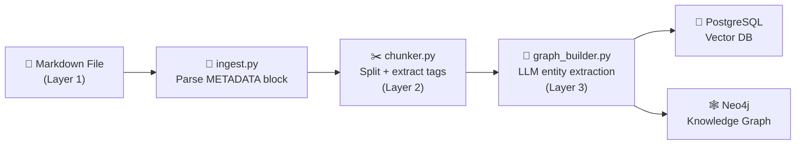

# CPG Metadata Schema — Reference Guide

> **Version:** 2.0 (Multi-Category Architecture)  
> **Last Updated:** 2026-04-29  
> **Scope:** All Clinical Practice Guideline (CPG) markdown files in `markdown/`

---

## Architecture Overview

The metadata system consists of **three layers** that progressively enrich each document chunk as it flows through the ingestion pipeline:

| Layer | Name | Source | When Applied | Storage |
|---|---|---|---|---|
| **Layer 1** | Document Metadata | `<!-- METADATA -->` block in `.md` files | **Author-time** (manual) | PostgreSQL `documents.metadata` JSONB |
| **Layer 2** | Chunk Metadata | `chunker.py` + `ingest.py` parsing | **Ingestion-time** (automatic) | PostgreSQL `chunks.metadata` JSONB |
| **Layer 3** | Entity & Relationship Metadata | `graph_builder.py` LLM extraction | **Ingestion-time** (automatic) | Neo4j nodes + PostgreSQL `chunks.metadata.entities` |



---

## Layer 1: Document Metadata (Manual — Author-Defined)

Written as an HTML comment block at the top of each markdown file, directly after the `# SECTION` heading.

### Format

```
<!-- METADATA
category: {value1}, {value2}
use_case: {Descriptive Phrase} — {keyword1}, {keyword2}, ...
patient_input: {comma-separated clinical inputs}
output: {comma-separated clinical outputs}
critical: true
treatment_type: {comma-separated therapies}
-->
```

### Field Definitions

| Field | Required | Type | Description |
|---|---|---|---|
| `category` | ✅ Yes | `string` (comma-separated → stored as `array`) | Clinical domain classification. Supports **multi-value** (e.g., `Treatment, Prevention`). See controlled vocabulary below. |
| `use_case` | ✅ Yes | `string` | Human-readable description + machine-parseable keywords separated by ` — `. |
| `patient_input` | ✅ Yes | `string` (comma-separated) | Clinical inputs required by this section (e.g., `age, TNM_stage, receptor_status`). |
| `output` | ✅ Yes | `string` (comma-separated) | Clinical outputs/decisions produced (e.g., `treatment_selection, dose_schedule`). |
| `critical` | ❌ Optional | `boolean` | Set to `true` for time-sensitive or high-acuity sections. Enables priority retrieval. |
| `treatment_type` | ❌ Optional | `string` (comma-separated → stored as `array`) | Specific drugs, procedures, or interventions covered. Only for treatment-related sections. |

### Array Fields (Parsed by `ingest.py`)

The following fields are automatically split from comma-separated strings into **arrays** during ingestion (see `ingest.py` line 816):

```python
ARRAY_FIELDS = {'category', 'treatment_type'}
```

**Example:**
```
category: Treatment, Supportive Treatment, Special Populations
treatment_type: bosentan, sildenafil, iloprost, transplantation
```
**Stored as:**
```json
{
  "category": ["Treatment", "Supportive Treatment", "Special Populations"],
  "treatment_type": ["bosentan", "sildenafil", "iloprost", "transplantation"]
}
```

---

### Controlled Category Vocabulary

These are the **13 standardized categories** used across all CPG repositories. Each section can have **one or more** categories (comma-separated).

| # | Category | Description | Typical Sections |
|---|---|---|---|
| 1 | **Methodology** | Executive summaries, evidence grading, guideline development process | Section 0, Key Recommendations |
| 2 | **Introduction** | Epidemiology overview, disease burden, CPG rationale, healthcare context | Section 1, overview files |
| 3 | **Pathophysiology** | Disease mechanisms, biological pathways, genetic susceptibility | Pathogenesis sections |
| 4 | **Epidemiology** | Prevalence, incidence, risk factors, prognosis, natural history | Risk factor, epidemiology sections |
| 5 | **Classification** | Staging systems, disease taxonomy, WHO/NYHA/TNM/Dana Point classification | Classification, staging sections |
| 6 | **Screening** | Early detection programs, high-risk population identification, screening modalities | Screening sections |
| 7 | **Diagnosis** | Clinical assessment, diagnostic criteria, investigation pathways, referral | Diagnosis, triage, referral sections |
| 8 | **Assessment** | Risk stratification, severity scoring, operability evaluation, prognostic assessment | Risk stratification, severity sections |
| 9 | **Treatment** | Pharmacological therapy, surgical interventions, acute/chronic management | Core treatment sections |
| 10 | **Supportive Treatment** | Rehabilitation, palliative care, symptom management, psychosocial support | Rehab, supportive care sections |
| 11 | **Prevention** | Secondary prevention, follow-up surveillance, lifestyle modification, risk reduction | Prevention, follow-up sections |
| 12 | **Special Populations** | Age/gender/comorbidity-specific management, pregnancy, paediatrics, fertility | Special groups sections |
| 13 | **Reference** | Appendices, algorithm flowcharts, reference tables, clinical trial data, implementation | Appendix, algorithm sections |

### Common Multi-Category Patterns

| Pattern | Example | Rationale |
|---|---|---|
| `Diagnosis, Assessment` | Risk stratification section | Contains both diagnostic criteria AND severity scoring |
| `Treatment, Supportive Treatment` | Comprehensive management section | Core pharmacotherapy AND conventional/adjunctive therapy |
| `Treatment, Prevention` | Post-discharge pharmacotherapy | Drug regimens AND secondary prevention initiation |
| `Treatment, Reference` | Treatment algorithm section | Active treatment decisions AND reference flowcharts |
| `Screening, Prevention` | Screening section | Early detection is a form of secondary prevention |
| `Classification, Diagnosis` | Disease classification | Haemodynamic/staging criteria ARE diagnostic thresholds |
| `Special Populations, Treatment` | Paediatric/elderly/pregnancy management | Population-specific treatment modifications |
| `Reference, Classification, Diagnosis` | TNM/staging appendix | Reference tables used for classification AND diagnosis |
| `Supportive Treatment, Prevention, Assessment` | Survivorship section | Complication management + lifestyle + ongoing monitoring |
| `Special Populations, Prevention, Screening, Treatment` | Familial/genetic risk | Risk-reducing surgery + enhanced surveillance + PARP inhibitors |

---

## Layer 2: Chunk Metadata (Automatic — Ingestion Pipeline)

Generated automatically by `chunker.py` and `ingest.py` during document ingestion. These fields are extracted from **inline content** within each chunk.

### Fields Extracted by `chunker.py`

| Field | Type | Source | Description |
|---|---|---|---|
| `evidence_grades` | `array[string]` | `[Grade I]`, `[Grade II-a]` tags in text | Evidence recommendation grades extracted from inline tags |
| `evidence_levels` | `array[string]` | `[Level A]`, `[Level B]`, `[Level C]` tags | Strength of evidence levels |
| `who_classes` | `array[string]` | `[WHO Class III]` tags | WHO functional classification tags |
| `section_title` | `string` | `## Heading` parsing | The markdown heading that owns this chunk |
| `parent_section` | `string` | Heading hierarchy | The parent section heading |
| `chunk_index` | `integer` | Sequential assignment | Position of chunk within document |
| `token_count` | `integer` | Tokenizer estimation | Approximate token count for the chunk |

### Fields Extracted by `ingest.py`

| Field | Type | Source | Description |
|---|---|---|---|
| `cpg_name` | `string` | Parent folder name | E.g., `Breast-Cancer(3rd Edition)`, `STEMI(4th Edition)` |
| `section_number` | `integer` | Filename pattern `section-{N}` | Numeric section index from filename |
| `line_count` | `integer` | Content analysis | Number of lines in the document |
| `word_count` | `integer` | Content analysis | Number of words in the document |
| `file_path` | `string` | File system | Absolute path to source markdown file |
| `file_size` | `integer` | Content length | Character count of document |
| `ingestion_date` | `string` (ISO 8601) | Runtime | Timestamp of ingestion |

### Fields from CPG PDF Parser (`cpg_parser.py`)

These are only populated when ingesting PDFs with the CPG parser enabled:

| Field | Type | Description |
|---|---|---|
| `section_hierarchy` | `array[string]` | Full section breadcrumb, e.g., `["4. TREATMENT", "4.2 Pharmacological"]` |
| `evidence_level` | `string` | Evidence level (Level I, II, III) |
| `grade` | `string` | Recommendation grade (Grade A, B, C, Key Recommendation) |
| `target_population` | `string` | Target patient population |
| `is_recommendation` | `boolean` | Whether this chunk contains a formal recommendation |
| `is_table` | `boolean` | Whether this chunk is a structured table |
| `is_algorithm` | `boolean` | Whether this chunk describes a clinical algorithm/flowchart |
| `structured_content` | `JSON` | Table data extracted to structured JSON format |
| `page_numbers` | `array[integer]` | Original PDF page numbers |

---

## Layer 3: Entity & Relationship Metadata (Automatic — LLM Extraction)

Generated by `graph_builder.py` using LLM-based dynamic entity extraction. All entities are discovered from text — no hardcoded limitations.

### Entity Categories

Stored in `chunks.metadata.entities` as a JSON object:

| Category Key | Description | Examples |
|---|---|---|
| `MEDICATIONS` | Drug names, drug classes, pharmaceutical agents | `Sildenafil`, `PDE5 inhibitors`, `Bosentan`, `Tamoxifen` |
| `CONDITIONS` | Diseases, diagnoses, symptoms, syndromes | `Erectile Dysfunction`, `STEMI`, `Eisenmenger Syndrome` |
| `PROCEDURES` | Treatments, surgeries, therapeutic interventions | `PCI`, `Mastectomy`, `Atrial Septostomy`, `Lifestyle modification` |
| `DIAGNOSTIC_TOOLS` | Tests, scores, questionnaires, imaging modalities | `IIEF-5`, `6MWT`, `Troponin`, `Mammography`, `RHC` |
| `RISK_FACTORS` | Lifestyle factors, comorbidities, predispositions | `Smoking`, `Obesity`, `BRCA1 mutation`, `Advanced age` |
| `ADVERSE_EVENTS` | Side effects, complications, toxicities | `Priapism`, `Cardiotoxicity`, `Hypotension`, `Bleeding` |
| `ORGANIZATIONS` | Medical organizations, regulatory bodies | `MOH`, `WHO`, `AHA`, `NCCN` |
| `CONTRAINDICATIONS` | Drug interactions, safety warnings | `Nitrates with PDE5i`, `Pregnancy in Eisenmenger` |
| `DOSAGES` | Dose amounts, timing, frequency, routes | `50 mg on-demand`, `5 mg daily`, `2-12 ng/kg/min IV` |
| `RISK_CATEGORIES` | Clinical risk classifications | `Low Risk`, `Intermediate Risk`, `NYHA Class III`, `WHO Class IV` |

### Relationship Types (Knowledge Graph Edges)

Stored in Neo4j as typed edges between entity nodes:

| Relationship | Description | Example |
|---|---|---|
| `TREATS` | Drug/intervention treats a condition | `Sildenafil` → TREATS → `Erectile Dysfunction` |
| `CONTRAINDICATED_WITH` | Drug contraindicated with another drug/condition | `PDE5i` → CONTRAINDICATED_WITH → `Nitrates` |
| `HAS_DOSAGE` | Drug has specific dosage information | `Tadalafil` → HAS_DOSAGE → `5 mg daily` |
| `REQUIRES_MONITORING` | Drug requires monitoring of labs/symptoms | `Testosterone` → REQUIRES_MONITORING → `PSA` |
| `RECOMMENDED_FOR` | Intervention recommended for patient profile | `Penile Prosthesis` → RECOMMENDED_FOR → `Refractory ED` |
| `CAUSES` | Drug causes an adverse event | `Sildenafil` → CAUSES → `Headache` |
| `ALTERNATIVE_TO` | Drug is alternative to another drug | `Tadalafil` → ALTERNATIVE_TO → `Sildenafil` |
| `FIRST_LINE_FOR` | Drug is first-line treatment for condition | `PDE5i` → FIRST_LINE_FOR → `ED` |
| `SECOND_LINE_FOR` | Drug is second-line treatment for condition | `Alprostadil` → SECOND_LINE_FOR → `ED` |
| `ASSESSED_BY` | Condition assessed by a diagnostic tool | `PAH` → ASSESSED_BY → `RHC` |
| `HAS_DEFINITION` | Term has a definition/explanation | `IIEF-5` → HAS_DEFINITION → `International Index...` |

---

## Pipeline Integration Summary

```
┌─────────────────────────────────────────────────────────┐
│                   MARKDOWN FILE                          │
│                                                          │
│  # SECTION X: TITLE                                      │
│                                                          │
│  <!-- METADATA                    ◄── Layer 1            │
│  category: Treatment, Prevention      (manual)           │
│  use_case: ...                                           │
│  patient_input: ...                                      │
│  output: ...                                             │
│  critical: true                                          │
│  treatment_type: drug1, drug2                            │
│  -->                                                     │
│                                                          │
│  ## Content with **[Grade I, Level A]** tags              │
│  ...                              ◄── Layer 2 source     │
│                                       (inline tags)      │
│  Bosentan improved 6MWT in...     ◄── Layer 3 source     │
│                                       (entity text)      │
└─────────────────────────────────────────────────────────┘
                        │
                        ▼
┌─────────────────────────────────────────────────────────┐
│               ingest.py → chunker.py                     │
│                                                          │
│  1. Parse <!-- METADATA --> → category[], treatment_type[]│
│  2. Split into chunks by heading hierarchy               │
│  3. Extract [Grade/Level/WHO] tags → Layer 2             │
│  4. Extract cpg_name, section_number → Layer 2           │
└─────────────────────────────────────────────────────────┘
                        │
                        ▼
┌─────────────────────────────────────────────────────────┐
│               graph_builder.py                           │
│                                                          │
│  5. LLM entity extraction → 10 entity categories        │
│  6. Relationship extraction → 11 edge types              │
│  7. Build Neo4j nodes + edges                            │
└─────────────────────────────────────────────────────────┘
                        │
              ┌─────────┴─────────┐
              ▼                   ▼
    ┌──────────────┐    ┌──────────────┐
    │  PostgreSQL   │    │    Neo4j     │
    │  (Neon)       │    │   (Aura)    │
    │               │    │             │
    │  documents    │    │  Nodes:     │
    │  └─ metadata  │    │  Drug       │
    │  chunks       │    │  Condition  │
    │  └─ embedding │    │  Procedure  │
    │  └─ metadata  │    │  Edges:     │
    │  └─ entities  │    │  TREATS     │
    └──────────────┘    │  CAUSES     │
                        │  ...        │
                        └──────────────┘
```

---

## Standardized Repositories

| Repository | Files | Multi-Category Sections | Status |
|---|---|---|---|
| Ischaemic Stroke (3rd Edition) | 18 | 9 | ✅ Complete |
| STEMI (4th Edition) | 20 | 10 | ✅ Complete |
| NSTEMI (2011) | 13 | 8 | ✅ Complete |
| Nasopharyngeal Carcinoma | — | — | ✅ Complete |
| PAH (2011) | 21 | 16 | ✅ Complete |
| Breast Cancer (3rd Edition) | 16 | 11 | ✅ Complete |
| Percutaneous Coronary Intervention | 11 | 11 | ✅ Complete |
| Prevention, Diagnosis & Mgmt of IE | 10 | 4 | ✅ Complete |
| Stable CAD (2nd Edition) | — | — | ⏳ Pending |

---

## Quick Reference: Adding Metadata to a New Section

```markdown
# SECTION X: TITLE

<!-- METADATA
category: {Pick from 13 categories above, comma-separate if multiple}
use_case: {Short phrase} — {keyword1}, {keyword2}, {keyword3}
patient_input: {what clinical data is needed}
output: {what clinical decisions are produced}
critical: true
treatment_type: {specific drug names, not drug classes}
-->

> **Context:** One-paragraph summary of what this section covers.
```

**Rules:**
1. Use **Title Case** for category values (e.g., `Treatment`, not `treatment`)
2. Use **specific drug names** in `treatment_type` (e.g., `bosentan`, not `ERA`)
3. Only set `critical: true` for acute/time-sensitive sections
4. `treatment_type` is only required for sections tagged with `Treatment` or `Supportive Treatment`
5. Multi-category: assign **all relevant** categories — don't force a single label
